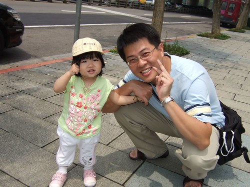
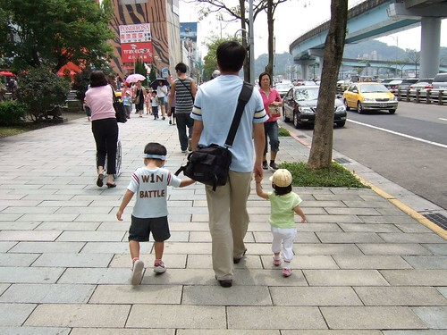
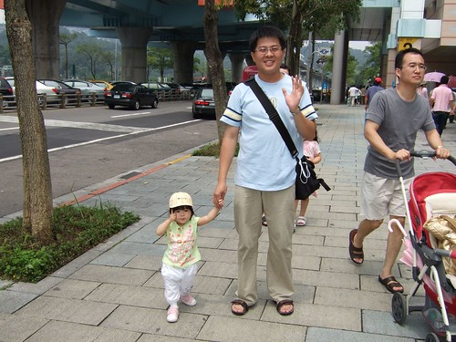

小愛最近似乎有越來越黏爸爸的傾向  
7點多用餐時間 只要聽到門外或是對面有任何掏出鑰拾的小聲音  
便會望向門外喊著"拔霸..拔霸..."  很像半路亂認親  
實在不忍心看那小臉眼巴巴的望著門外 等著爸爸破門而入  
還是得告訴她"爸爸還沒回來 那是別人在開門"  
小女子只好轉回頭 繼續埋頭苦幹他的晚餐小點心  
等到聲音真的是從我們家的鑰拾孔傳來時 (耳朵時常比媽媽還靈)  
小女子便又開心的喊著"拔霸..拔霸..." (然後在爸爸進門後便會錯亂的喊著媽媽)  
讓上了一天班疲累的爸爸 在聽與看到那甜甜的聲音與笑容後 甘願的每天這麼做牛做馬  
  
每天回家之後 已經很能夠自己或是跟哥哥遊戲的小愛  
常在爸爸吃飽飯後 討抱抱  
高舉著她的一雙小手 像無尾熊般的想攀上爸爸的大腿  
讓剛吃飽撐著挺著大肚南的爸爸  抱著她說說話或是跟哥哥競逐遊戲  
呵呵~女兒真的比較黏爸爸喔~    

很多人看到我們帶著一男一女都會說 "這麼能幹阿"  
啥咪~這樣就是能幹喔   這這...這話不是這樣說的吧  
雖然男生女生都好  但真的感謝老天給我們一個阿徹 一個小愛  
迥然不同的兩個寶貝  讓我跟徹爸的生活更加忙碌卻豐盈....  
  
  
  
小小愛  長大後可別忘記 小時候你曾經是你爸的小甜心 小心肝  
甚至有了男朋友後就忘了家裡的老爸阿...  
  

