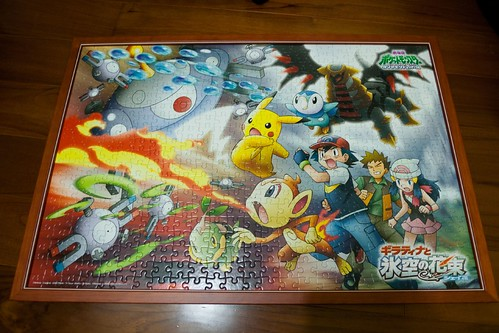
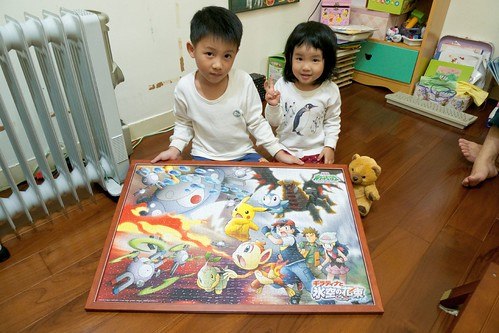
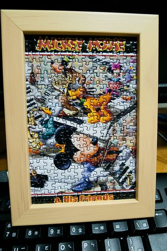
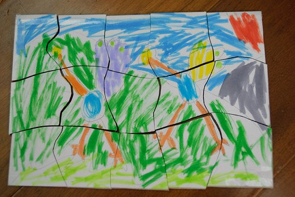
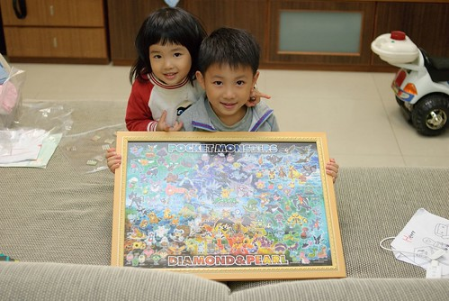
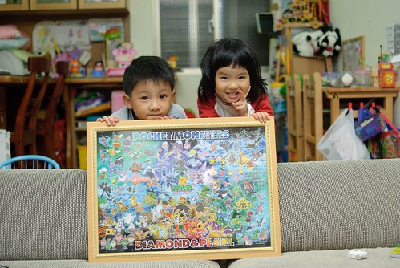
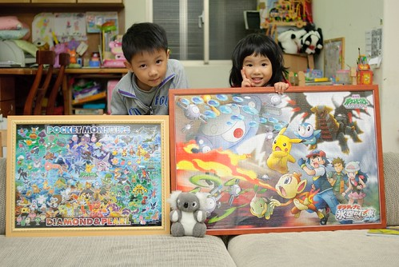
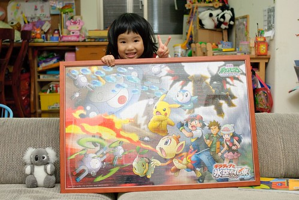
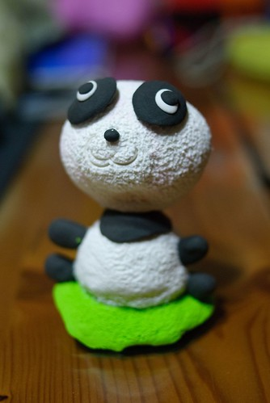

阿徹常常一陣一陣的著迷一件事 有時候專注投入到出乎我們的想像 但轉換"興趣"的速度卻也常出乎我們意外的快 常在我跟徹爸還津津樂道的說著 "看不出小子這麼有興趣 也許可以…(加碼投注)"時 阿徹卻已經翻臉如翻書般的早已轉移他所謂的興趣

過年前阿徹著迷打wii的sports game 當跟徹爸聯手打敗電腦對手時 阿徹開心的手舞足蹈

過年後受徹爸著迷火影忍者卡通影響跟著打起wii的火影忍者 每天專注享受著半小時的逞兇鬥狠 還會隨著出拳踢腿而吆喝著 半小時打下來滿頭大汗的像是真的跟人家去幹了一場架一樣 不過因為媽媽一直覺得打太多電動會"腐化"一個人的心智 加上阿徹常在打輸徹爸後不服氣的生氣大哭 因此這項興趣被媽媽禁止一週只能1-2次了

那最近阿徹在著迷什麼? 受徹爸影響(唉~父母的身教果然重要阿)跟著玩起拼圖 這兩天阿徹獨自完成了自己的第一幅300片 為了早點完成拼圖可以不要看電視 甚至媽媽得禁止他再拼 該休息一下做其他事了 徹爸說總算有一件事可以讓阿徹持續專注一兩個鐘頭 希望阿徹這回的好興趣可以好好持續久一點…

