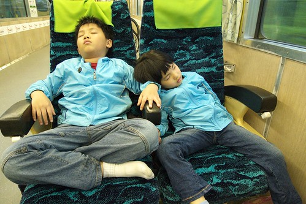

首先要澄清 我們家之所以這麼愛玩都是因為媽媽我愛玩 我常在網路上看到心動的花東介紹時便會丟給徹爸看 讓徹爸看的也忍不住驚呼'好漂亮喔' 然後等到某個美景觀賞的時機到時便問徹爸'我們來去哪好不好 那有什麼什麼...' 只要不是太誇張 大半的時候徹爸一定是回答我'好阿 你安排安排' 然後當我把所有的行程安排好 住宿點敲定 任何的行李準備後 徹爸只要負責行前導航定位 準備相機 當專職司機出門即可 (還有付住宿訂金時照著老婆說的帳號金額傻傻匯) 而徹爸也常搞不清接下來老婆要去的地方到底有什麼 要吃的東西到底多有特色...反正一切聽老婆的就是 老婆說上山就上山 說下海就下海 即便老婆要去的地方常被導航系統導向窮鄉僻徑... 我常覺得我跟徹爸兩人很相像卻又很互補 以致我們的人生才會有越來越多我們未預期的事發生著 就像帶著兩個小孩三台單車 撘著火車去花東旅行 這可是我們從前壓根難以想像的事阿..

這是我們家的第一次不靠汽車的旅行 而且還是鐵馬+鐵路的兩鐵旅行 很新鮮 很有趣 很難忘的初體驗 而且還讓我們就此喜歡上這樣的旅行方式了....

雖然去年我們便知道台鐵開始有人車(單車)同行的服務 但也一直沒放在心上 尤其從台鐵的一般網站上還真難讓人發現有這班次的存在 3月底開始規劃行程時 原來我們也只想到羅東到花蓮間用火車兩鐵運輸的方式(單車放貨物車廂) 但是兩鐵運輸得每個區段換車(台北到宜蘭一段 宜蘭到花蓮一段 花蓮到南花蓮一段) 而且銜接上會有很多的等候空檔 若真只想靠單車+鐵路旅行 '折騰'是絕對絕對免不了的 而且還超級的哩... 幸好後來再估狗時看到網友介紹人車同行這班次 才喚起了我們的記憶 因此決定試試看 只是每天上下行各一個班次及只有15個的座位(一車一座位 不售站票)讓粉多粉多年沒搭火車沒訂過火車票的我們超級緊張 徹爸還早早在他手機設定乘車前12日開始的訂票日鬧鈴提醒 兩人打算清早六點就上網搶票 原本預計是4/23這週阿徹考完月考後再去的 只是在我們以為的開始訂票日前一天時 徹爸上網查詢赫然發現怎麼4/23沒票了( 兩人為此還討論一番到底開始訂票日是如何計算的) 而前一週末竟然來回都有票 那一刻我們兩人的內心超級掙扎 徬徨的.... 因為阿徹4/21-4/22有國數的月考 因為若4/15不去再來就得5月中後了 天氣又更熱了 加上我們又超級擔心如果5月的票到時候也很難訂怎麼辦... 兩人討論掙扎個幾十分鐘後 最後決定還是'把握當下'吧!  所以我們成行了...

當阿徹跟安親班老師說他月考前的週末要去玩而且還要請週五的假時 老師說'要月考了還去玩'  阿徹跟老師說'因為火車票只能訂到這時候...' 聽完阿徹上面的轉述 我跟阿徹說'你可以跟老師說 沒辦法 媽媽太愛玩..' 而當徹爸再聽到我以上的轉述時說'你這樣說也不恰當 要說讀萬卷書不如行萬里路阿' 哈哈!! 這個說法果然比較強 不過講真的啦...我們是真的覺得反正阿徹也不會在週末唸書 而請的那一天假就當作是給他的磨練 說不定他還會因為這緊要時刻少了別人一天課而多認真點面對考試(這是正向媽媽的貪心期望)

這回的行程如下 第一天：(23KM)06:35板橋搭車 -> 10:56 抵瑞穗 -> 宿玉里 第二天：(30KM)玉里 -> 南安遊客中心 -> 卓富公路(花75鄉道) 卓楓國小 -> 宿池上賢情玉緻民宿 第三天：池上環圳車道/萬安村/伯朗大道 -> 大波池春耕野餐節 -> 16:30池上搭車 -> 21:59抵板橋 看起來很沒有什麼的行程吧! 不過我跟徹爸可是超期待的ㄋ 連阿徹都看穿我們的心情 在出發的前兩三天時還跟我們說'你們看起來好像很開心 很期待的樣子' 哈! 可憐的阿徹明明再一週就要月考了 還得這樣陪著爸媽瘋... 拉哩拉雜又寫了這麼多 就來開始我們的旅行吧!

4/15清晨五點起床梳洗後 5點45分所有行頭上裝 我們出發往板橋火車站搭車嚕 這時候天雖然亮了 可是路上的車還好少... 

到火車站後 去seven買了飯團當今日的早餐 

6點35分的車我們卻很早出門 6點不到就到火車站 本來是想說沒經驗 時間充裕些安心點 可沒想到徹爸沒帶相機電池出門又花了20分鐘回家拿 以致最後我們只剩15分鐘的作業時間 下到B1剪票口 下到B2月台 時間嘟嘟好的讓人很緊張 

直到人車都平安上到火車後才鬆了一口氣 

這是去年台鐵才推出的人車同行列車(274與275班次) 人跟單車都在同一節車廂中而且車子還穩穩的固定很好 讓人安心不少 

一切都妥當後先吃飯團填飽肚子 

然後開始努力打發接下來的4小時車程  先是玩angry birds 

然後講故事 看國語日報週報... (話說這家子竟然還帶這些'奢侈品'出門騎車 難怪行李這麼多 除了馬鞍包外還要每人都揹一大咖) 

車子駛過松山 汐止 七堵..我們的眼皮也越來越重了... 

一家子睡翻了 

醒來時都已經快到花蓮的和平車站了 差點錯過窗外美麗的海景 

睡了一覺後全家人都精神抖擻了起來.. 發現沒? 啥咪 整節車廂就我們一家子四個人三台車? 本來在板橋還有一個人一台車跟我們一起的 後來他棄逃到別節車廂跟同伴一起後 這節就變成我們家的包廂了 我跟徹爸兩人忍不住嘀咕 原來搭的人還真的很少 我們還窮擔心怕訂不到票哩 

因為包廂 我們也愜意地在火車內走走伸展筋骨  也好好的替我們的三台愛車留下這別具意義的紀念照 

一站一站的過去 看到的稻田越來越多 越來越花蓮 

'各位旅客 花蓮站到了 要下車的旅客請準備下車...' 

我們不是到花蓮站啦! 不過因為火車得更換電力系統(到花蓮前吃電力 之後吃柴油(這是徹爸說的 有問題找徹爸))所以在花蓮站將停留10分鐘後再開車 其他帶著單車同行的旅客們全在花蓮站下光了 打掃車廂的阿姨好心告訴我們'難得來花蓮 下去晃晃吧 車子10分鐘後才開' 下車後我們才發現原來這三節改裝成人車同行的車廂這麼美阿 (在板橋站上車時 完全專注在得時間內趕緊上車 根本無暇觀看) 

我幫徹爸拍的這張 徹爸唸說火車完全的沒延伸感 主題'鐵馬向前行 台灣好風景'也被咖掉了 一整個不及格阿 

因為背包空間有限 阿徹愛愛算是很有自制力的'只'帶兩隻小巧的小熊出門 他們是接下來三天阿徹愛愛的陪玩 陪睡伴 (每次旅行都會讓小孩帶些她們喜歡的東西一起出門 但會限制數量與大小必須能裝進她們的包包 而且太心愛的 太重的也不建議 因此阿徹小愛已經懂得如何選擇/取捨帶二線玩具出門... ) 

火車繼續開了 而我們也繼續想辦法打發時間.. 玩抽鬼牌 

拿著徹爸送的sample手機玩具玩火影忍者 

每次看到兄妹兩可以拿著假手機模擬想像玩著對戰遊戲竟也能像真的那樣"聲" "笑"十足時 我除了佩服還是超級佩服... 

這些從徹爸公司退役下來的sample機真的超級好用 可以講電話 可以玩遊戲 還可以玩反光遊戲(上回去武陵兩人在後座就用這機子跟電燈玩出彩虹) 

不過即使玩的不亦樂乎 兄妹兩還是一直問著'到了沒?要下車了沒?' 總算過花蓮站後的一小時 我們也到了我們的下車站 - 瑞穗 帶著單車搭火車的過程中 最困擾也最折騰的常常就是單車如何通過月台出車站 板橋火車站有電梯可以撘 瑞穗火車站在樓梯兩側也起碼有增設個'單車道' 但是這個'道'也未免太迷你了... 讓後座有馬鞍包的我得斜側著車子牽而徹爸乾脆用扛的比較快.. 不過不過後來回程在池上就什麼都沒了 自己扛ㄅㄟ 

各位旅客 瑞穗站到了 我們的旅行也正式從這裡開始了....................  ..............................................(哈! 這回又改變寫遊記策略先寫頭寫尾)

很開心的玩到第三天了 縱然不捨我們還是得搭車回家了 

在池上車站搭車時還小小波折了一下 雖然我們早已有回程的車票 但想說還是跟站務人員問候一聲 讓他們有個心理準備 結果售票的先生一下說沒有這班次 一下說這不能載單車 直到徹爸拿車票給他看 車票上明明寫著'含自行車票價' 而後來在剪票時 剪票的先生即使剪了票讓我們進去(我們排第一個 後面一掛人 不想被我們耽擱所以才先放行的吧) 但大聲地 且堅持的說著(我覺得有點像是罵啦) 與我們爭辯著 這單車只可以載到花蓮 不能到板橋啦 直到我們人車都上了車廂 火車開始駛動後 望著窗外的剪票先生 我們忍不住微笑了'就說可以的吧!' (因為人車同行的車廂門是當火車上的工作員看到有車要上時才會開啟的 所以既然會開啟讓我們上就更肯定是有的啦) 而且就像徹爸說的 火車票上都打池上到板橋了 而且也寫含自行車票價了  還騙你不成.. 不過也又真的就像我們之前在網路上看到人家寫的 很多站務人員並不知道有這種車廂及服務 連台鐵的站務人員都不清楚 那這要如何大大推廣到全民ㄋ? 

搭車前我們買了三個全美行的鐵路便當帶上車做晚餐   火車才剛開始開 阿徹跟小愛就開始嚷著'吃便當' 

'啥咪?! 現在才4點半就要吃便當 那是晚餐耶. 起碼玩到5點才能吃' 

'什麼? 還要到五點喔? 肚子餓了說 你怎麼這樣不給我們吃便當' 

如果4點半就把便當嗑光了 那接下來的5個半小時的時間裡怎麼過阿 所以媽媽很堅持要5點才能放飯 先拍拍照 打發時間吧 

又是涯給二人組的自拍 

回去的車廂一樣又被我們這家子給包了...直到花蓮站才再有5人上車 

對這樣列車有興趣的 可以上下列的網站查詢喔..真的很方便 很不錯的服務 

OHYA!  5點了 可以吃便當了 媽媽說放飯那一刻 阿徹跟愛愛真的大聲歡呼了起來 

便當好吃嗎? 阿徹說讚 

愛愛也說讚 

便當好吃到讓向來吃飯很遜的愛愛難得的大口大口的扒飯 連臉上也帶了一個飯包 

池上的米真的好吃! 不過我想鐵路便當最美味的地方應該是在於那份鐵路旅行美好的回憶吧 因為火車 因為回憶 讓便當吃起來特別的好吃! 

吃完便當 累了一整天(或許是三天)的阿徹愛愛就呼呼大睡去嚕 

阿徹睡了兩小時 愛愛睡了3個多小時 後來徹爸還很寵的抱著愛愛睡 

雖然吃吃睡睡 但5個半小時的車程還是讓人感覺好久阿... 不過全家一起累的感覺挺好的 尤其是不用開車的徹爸應該感受特別深吧! 

回程時我們還很有緣的在花蓮站又遇到我們第一天在193上遇到的環島父女(因為下雨 她們提前結束行程) 趁著下車前合照一張 紀念這難得的二次相遇緣分 因為這緣分讓這回的火車旅行又顯得更美更令人難忘了..... 

回到板橋時 板橋下著雨 而我們冒著黑淋著雨騎著我們的車回家 4/17晚上10點30分回到我們溫暖的家  平安圓滿的結束我們三天的雙鐵旅行!
