上週六玟姿上來台北看同事參加的國際田徑賽  我們一家子一起跟去湊熱鬧 超級難得的來到田徑場 尤其還是這樣正式的大賽 我們滿心好奇也滿臉好奇 第一次這樣近距離的觀看選手 從賽前的熱身 比賽時的全心全力 到賽後的興奮或沮喪 真的是台上一分鐘 台下十年功阿!   我相信阿徹那一天肯定也有這樣的震撼與感動 尤其當我們所加油的選手拿到第一名的那一刻 徹愛與我忍不住鼓掌 大聲喝采 這是一門托玟姿的福而給徹愛帶來的一場很棒的戶外教學課!

沒來過小巨蛋這裡的我們 走在這真有種鄉巴佬進城的感覺 不過也才發現原來台北真的進步 改變很多阿! 田徑場完全跟我想像中的破爛不一樣阿 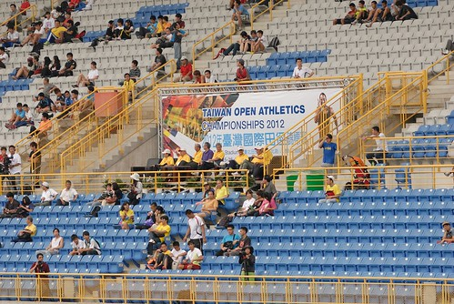 看到這樣大場合 還有嚴肅的比賽氛圍的那一刻 我想我們一定驚訝的不小心張大了嘴 >O< 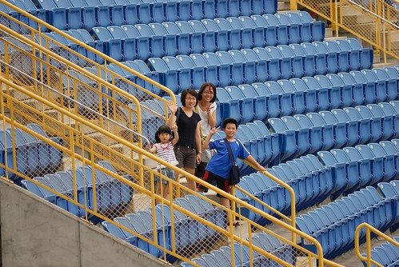 那天台北街頭很熱 但坐在場內的看台區微風徐徐  其實是種很棒的享受 就像悠閒的在看一場秀或是一場棒球賽 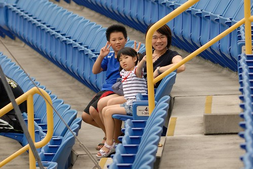 玟姿以前的同事是女子撐竿跳選手  所以我們從頭到尾的看著女子撐竿跳比賽 我們以前只看過電視上的撐竿跳 這是第一次現場看 哇~ 那根本不只是跳 是飛阿~~ 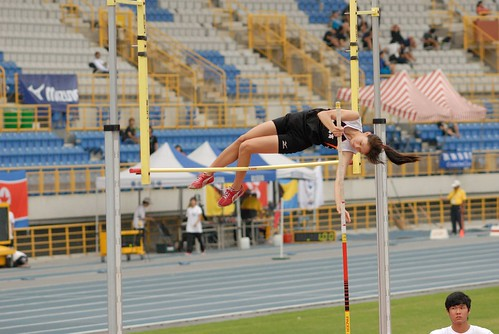 而且還都飛的好優雅阿 看著每個選手纖細又靈活的腰 我們忍不住一再讚嘆"果然是靠腰吃飯的" 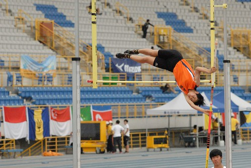 玟姿的同事(雪雪)太厲害 別人是陸續從2.8 3.0起跳  唯獨他從3.4米開始跳 也因此我們等了一個多小時 等到徹愛都快沒耐心的直問"阿姨要跳了嗎"   才見雪雪的登場 徹爸的長鏡頭紀錄下雪雪的每一跳 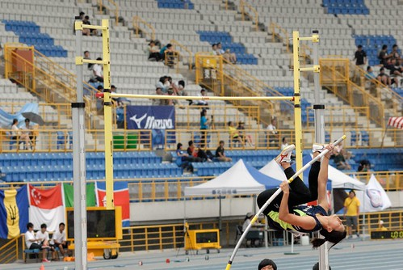 

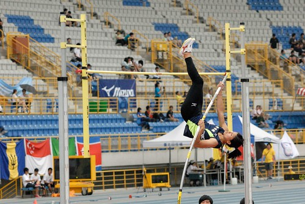

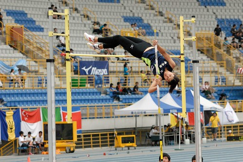

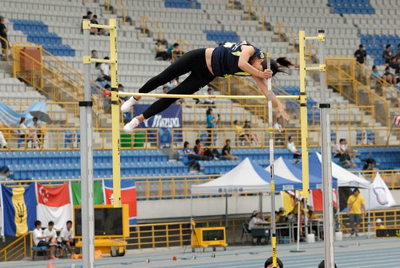

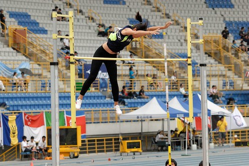

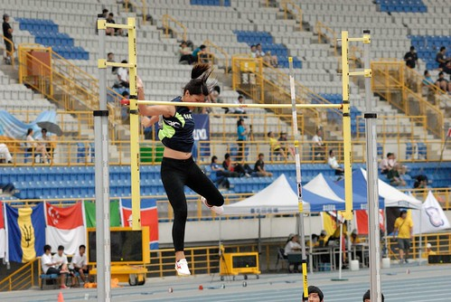

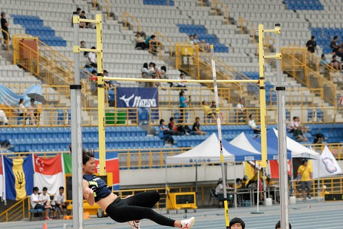 玩美落地 我們忍不住大聲喝采!!! 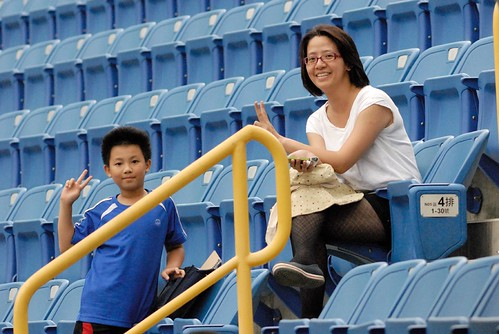 雖然最後挑戰3米6失敗 留了些遺憾 但能有金牌真的很棒了! 尤其事後聽玟姿說起雪雪已經很多年沒有參加比賽 那天賽前還被以前的教練嗆 更是佩服雪雪決定參賽的決心與在場上一跳的奮力阿 因為她畢竟可以就此悠悠哉哉的當個快樂高中體育老師就好的阿 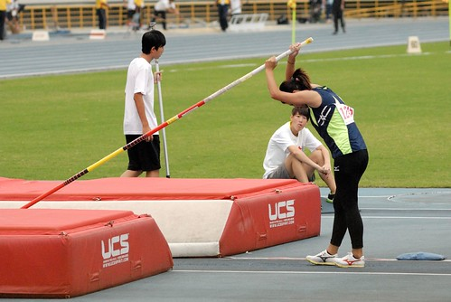 謝謝雪雪帶給我們這麼棒的榮耀分享 明明我們這家只是跟去湊熱鬧的 但能跟金牌選手扯上邊 竟也開心的不得了 ㄏㄏ~~ 每個認真的 有夢想的 都加油~~~ 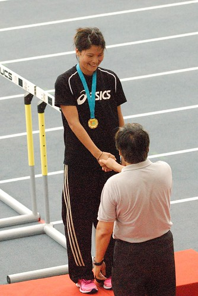
