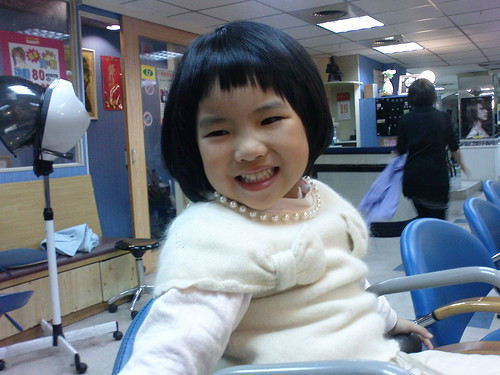
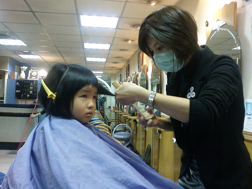
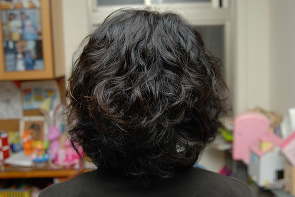

上週六是我們家的剪髮日  四口人都該是好好俢剪過長頭髮的時候 本來只打算小俢小愛的流海的  想說難得把頭髮留這麼長了(出生以來現在最長) 冬天時候綁個公主頭 穿上洋裝小皮鞋還怪有氣質 怪有一番公主味道的 可是愛愛在預定剪髮日前兩天 竟然自己主動提出想要把頭髮剪短 我還用手比了比她的脖子問 "你要剪這麼短? " 她肯定的點頭回應我 其實捨不得長髮的是我 好不容易養出一個稍微有像公主的女兒ㄇㄟ 接著兩三天我三不五時問她"你真的要剪短嗎  到阿姨幫你剪之前你都可以說不要喔" 甚至我還說"剪短了就不能綁公主頭當公主了喔" 愛愛還是非常肯定的要剪短頭髮 甚至跟我說"我剪短了 媽媽就不用那麼累每天要幫我綁頭髮  上班還會遲到" 雖然媽媽我的技術實在不好 頭髮都綁的簡單鬆散 但她還是最愛披頭散髮的自在 因為不用出門上課的時候 很難要她綁頭髮 甚至常在放學回到家後就扯去她的髮束 所以我想 這小妮子想剪短的最大原因是她自己不想綁頭髮 想要給頭髮自由吧!!! 雖然不捨得她的長髮髮 但是很高興她有自己的想法且沒被"女生愛漂亮"這事給綁架住了 重點是 短頭髮其實真的更適合她  看起來真的超cute的喔~ 

去剪頭髮的那天早上 戴上帽子後的頭髮看起來真的頗長的樣子

坐上椅子準備給阿姨剪頭髮時 不小心露出竊喜的模樣 然後乖乖不太動的讓阿姨操刀了2-30分鐘 阿姨說 "一定要給愛愛剪一個超ㄇㄟ的頭"  尤其愛愛的頭型又這麼好怎能不好好突顯一下ㄋ

剪完頭髮後 開心全顯在愛愛的臉上了 遮也不遮不了 那天早上愛愛有交代我得幫她帶她當花童的白色髮圈還有小梳子去 (其實後來是她自己偷偷的拿去放我包包了) 剪完頭髮後 她就自個去我包包拿出她的髮圈套在她的頭上 這得意忘形的模樣完全顛覆她平常在外的害羞樣 連阿姨都可以感受到這位小客人很滿意她的新髮型喔

平心而論 我跟徹爸也真覺得小愛適合短髮 頭髮一剪 她的圓圓臉跟小五官整個都突顯出來嚕

嘿嘿~ 媽媽也來了個歲末大改變 前所未有的勇敢與不知道哪跟筋不對的超想趟短捲髮 在設計師阿姨大略的筆劃一下 下面捲 上面捲 法國娃娃風之後 就全權交給設計師處理了 2小時後當阿徹跟徹爸抵達髮廊時 看著我滿頭的捲子皺著眉問我 "你為什麼要趟捲阿" 我說"改變一下ㄇㄟ 不會很捲啦" 徹爸也問"有沒有圖片可以看阿 是要燙怎麼樣的髮型" 我說"沒有" 徹爸不可置信的問我"沒有?! 你就這樣燙了" 我說 "對阿"  可見我有多麼想改變 細節都不管了 不過主要也是設計師阿姨認識10多年 我早已把我的頭都交給她全權處理了 後來解捲子的時候 第一捲解下來的時候 阿徹看著那搓髮更憂的跟我說"可是很捲哩" 哈哈~ 果然~ 整頭捲子捲下來的時候 我也明白我誤會阿姨的法國娃娃風了(我以為只有下面捲 上面略捲) 雖然阿姨在過程中一直給我心理建設說  "剛開始難免不習慣捲度 但是洗幾次自然了就會漂亮  開始就不夠捲的話 以後很容易就沒型就麻煩了..." 可是講真的 那瞬間還真的不知該怎麼笑了 看到阿徹在一旁一直念著太捲了太捲了 徹爸笑說"阿徹 不管媽媽變成怎麼樣 她都還是我們的媽媽" 聽的設計師阿姨有點哭笑不得 心裏應該小小受傷了吧 不過最受傷的是 回家後小愛跟我說"我覺得你的捲捲頭跟阿嬤好像喔" 挖勒!!!阿嬤!!!! 幸好阿姨沒聽到 要不然她一定當場大哭

其實我也一直不知道我的後面有多捲 但看前面我猜想後面應該真的也很捲吧 直到第三天晚上我總算請徹爸幫我拍後面頭髮的樣子給我瞧瞧 耶~ 其實也沒有很捲嘛~ 只是果然髮色很重... 不過看到照片後 我自己才第一次喜歡上我的新髮型

堅持燙染不能同步的阿姨 (最好隔個一兩週) 捱不過我的哀求 再燙後第三天給我染了 顏色當然又是阿姨幫我挑的 嘿嘿~上色後的捲捲頭 讓我開心的笑了~~~ 不過"下頭"是經過阿姨整理的   自己整理的能不能這麼水老實講肯定沒有的嚕 但是我愛我的新髮型!!! 正式宣告變髮成功!!!!

ps. 有關正面照 就讓我還保留點神秘感吧 嘿嘿~

