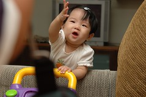

上個週末小愛扶著東西站著玩時  
突然放手站立了幾秒鐘  
不只我跟徹爸看的目瞪口呆  
連她自己都一臉訝異與驚喜的樣子  
蠻好笑的...  
不過我們想這應該只是個偶發事件  
非她自己本人預期的事件  
就像她偶而會側身下腿然後平安跨下床階  
但大半的時候只會伸長小手對著床下的東西哀哀叫  
徹爸說的都是"註死"的

其實我是不太樂見小愛太早學會走路的  
現在已經夠會東爬西上的  
偶而玩的過頭就ㄎㄡ的撞地  
蠻慘的...  
況且她真的好小隻  
看到一個這麼小隻的小孩走來走去真的會很不習慣...

