 以前跟徹爸兩人常打著如意算盤 "等阿徹念小學大一點了 就可以回嘉義過暑假輕鬆輕鬆了"(他輕鬆 我們也輕鬆) 但想不到這個暑假卻提前這麼早的到來了 因為徹爸三姐家的兩個小兄弟要回嘉義過暑假 當我們還在考慮著是否讓阿徹一同回嘉義過暑假時 好不容易有機會可以留阿徹在嘉義的徹嬤卻早已問得男主角本人的同意 有過畢旅外宿經驗 阿徹絲毫不擔心沒有爸媽在身邊的日子 反而殷殷期盼著暑假快快到來 看的身為父母的我們只能說"唉 孩子真的大了..."  

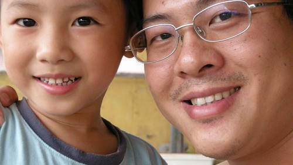

是的...小子是抱著很雀躍 很期待的心情回嘉義過暑假的 絲毫沒有不捨 沒有不安 沒有惶恐 其實也才回去一個禮拜七天而已 其實也沒有什麼的嘛....

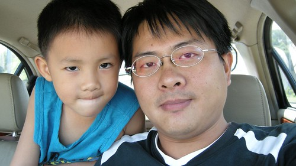

徹爸偶而會鬧鬧阿徹"你真的要回嘉義嗎? 你真的要離開我們嗎?" 阿徹都笑的點點頭說"我會想你們的" 我數落著徹爸"你別再嚇他了 讓他好好去嘉義玩吧" 但其實最放不下 最捨不得的是媽媽我阿 純粹想說難得有伴可以一起回嘉義住加上8月初新學期剛開始還算輕鬆 於是放手讓阿徹自己飛飛看

我刻意的沒有跟阿嬤交代很多事情 (剛好那天徹爸五姐弟都在家也有點混亂) 只有把阿徹需要的衣物 備用藥品東西放好在櫃子 將心早已玩開玩野的阿徹叫進房間交代  衣服怎麼分麼穿 其他的全交給阿徹跟徹嬤們自己看著辦 徹爸說"你是故意要考驗阿徹的阿"  也許吧... 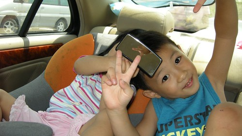

週六回到嘉義看到哥哥們後 阿徹的心整個的飛走 鬆散漫不經心了 逼的徹爸忍不住要脅"你這樣的表現 怎麼留在嘉義過暑假" 於是眾姑姑們時時提醒阿徹"快\*\*\* 快... 要不然就不能在嘉義了" 而阿嬤即使面露百般擔憂不願意卻也不敢跟徹爸多說什麼 只能期望阿徹能夠通過徹爸那關可以留在嘉義一週 似乎大家都了解徹爸不是說假的....

雖然好像壞人都是給徹爸做的  但我這媽夾在中間也很為難哩 因為實在不想讓滿心期待的兒子與阿嬤失望哩 但阿徹的表現卻又真的不達平日我們對他的要求 而且似乎可以預見阿徹這一週將會玩的多野....

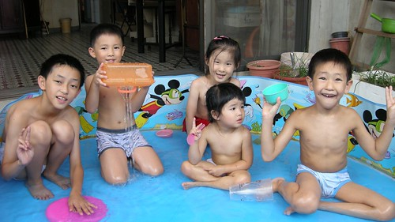

小孩子終究是小孩子  有伴玩一起就啥也不顧 啥也不怕了 (聽說每天下午都像這麼著玩水  阿嬤這期的水費應該很嚇人)

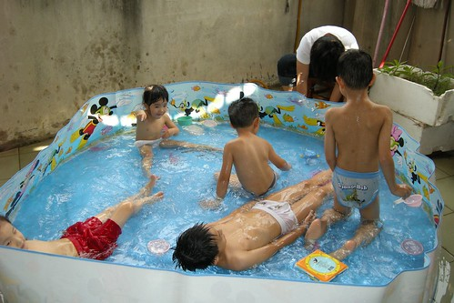

雖然這是幸福的事  是童年難得且重要的回憶 但考驗著爸媽心中的那一把尺 尺很難抓...真的覺得爸媽越難越難當 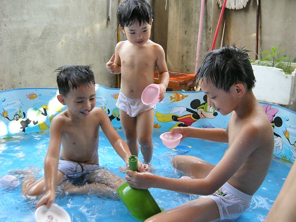

本來擔心小愛會不會鬧著也要留嘉義 會不會不能意識到哥哥將有一個禮拜不在家這件事 週六早上要從台北出發回嘉義時 小愛對著我說"我們要去阿嬤家 然後哥哥住在那裡 我們自己回家對不對?" 恩~沒錯...果然快三歲的小愛什麼都懂了 問他要不要跟哥哥一起住嘉義 每次她都毫不考慮的說"不要" 我想她應該也懂得自己還小 還離不開爸媽 不能一天看不見我們吧 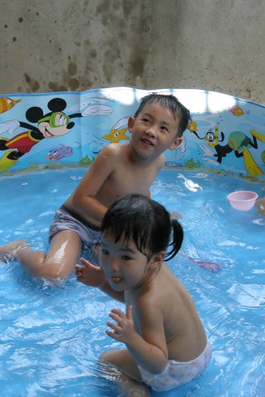

就是這三個小男生 一個小三生 一個準小一生 一個大班生 將留在嘉義一週考驗阿公阿嬤的耐力 卻是他們人生第一次沒有爸媽嘮叨的暑假假期 

OS..三個男生在一起要不玩瘋都很難.... 

跟阿徹除了交代衣服外 最耳提面命的就是電視不要看太多阿 但最後還是因為電視讓阿公在五天之後打電話上來告狀 "阿徹跑進跑出顧看電視 不認真吃飯" 氣的徹爸對著話筒大喊"那你就打下去阿 這是你要解決的 打電話跟我告狀做啥 " 後來我打電話回嘉義關切聽到一個在啜泣的小孩 唉....我只能說 阿徹終究沒通過我們的考驗 出包了 雖然徹嬤在把小孩送上來的時候 一直說阿徹很乖 飯都吃很快很多 只有那一天電視看的比較多所以才那樣 但...."頹勢"已造成阿....阿徹電視看太多是他本人也承認的事阿

問阿徹"你覺得自己這一星期有乖乖嗎?" 阿徹說"有一點點乖 因為電視看太多了" 加上回家的第一天每隔半小時就嚷著要看電視 試探性的問他 在嘉義有看哪些電視? 海綿寶寶 神奇寶貝 \*\*\*\*&&&& 一堆家裡電視從沒看超過一分鐘的卡通節目都出現了 隨便一算都早已超過平日在家2個小單元的限制 雖然說是暑假假期  雖然說在阿公阿嬤家是一定會爽的 但....這也未免把胃口養太大了 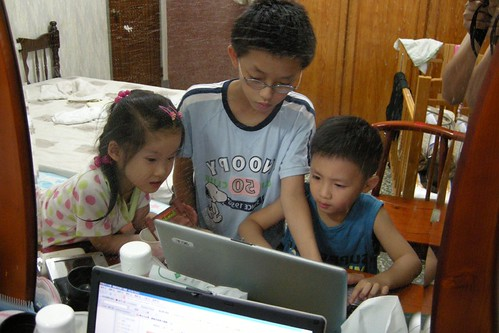

在嘉義的第二天(週日) 阿徹就已經不像是我們管轄的 只剩下妹妹賴在我們身邊

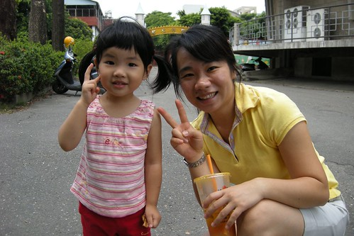 很久很久沒有這樣只帶著一個小孩了 而且還是大不同的小女生 一整個的優雅 悠閒 愜意 徹爸說 他總算可以體會爲什麼有朋友在只生了一個女兒後不願意再生 只因想把所有的愛都給這唯一的寶貝女兒了

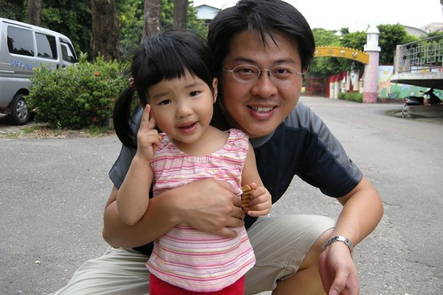

哥哥不在家的這一週 小愛一樣每天上學去 媽媽因為剛好工作忙也沒法晚點送上學 早點接放學 不過放學後到入睡前的這段時間  小愛難得的可以自己獨享爸媽 沒有人跟他搶爸媽 爸媽隨她喚就到 很難得的經驗 好像也應該很幸福...

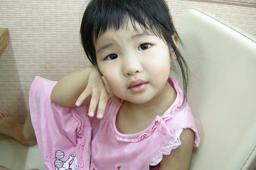 當獨生女的這一個星期 小愛沒吵沒鬧 沒有不快樂 但卻也沒有感覺excited的樣子 我想哥哥不在 其實她的樂子真的少很多 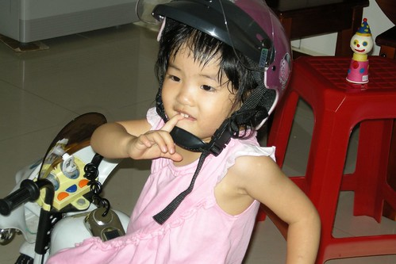

自己一個人看電視 好像也沒那麼好看

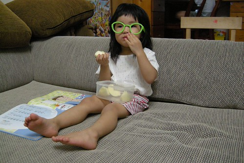

除了跟徹爸蓋了兩座樂高101  一整個禮拜遊戲區幾乎都維持這模樣 被搬出來的玩具很少  我也不用像平日大爆炸般的吆喝恐嚇小孩收玩具

如果老大因為有爸媽全心全意的照顧是幸福的 我想老二是更加幸福的 因為是有三個人的愛陪伴著她的

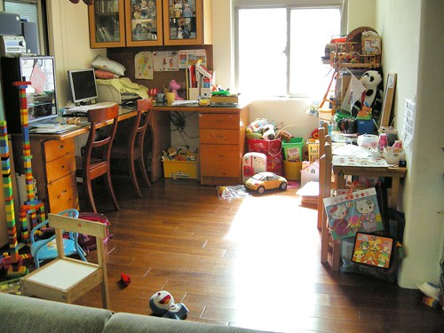

猜猜看 在台北剩下的三個人中誰最先想阿徹? 出乎我與徹爸意外的是小愛 從嘉義回來的隔天(星期一)早上 小愛起床後就往我們房裡走 然後一臉疑惑加失望的問"哥哥哩" 跟她說哥哥在嘉義阿 小愛的眼淚都快滴下來了 幫她打了通電話給阿徹哥哥  讓哥哥跟她說說話才又開心的願意上學去 兄妹兩每天晚上通電話時 彼此第一句話就是"哥哥 我愛你" "妹妹 我愛你" 哥哥每次還都會交代妹妹"要乖乖睡覺 要乖乖上學" 兩人噁心肉麻的樣子很像一對戀人 雖然阿徹在嘉義跟哥哥們玩打架遊戲很得意 但我想他應該也很懷念跟妹妹玩爸爸媽媽遊戲的

一週後要去新竹接阿徹時 跟小愛說"不要去接哥哥好了" 小愛說"不可以" 以後再跟她說"把哥哥送回去嘉義好了" 她也說"不行" (以前兩人吵架問把哥哥送回嘉義好了 她都說好) 我想這回小愛應該也深刻體會哥哥不在家的日子有多無聊了

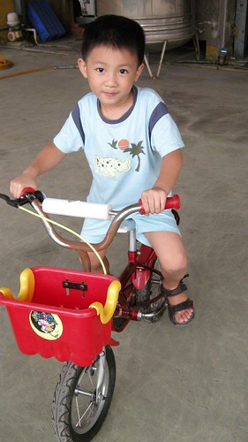

阿徹從嘉義回來後的頭兩天 被我們電的很慘 因為常吵著要看電視 不給看面露殺氣的滴淚 還會說"我砍你喔" 連徹爸暫時拿起不給他喝的果汁都會動手搶 我們真的深深懷疑電視的影響真嚇人 不只眼神充滿殺氣連之前異想天開可愛的話與遊戲也都不會說不會玩了 徹爸說下回要再回去過暑假只有一個條件"電視線拔掉" 我想六歲的阿徹終究抵抗誘惑的本事還是不夠

當阿徹被我們電了一天後  又會開開心心的找妹妹玩一些很不Man的遊戲時 我跟徹爸總算鬆了口氣 我們還是比較喜歡這樣不Man 有點無厘頭的阿徹....

對了 阿徹還有接受一個處罰 就是接下來的兩週每天只能看一個小單元的卡通 阿徹的這個暑假到底快不快樂 只有問他自己才知道嚕....
