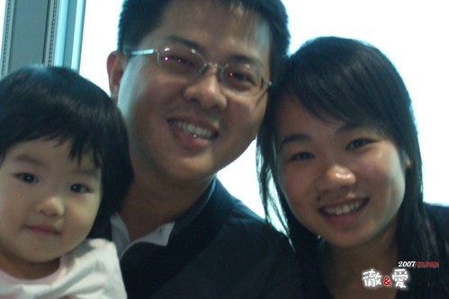
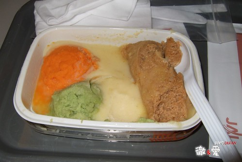

我們是很愛玩的父母 也是很貪小便宜的父母  
所以再怎麼樣也要趕在小愛滿兩歲前 搶嬰兒價出去一趟  
原本預計9-10月才成行的  
但媽媽堅持一定要6-7天的行程  
加上一定要有個樂園當做給阿徹的犒賞(要他看7天的山海風景 可能會抓狂吧)  
能夠這樣滿足大的小的行程就只有暑假的團了  
於是匆忙的趕搭上暑假的最後熱潮  
趕緊帶了小愛去照大頭照 幫她辦護照  增添大大小小需要的衣著用品   
10天後跟徹爸便拖了兩個大皮箱 揹了四袋隨身包 扛了兩個小孩(這也算是大行李吧)  
放風去~~~  
   

12點50分的班機讓一家四口可以睡飽飽 照著平常起床時間起床  
從容的替家門上了兩道深深的鎖後 驅車前往機場嚕  
順道送了一直被忘在冰箱裡的香腸去新莊給阿嬤  
只是往新莊的路有點出乎意外的塞車 小愛不知是暈車還是一早喝太多水  
短短半小時的車程就兔濕一身  這...這...這預兆實在不太好  
行李箱裡準備了各種退燒/止咳藥水 塞劑  腸胃藥 脹氣膏  獨缺止吐塞劑  
於是臨時去藥局買了幾顆止吐塞劑備著  
要不然真這麼搞下去 帶的兩箱衣服也不夠換哩  
幸好...一切只是空擔心 ...  
  
雖然帶了小腳架準備在飯店內搞自拍全家福  
但出門在外想要跟徹爸合照還是得倚賴阿徹的掌鏡  
踏出國門前開始練習 來一張吧~ 頭很大被卡掉了....下次記得頭再小一點點嘿  
  
   
  
出關往登機口的路上小玩意不斷 開始刺激考驗著小朋友...(當然也考驗著父母的耐受力或是荷包)  
  
  
  
別急....迪士尼有更多好玩好看的東西的....  
  
  
  
不過小愛很不貪心 有溜滑梯就很High很滿足 似乎感受不到真正好玩的正等著她ㄋ    
  
  
登機口的旁邊是遊戲區正好可以讓小人們愉快的渡過慢..慢..候機時間 (玩了一小時還不想上機哩)  
  
  
  
旅行社小姐事前尋問幫我們訂了嬰兒餐與兒童餐  
嬰兒袋裡有尿布 濕紙巾 米餅 香蕉....很豐富   
但是嬰兒餐很嬰兒 一團團的各色泥狀物(咖啡色的還條狀的 真不知道是故意的還是特意的)  
小愛嚐了一口後便抵死不吃 於是餐盒幾乎原封不動的請空姐收走  
  
  
  
阿徹的兒童餐好一點(又有一團綠色蔬菜泥)  
但除了兩片壽司進了阿徹肚子 炸丸子進了我跟徹爸的口外 其餘的也幾乎沒動到  
  
  
  
吃飽點阿 接下來的七天會很累喔  
大家作好心理準備吧~  
  
  
  
3小時的航程其實比從台北開車回嘉義還要快  
只是搭飛機前後的出關入關 實在折騰人  
一整個白天就這麼的都在機場 飛機上轉阿轉  
飛阿~快到夢想的東京 北海道 迪士尼了~  
  
  
  
下了飛機 出了關 旅行正式展開~~  
  
第一天:台北／東京─台場彩虹橋─品川驛─北斗星(浪漫臥鋪)電車之旅(車內三味弦演奏)→東北

第二天:盛岡─八幡平溫泉(泡溫泉、吃早餐)─十和田湖(瞰湖台)─奧入瀨溪流(瀑布群.楓葉林)溪澗步道─八甲田山麓─長壽高原─青森─青函隧道(海底電車)─函館山(纜車)世界三大夜景─湯之川溫泉

第三天:湯之川溫泉─函館(特拉卑斯基奴.女子修道院)─日本新三景(大沼國立公園)美麗駒岳─內浦海岸─洞爺湖國定公園.昭和新山(火山奇觀)─洞爺壯別水果之鄉(草莓.櫻桃)摘果樂─SAIRO(瞰湖台)─中山嶺(羊蹄山)─定山溪溫泉鄉

第四天:定山溪溫泉-小樽運河(羅曼街道散步.北一哨子.音樂盒博物館)-曾雲峽溫泉

第五天:層雲峽─美瑛四季彩之丘(貼布之路)田園景觀─富良野花田(薰衣草.向日葵.鼠尾草.波斯菊)─浪漫景觀小火車(富良野‧美瑛????號)─札幌(免稅店)─札幌(夜遊狸小路)

第六天:札幌千歲空港／東京(迪士尼樂園)煙火秀

第七天:東京自由行(上野公園熊貓)─成田空港／台北
