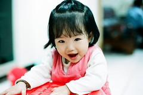
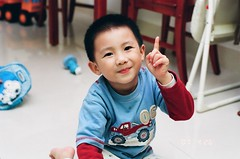
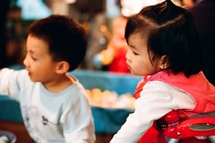
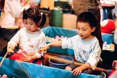
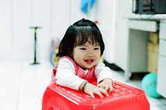
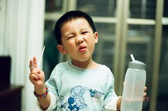
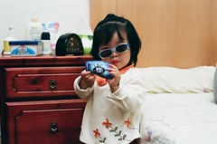
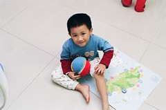

繼小7  小兩 小3之後 家裡又多了個新成員就喚它做小8吧  
小8的身分很特別 不是DC 是底片機  
是徹爸最近"新師好棒賽" 常拿在手上的機子  
雖然都自嘲徹爸的興趣其實不是攝影而是買相機  
但還是得大力的讚揚一下 徹爸拍自己的小孩(含蓄點的說法) 感覺 timing都很好  
原本以為習慣  拍拍 預覽 刪除 後製等可以提升照片品質的數位拍法  
徹爸的底片機成功率應該不高 可能要炸不少錢當學費吧  
但看了徹爸最初兩片的效果  恩~成功率出乎我意外的高  
可見徹爸的功力真的不是像他常說的拍100張總有2-3張好看的  
(每每跟徹爸說 某某人誇讚小愛阿徹的照片照的好時 徹爸總是這麼說)  
雖然底片機濃郁的色彩 別有一番味道 尤其適合婚喪喜慶等活動場合  
但換算一張照片成本 底片費用加沖洗加掃描費用將近10元   
感覺實在不是普通人家可以有的興趣阿  下手不可不慎阿~  
  
    
  
不過還是比較喜歡小兩 小7 那淡淡 自然的色彩  
底片機只能當作是偶而吃吃的重口味小點心...

    
  
    
  
    
  
歡迎大家多多鼓勵 讚美徹爸 讓他敗家有理 (雖然只要想敗家就會有千百理由)
