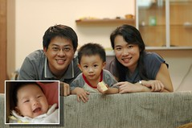

過年前的10天是我多出來的產假  
原本打著如意算盤可以帶著小愛好好的去逛逛街  
阿知 老天果然不想給我這假  
感冒很久的阿徹 被馬偕的醫生診斷為肺炎  
(如果沒去馬偕 應該就是一直吃診所的藥下去 也不知道是肺炎吧)  
所以阿徹提早開始他的年假 而我真的成了在家帶小孩的老媽子  
其實在家帶小孩的日子還挺愜意的  
只是少了自己的時間與空間  
哄完小的睡著 趕緊陪大的玩耍 睡覺  
大的玩爽睡著了 再趕緊幫小的洗澡餵奶...  
每天的日子就這樣簡單而重複著  
而我的產假就這麼著結束了  
我想我這輩子再也沒機會可以這樣放10週的假了  
還真給他有點戀戀不捨  
很多人說都兩各小孩了乾脆自己帶  
雖然2/3的薪水真的給了保母與學校  
但是當做花錢買生活品質嚕  
而且阿徹大了 本該有教育費的支出  
就像他在家時 就算每天控制他早中晚看電視的量  
總的加起來還是比他上學時看的量多出許多  
去上學起碼讓阿徹不要每天"逗阿逗的"  
放了半各多月假的阿徹 心都玩野了  
爸爸直嘀咕著"我一定要送你去上學 都沒規矩了"

兩各小孩的日子  
說真的感覺忙碌疲累甚至有點焦燥的時間 大於感覺快樂幸福的時候  
也許該說是太多的瑣事讓自己沒法好好細細去品味一些值得品嚐的簡單幸福  
因為日子被小孩追著走...  
每每抱著小愛看著阿徹時  
我就期待著妹妹趕快長大會走路會說話會思考了  
好像到那時 才可以稍微喘口氣  
可以撥點時間心力給自己...

徹爸很喜歡在阿徹跟小愛睡著後 偷偷的親他們  
每當看到徹爸親著我們的寶貝時  
就會益加感謝阿徹與小愛豐盈了我跟徹爸的人生  
雖然知道未來還有很多困難與辛苦  
但我知道 這就是我們的人生 我們選擇過的日子  
我們會盡力讓我們一家四口 幸福快樂的.........

