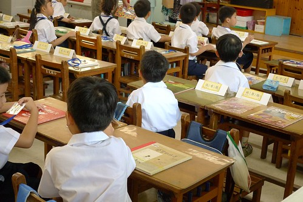

燒喔~好久沒寫這麼燒的日記了....

阿徹昨天開學了  正式成為一個小學生了... 看著穿著新制服 揹起大大書包的他 我跟徹爸忍不住搖著頭笑著說 "真的這麼大了!"

開學的第一天由徹爸嶺著去新生報到 因為媽媽的照相技術太差 所以派徹爸去見證且留下紀錄這歷史的一刻

我跟徹爸兩人推演了好久 走路還是騎車去上學? 走哪條路最好走又最有效率? 東西南北哪個校門進入? 最後還是決定穿越條條小路到學校 所幸實際走路時間比預期的15分鐘來的要快

第一次揹著書包走進小學的阿徹 背影怎麼看起來有點緊張ㄋ

阿徹她們是從西側門進入的 而在南側門那竟還有管樂隊演奏歡迎新生哩

循著週六媽媽參加家長座談會探勘過的路線 阿徹們順利的抵達位於二樓的教室 找到自己的位置

然後上前繳交資料表

回到座位等待.... 徹爸說阿徹看起來有點緊張 靦腆坐在自己位置上的樣子跟他小時候好像

許多家長們依依不捨的在教室內陪伴新生 我們的徹爸果然一如平常的酷樣 把阿徹丟在教室後就去走廊外晃蕩了

這是阿徹教室外頭的走廊  還蠻涼爽的

阿徹是一年九班9號 很好記的數字 就像他的生日是3個2一樣

她們班的課表 目前除了週四為全天課外 其餘都是半天課 課表上幾乎都打著領域課程 所以我們還是不明白每一天到底上什麼課

雖然比起那些改建過後的新學校新設備來講 阿徹學校設備算老舊的 但是比起我們那個年代 一個班級4-50人的人數都得坐到垃圾桶掃把旁 現在小學的教室都算寬敞且豪華了 有書包櫃 工作櫃  讀書角 還有電視可以看影片

阿徹目前被安置在倒數第二排的高桌椅區(現在小學教室內高低桌椅都有 隨身高調整) 過了兩三週的老師認人認名期後 矮個子阿徹應該就會往前坐了吧

阿徹老師看起來跟聽起來(聲音啦)都很像學佛的人 而且感覺已經很有"教學經驗"的樣子 希望在他的教導下我們的小猴子阿徹可以"有才"一點

去參加家長座談會時我無聊的從窗外參觀了幾間一年級教室 一排看下來 從教室的佈置就可以感受老師帶班風格的不同 新生報到當天 徹爸說果然老師很不一樣 有的老師早早就把家長趕出教室 讓教室單純的留給小朋友

而有些教室的前後以及左右則占滿了比新生還投入還緊張的家長 雖然我們都知道小孩子的適應力很好 但我們大人就是忍不住會比小孩還緊張

徹爸異常興奮的到處參觀瀏覽阿徹前後班級後 跟阿徹打聲招呼後 8點初離開校園留下阿徹獨自展開他的小學生生活 連中午放學也都沒去接了 讓阿徹自己留在教室等安親班老師來領人 晚上阿徹說好多爸爸媽媽都來接 除了還有一個外他是最後才離開的 我們說Kitty媽咪有去接你 沒有不見就好阿

國小一隅 希望阿徹可以在這個"莒光大家庭"(校長 四大長都這麼說)快樂有收穫的度過人生寶貴六年(只說快樂的話真的太假了)

晚上6點初我既期待又怕受傷害的去安親班(以前幼稚園)接小孩時 看到阿徹一如以往的像小猴子般探頭探腦找我 大聲喊媽咪 我懸了一天的心總算放心的放下來了 我想阿徹今天雖然緊張但應該是快樂的吧 問他今天還好嗎  小子一臉天真的說"我覺得小學好好玩"   甚至很開心今天學校沒有功課 嗯~ 果然是愣小子阿.... 希望正式開始上課後 有功課後 老師嚴格要求課業後 你還能覺得上學好玩 晚上看到阿徹很High的樣子 我跟徹爸兩人忍不住私底下猜測(賭)阿徹第幾天就會說不好玩了 很壞的父母... Anyway還是很高興 小學的開始 我們家的阿徹很開心!   希望好的開始是成功的一半

其他: 去參加家長座談會時才在學校合作社幫阿徹買了一套制服及運動服 徹爸難得的提醒我要幫阿徹買小背心 他說他小時候最討厭同學不穿內衣的 因為那種白襯衫都不吸汗 不穿內衣的話都會臭臭的 所以媽媽週日去市場買菜時幫阿徹買了兩件小白背心 洗完晾乾後徹爸迫不及待的要阿徹穿給他看 兩人還合照一張 徹爸開心的直嚷著"哈哈 我兒子已經大到跟我穿一樣的"吊尬"了" 只穿著背心的阿徹看起來又更像鄉下小孩了 黑黑瘦瘦小小還一臉古意的樣子

開學前一天的週日阿徹又跟徹爸再次挑戰騎單車到鶯歌 早上6點半出門直到中午一點才返抵家門 這回因為20吋車輪的加持 所以雖然跟上回花一樣的時間但是多騎到三峽三峽 來回多了10公里 總共騎了50公里 平了徹爸目前單車騎乘最遠距離 臭小子得意的笑他爸說"你好弱喔"  看來徹爸要再多勤勞點打破紀錄了

藉由騎腳踏車兩人建立了我跟小愛女人所不法參與的革命情感 看的父子倆這樣的情誼 雖然羨慕但很欣慰.. 而徹爸因為這樣的情誼對他兒子可是越來越"愛"了 第一天上學中午竟然還要我打電話去安親班問狀況 可是我很無情的跟他說"有什麼好打 小孩子不見老師就會打來了啦" 唉~ 其實男人的感情真的比女人脆弱的...
