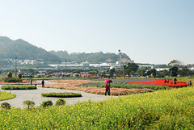

  
網路上看了好多新社花海的照片  
又讓我跟徹爸看的心好癢  
原本上趟回嘉義的時候要順道殺過去的  
可惜寒流來襲加上不小的雨勢只好作罷  
徹爸失望的那個週末都沒拿出他的小兩把玩

為了不錯過花期也為了避開人潮車潮  
上週五一家四口就這麼曠工曠課的給他賞花去了  
非假日 沒有車潮 沒有人潮 沒有吵鬧  
加上藍藍的天空 微微的徐風 暖暖的太陽 輕鬆的心情  
真的只能說 爽爽爽~  
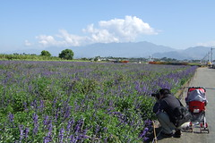

看到新社花海的確會感受到當地人的用心營造  
花很大遍 規劃的也很漂亮  
路也鋪的很好走  
但...並沒有太感動震撼我  
感覺有點像是人工美女  
就是一個刻意穿上華服 畫上美麗的妝 再戴上珍貴珠寶的美女  
很漂亮但就不是我的味  
大剌剌道路旁的兩大片花海  
少了一點走在田間小路的靜懿感  
也少了份野生的自由奔放感覺  
金針花或是芒花或是桃園苗栗的田間波斯菊花  
都算是農作物裡的產物或是一個過度期的植物  
本來就存在的 觀光賞花只是一個附加的價值  
但觀光型的花海存在的目的似乎就只為了讓人欣賞  
所以對我來說少了份原味  
不過還是很值得大家去走走 響應台灣的觀光啦~

美麗的花 美麗的天空 美麗的心情  
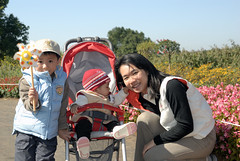  
  
今天唯一敗家的東西 50元的小風車 美麗又堅固  
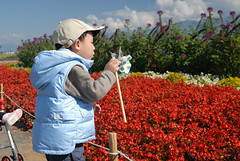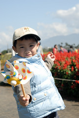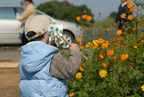  
  
園區真的是整齊又乾淨  
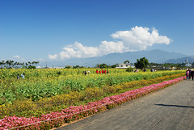  
  
數量頗多也頗大朵的太陽花(快要死掉的太陽花其實看起來怪噁心的 像是被萬蟲鑽心) 竟然都快比徹爸的大餅臉大  
  
  
  
  
淹沒在花海中的小小愛 第一次在戶外暴走 雖然後翻/前倒的難以計次 但小愛可開心的哩  
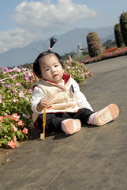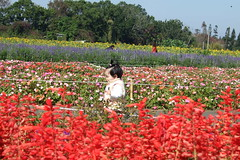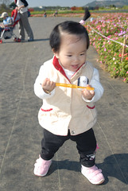  
  
偷懶 偷偷坐上推車的阿徹 后~被妹妹發現了喔  
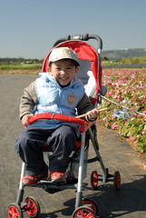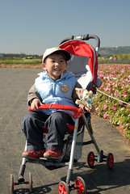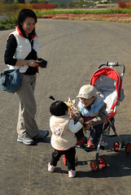  
  
沒有規劃步道的波斯菊花田 像是個出色但不搶戲的配角 靜靜坐落一旁  
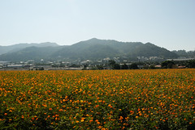  
  
 離開前 雅致地在花海旁吃著豆花  
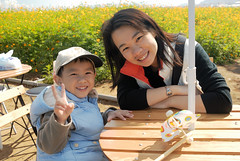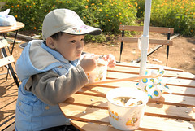  
  
揹著小兩的徹爸超級帥 超級可愛 超級認真 真是難為帥帥攝影師還要顧小孩  
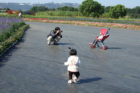
