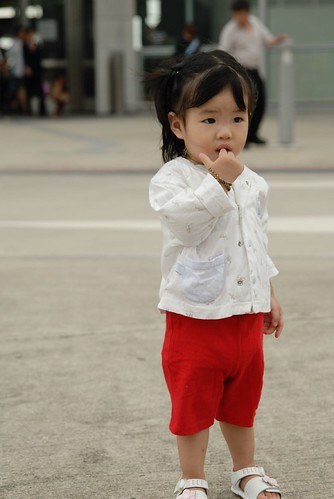
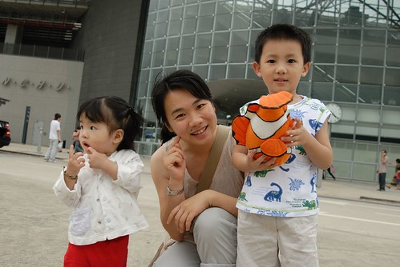
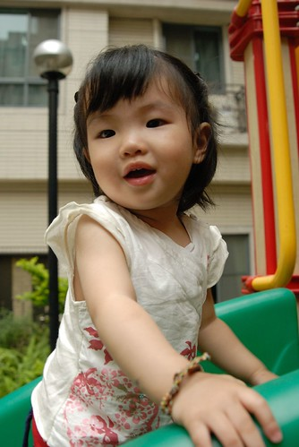
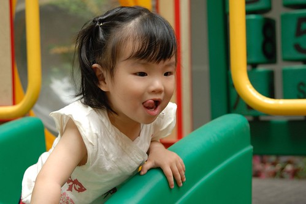
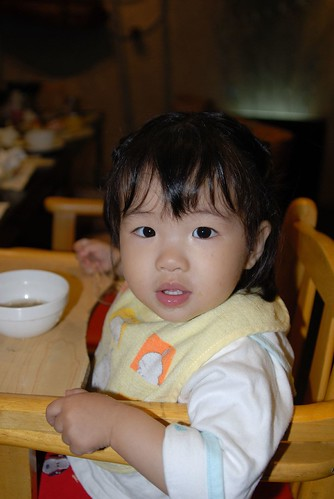
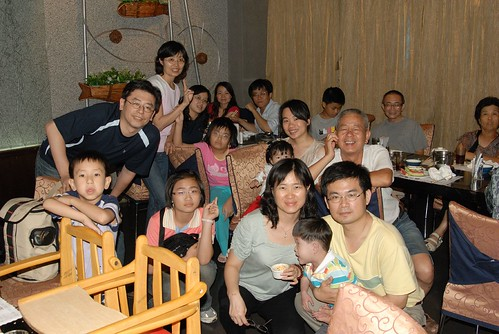
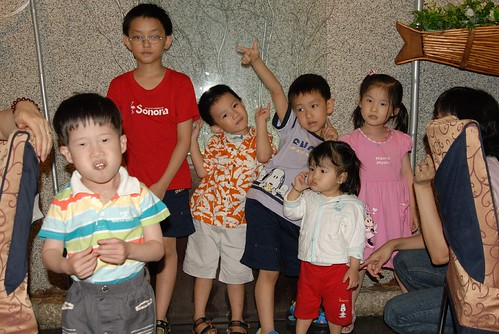

因為徹伯要買新房  徹爸的五個兄弟姐妹藉故相聚新竹  
連徹公徹嬤也遠從嘉義上來  
大家相約 週六下午四點 新竹高鐵站見  
結果就我們這家子四點準時到達    
於是打發時間進高鐵站逛逛嚕~  
  

剛睡醒下車的母子三人依舊睡眼矇矓  (媽媽右眼還長針眼)  
  
  
  
高鐵站晃了10多分 徹伯總算出現 於是跟徹伯先去看新房嚕  
進到社區內 我跟阿徹小愛的目光就被中庭的遊戲區吸引了  
草草看完房子 (真是對不起徹伯) 剛好其餘人也陸續抵達  
阿徹跟小愛就開始在遊戲區玩了起來  
小愛真的比哥哥大膽許多 不常去公園的她看到滑梯也是二話不說的走上去 溜下來  
  
  
  
玩的可開心哩~  
  
  
  
眾人參觀完 也給了一堆意見後(果然出嘴巴都比較簡單)  
就往新竹市內的餐廳用餐嚕 (今天果然是出嘴巴之行)  
聽說今天晚餐的餐廳"東京都"很有名  
是日式自助餐 但是對我跟徹爸這種幾乎不吃生魚片 生蠔的人來說 實在很難撈本  
幸好最後烤蝦 烤魚 烤了不少  要不然實在有點浪費摳摳  
  
原本擔心今天的晚餐沒有適合小愛的東西可以吃  
還特意從陳嬤家帶了兩碗碗稞備著  
結果小愛是全部23個人中 在位子上坐最久也吃的最賣力的那一個  
大人還會起來拿食物晃晃或是聊聊天分散吃東西的注意力  
而小愛從上了高腳椅後 就是陸續的吃著媽媽送到面前的食物  
數個小壽司  半碗烏龍麵  一個日式布丁 半碗綠豆湯 半顆蓮霧  一球冰淇淋  一杯果汁 數十口烤魚  
當眾姑姑 姑丈吃飽撐著 四處串門子聊天之際  
大家都跟小愛的媽說"觀察很久 小愛吃的最認真了 嘴巴都沒停過"  
果然2個小時後把小愛從高腳椅上抱放到地上  
小愛的小肚肚讓大家又忍不住微笑點頭  嘖嘖稱奇  
其實媽媽會一直陸續堆這麼多食物給小愛吃  
主要是要打發她 就算只吃幾口也無所謂 不要餓著就好  
但想不到小妮子真的就是低頭猛幹(原諒媽媽非得用這麼粗俗但很貼切的話語形容 )  
還真的有點擔心她的小肚子會被撐破  也怕半夜肚脹哭鬧  
但幸好除了之後幾天黃金的量有點多外 一切平安  
  
  
  
OHYA~就是這群蝗蟲過境   
五個兄弟姐妹 六個小家庭真的很熱鬧   
真的 有兄弟姐妹真的很好 什麼都無法取代  
  
  
  
小一以下的眾小朋友們   很熱鬧但也真的很吵....  
  

