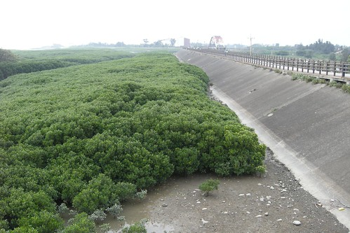

聽張大哥跟陳大哥兩位住在新竹的人講了好幾次 總算總算我們也去新竹南寮漁港騎有名的"新竹十七公里海岸線"自行車道嚕~  

這回去新竹騎車除了因為去新竹張大家探望所以順道外 最主要原因是要測試徹爸想了好久而總算在前一天去台中裝設好的車架 2010年3月6日 徹家車架第一次出任務嚕~~~~ 我想這天絕對是徹家單車逍遙遊的一個重要里程碑/轉淚點 有了車架就更能帶著自己心愛的車去各地美麗的車道騎車嚕~~~~ 我跟徹爸真的挺開心 嚮往的ㄋ...(所以家裡有關單車介紹/旅遊的書快速累積中)

首先就來介紹這個讓對器械很歸毛的徹爸考慮一年後總算下定決心去裝的車架

車架裝好的模樣

兩台車上去的樣子   (可惜車子是汽?場的 有點失真)

平常車架收起來的模樣 外觀上無異

第一次試用 雖然我跟徹爸偶會擔心車子會不會半路掉了或是停車撞到了 總的來說挺滿意的 很堅固也還算好拆卸跟上架 徹爸請了一天假下台中搞定這車架似乎還挺值得的   (有興趣者請洽徹爸)

不過今天只先帶了阿徹的車(帶阿徹的車出門是讓徹爸決定裝車架的最大因素 因為童車難租阿) 以及徹爸的小小摺出門  我跟愛愛的親子車是到南寮之後才租的

海岸自行車道沿途風景果如大家所說很漂亮...

可以看海

有彩虹橋

生態紅樹林

沒有濱海的路段兩旁也是綠樹如蔭

只是騎的人還真不少 得多注意前方以及從後頭殺出的超車

騎了2/3路程後總算看見遠方的大風扇  感覺終點離我們不遠了...

今天不知道是不是因為海風的關係 阿徹常喊累 不行了 所以媽媽努力騎在前頭讓阿徹追  徹爸殿後有個照應 所以阿徹今天的速度有帶起來 常可以騎到17-18了

騎經過大風扇下面時老實講覺得粉恐怖  忍不住加想快速度趕緊通過  呵呵

最後快抵達終點段  風景又另一番風味了

快快快...路的盡頭就是終點處了 衝啦~

啥~還沒衝 還在這... 難得來一趟新竹就讓這美麗的風扇替我們徹家留下點見證ㄇㄟ...

我們花了大約2個小時抵達新竹17公里海岸線的終點 (回程花了1.5小時)

YA~ 沒錯! 以後我們三個人就要開始像這樣子征戰各地的自行車道了

阿~ 還有這個超級跟屁蟲小愛啦

她可是我們最佳啦啦隊ㄋ~

我們相信很快的愛愛也會大到自己騎一台了...跟他哥哥一樣棒....

回程接近南寮漁港處 看見有一長串的接車 這種車子我們在日本的大昭公園騎過一值印象深刻 想不到台灣也有了 只是台灣的車身較長所以靈活度不加 加上道路狹窄實在不是這種接車適合騎的地方 所以有趣歸有趣 但其實很擾民 因為大轉彎時 其他的單車都被擋住過不去啦

今日出擊成功~ 晚餐就靠賞全家吃肯德基炸雞嚕~

路徑圖提供大家參考參考.............

[http://www.bikemap.net/route/404892/widget?width=600&height=400&maptype=2&extended=true&unit=km&redirect=no](http://www.bikemap.net/route/404892/widget?width=600&height=400&maptype=2&extended=true&unit=km&redirect=no) 單車路徑 [404892](http://www.bikemap.net/route/404892) - powered by [Bikemap](http://www.bikemap.net)
