(斷斷續續寫好久本來上週五可以終結這篇的 結果竟然在最後只剩幾張照片的時後瀏覽器當掉 一小時的努力全不見了 老天爺一定是要逞罰我沒有乖乖上班 時間到了也沒乖乖下班 硬ㄍㄧㄥ的下場...) 上週四元宵節的晚上原本想要帶阿徹他們到公園提個燈籠應應景的 最後卻因為天雨只能在頂樓過過小癮.. 不若我們小時候提的大紅紙燈籠(一個燈籠提了好多年) 或是奶粉罐燈籠 或是大孩子的火把 阿徹們從小到大的燈籠都是每年從新莊阿公家拿的制式生肖LED紙燈籠 雖然已經沒有了我們小時後製做燈籠以及提著燈籠去探險的樂趣與年節氣氛 但看到阿徹愛愛能在小小的頂樓上因著一閃一閃的LED燈而雀躍 或許這也是他們這時代的城市小孩所能有的小小幸福與過節回憶吧! 過完元宵 春節也算是正式結束了! 趕緊補上徹家的春節特集 要不然馬上就又快清明 端午了.... 日子在過真的很快地.... 

過年前最後一個週末的例行性打掃時 吆喝了阿徹跟愛愛一起好好的整頓遊戲區 (少的年節味 原來從大掃除這件就充分展露無疑阿) 我打著"過年大掃除"之美名 阿徹跟愛愛只好情願地讓我清掉好些玩具與雜物 連阿徹學期剛結束的書本也給全打包待回收了 望著稍微有整齊些的書桌 書架跟雜物櫃 感覺真是清爽多了... 我們家的年節就由這小小的掃除與隔天的拜地基主給揭開了序曲 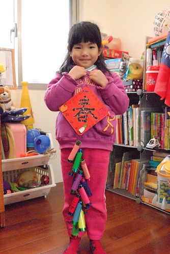 

可能因為透早出門玩有經驗了 所以今年我們竟然在除夕透早就摸黑返鄉 這在之前好多年是根本不可能的事阿! 果然有訓練有差 (愛愛上車後瞬間繼續昏睡 睡到平常假日起床的8點才醒來) 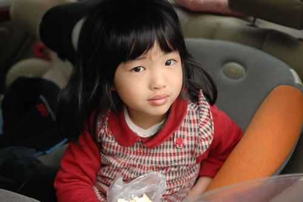

早上6點天都還沒亮 我們已經過了樹林收費站 疾駛在往南的國道3號上 九點左右我們就回到嘉義 阿徹愛愛進家門後跑去找阿嬤時 阿嬤還嚇了好大一跳 今年我們一家子有勤奮 有熱情喔 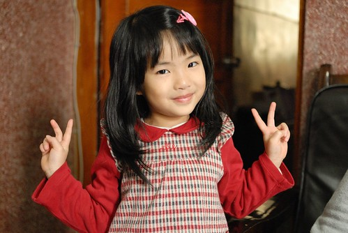

2/2號 一家子團圓的除夕夜 我忙著幫忙阿嬤鋪被子 準備拜拜的東西 阿徹跟小愛則邊玩邊殷殷期待阿伯什麼時後回來... 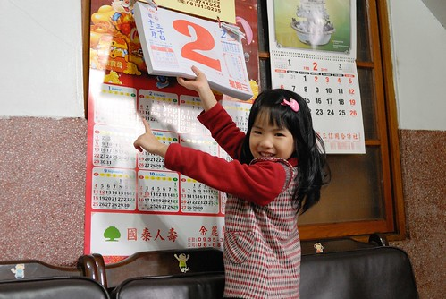

下午一點多拜了祖先後帶阿徹他們去早答應他們的麥當勞吃東西 元旦升旗那天看到DM寫說 過年期間兒童餐的玩具為神奇寶貝 所以那時便答應過年回嘉義會帶阿徹來吃M的 結果我們好像搞錯了 沒有神奇寶貝倒是很多的多啦A夢 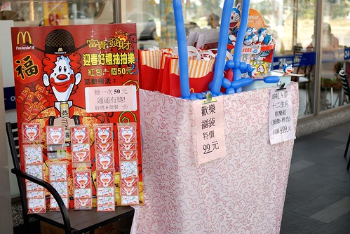

點了二份兒童餐外加一點東西 是阿徹愛愛的中餐 我跟徹爸的小點心 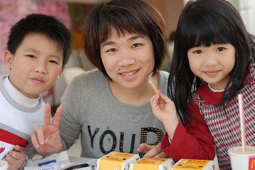

除夕下午的麥當勞沒什麼人潮 有種難得的寧靜 愜意 還不錯! 大小皆歡心 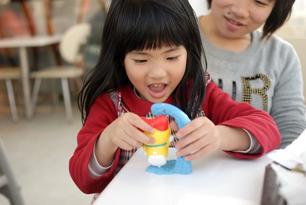

離去時 最近很愛跟各式塑像照相的愛愛 當然也要跟麥當勞叔叔來一張嚕 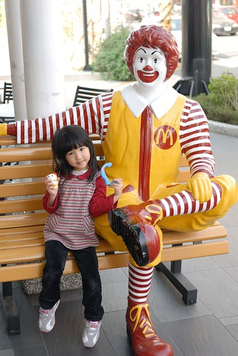

讓我們佇足研究許久的A夢棋樂組最終還是沒買回家  相信沒有A夢阿徹愛愛的新年也會是超快樂的 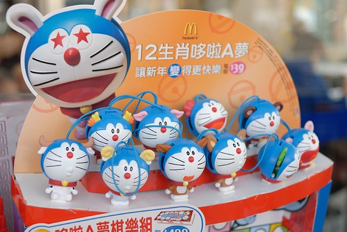

接著我們又去了耐斯松屋拿徹爸之前線上預定的羽絨外套 恭喜徹爸有了生平第一件羽絨外套! 度過一個充滿吃吃喝喝 血拼花錢 超有過年氣氛的下午阿! 花錢買東西應該也算是過年很重要的氣氛之一 (在嘉義越來越多這種用老房子裝修而成的個性小店) 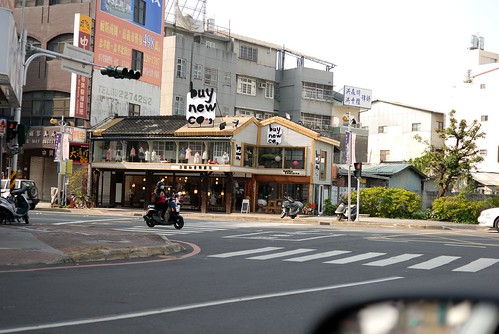

初一早上跟著阿公阿嬤一起去"探墓草" 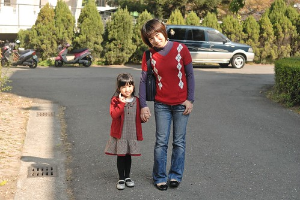

雖然嫁來也度過八個年了 我還是每年都問徹爸"為什麼嘉義人要在初一去墓地阿" 這對於從小到大初一都是去廟裡拜拜的我來說一直挺難習慣的 不過這是全台只有嘉義特有的習俗 可能嘉義人真的特別有情有義緬懷祖先 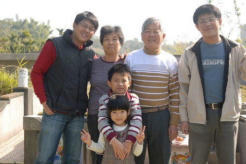

跟著去掃墓的阿徹小愛雖然也是每年問為什麼 但還是都有乖乖跟著一起去 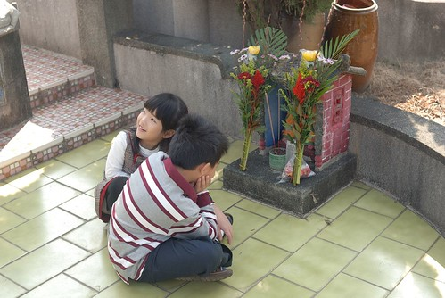

藉由對祖先的緬懷加深家庭的凝聚力  或許是這特有習俗的美意吧! 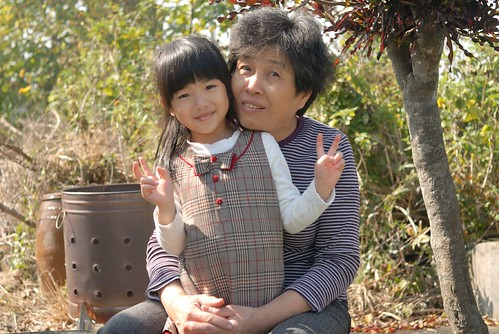

對於在台北發霉好久的我們來說  好天氣下來這曬曬太陽 心情也好的就像去郊遊 呵呵! 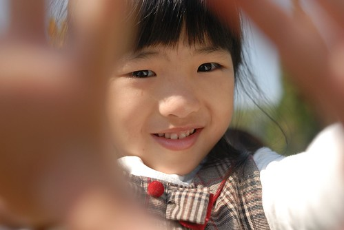

探墓草完 我坐阿公阿嬤的車先回家煮飯  阿徹愛愛則跟著爸爸阿伯去家樂福買wii遙控器 阿徹前一天晚上從我們手上領到的200元紅包 (因為要讓阿徹可以完全自行運用 所以金額很小 不是爸媽小氣啦) 竟然在考慮好些小物後 決定連同之前剩下的40元零用錢 一起貢獻出來買wii的遙控器 他說這樣家裡有四隻遙控器就可以四個人一起玩馬力歐賽車了 衝著這片孝心 媽媽以後不能一直裝忙沒一起闔家同歡了 只是很沒玩電動天份也很不勤於練習的媽媽 每次玩的壓力都好大阿... 都是最後一名

中午吃飽飯 我跟徹爸也睡場舒服的午覺後帶了阿徹跟愛愛去中山公園晃晃 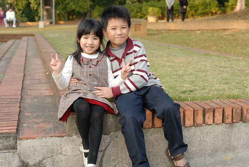

來公園來的很有經驗的阿徹原本心裡打的算盤是要去過年期間才有的市集吃吃喝喝玩玩的 可是爸爸媽媽不愛這種也不願意買單  阿徹煞是難過還頻念著"那要做什麼? 在公園要做什麼" 我說"跟爸爸媽媽來公園就肯定是來公園內散步 玩滑梯 頂多畫個沙話而已 從以前到現在就是這樣 你怎麼會期望爸爸媽媽帶你來公園確是玩那些擺攤的商業遊戲ㄋ?" 阿徹可能想想實在有道理 實在押錯寶 所以後來認份的跟我們單純的走走看看... (兄妹這張照片照的不錯 一附兄友妹恭的樣子 ) 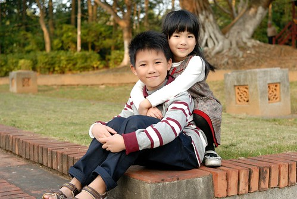

小孩子在玩的時後 徹爸很無聊的搞起自拍 還要這樣搞sense的哩 羞羞羞! 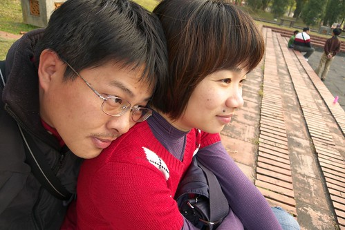

過年前應阿徹的要求說想在初一穿紅衣服(為此還專程在年前就去血拼了) 今日全家的衣服都帶有點紅色喔 (幫父子三人照了兩張 一張小愛閉眼睛 一張阿徹閉眼經 我還是犧牲了阿徹 哈) 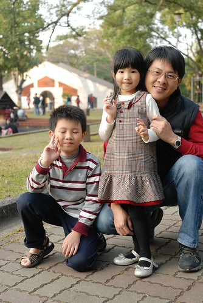

散步在公園內的忠烈祠附近時 跟愛愛說難得穿的這麼漂亮擺些POSE多照個幾張吧 就像新娘子拍照那樣 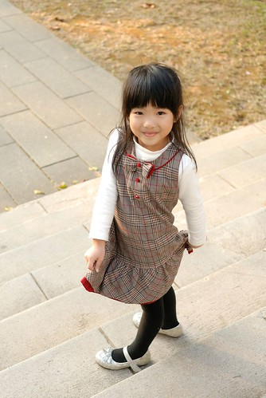

愛愛開心地一張照過一張 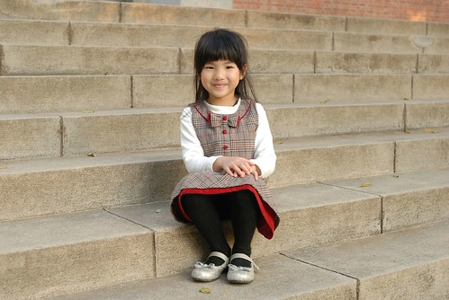

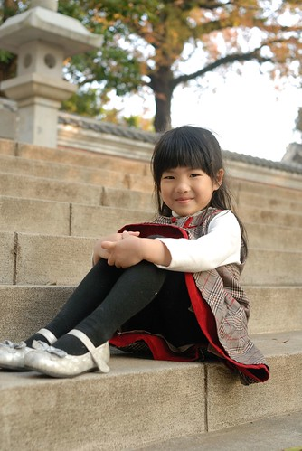

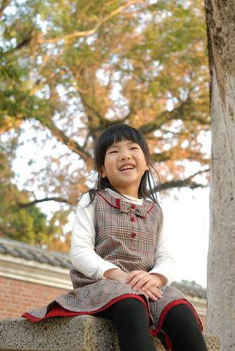

阿徹雖然有點"嗤之以鼻" 但起碼還耐性子陪著 

只是生性調皮的他還是不甘無聊的跑去玩小水溝 上上下下玩的不亦樂乎 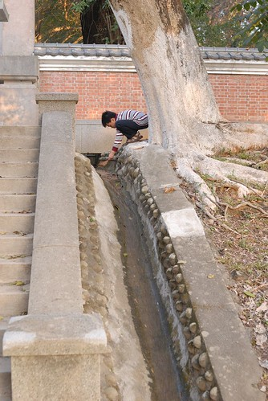

同時間愛愛也照的不亦樂乎 (夕陽餘暉好難拍出來阿) 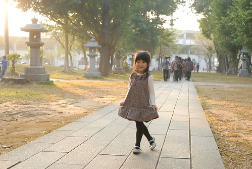

只是怎麼都是這斯文含蓄的笑容阿  都快成一號表情了 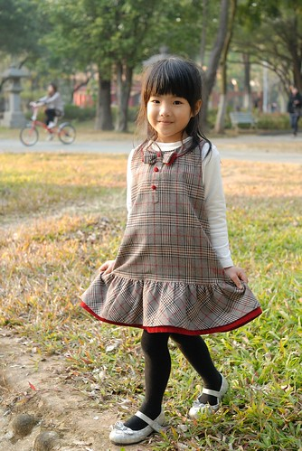

假想一下前面是新娘 後面是新郎 呵呵~ 婚紗好像都這樣拍 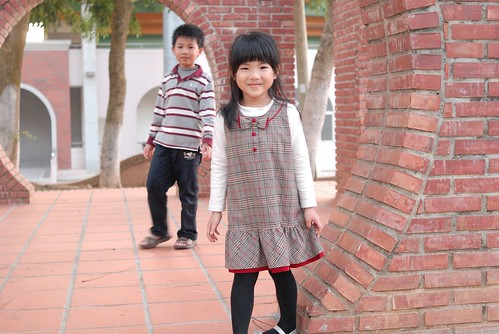

5點多離開公園前 那溫度那太陽那個天 真的是好舒服好美麗阿... 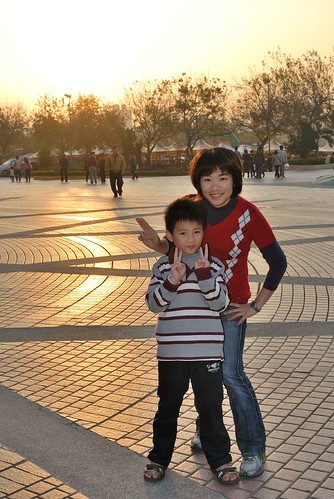

越來越能體會為什麼徹爸以前總會說"台北真不是人住的地方又冷又濕的" 我越來越習慣也喜歡嘉義這個城市了 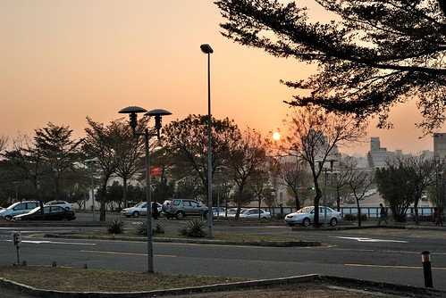

初一晚上徹爸的三姐也就是阿徹的三姑姑回來嚕  帶回了阿徹最愛的瑋瑋哥哥 據說哥哥們從除夕夜就開始吵著要回外公家 而且在初一不論爸媽到哪個景點也不願意下車 一心只想趕緊回嘉義找張小徹玩 而等在嘉義的張小徹為了想要當晚可以跟哥哥們玩晚一些也很破天荒的睡了午覺(晚睡的交換條件) 真的只能說這三個小男生實在有夠臭味相投的.. 從過年前阿徹就開始倒數過年的日子 嘴上念著"好期待過年時的跟瑋瑋哥哥玩瘋" 可是愛愛每次聽到阿徹哥哥這麼說就會忍不住嘟小嘴 她說 "每次他們(三個臭男生)都一起玩 都不陪我... 我一個人好無聊..." 所以千叮嚀萬叮嚀徹哥哥 不要有了兄弟沒了妹妹阿! 爸媽對他玩瘋的忍耐極限就是只要還記得照顧愛妹妹 不要讓妹妹來告狀就好...

第一晚 三個臭男生陪著愛愛玩抽鬼牌 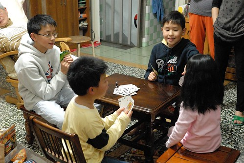

難得會玩的的愛愛玩的很開心 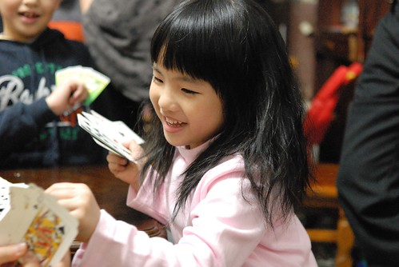

可是在初二一大早三個男生馬力全開後 愛愛開始顯得孤單跟著大人團團轉 (話說愛愛與眾多親友間的應對越來越落落大方了 果然有長大) 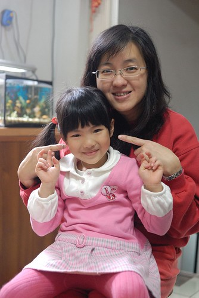

過年年假從來沒有想過出遠門或是單獨的旅遊計劃 除了因為我的人潮恐懼症不愛旺季的人擠人外 最主要的原因還是因為覺得過年就是該在家裡跟著爸媽一起過 即使每天都是吃吃喝喝 除了睡覺外一張嘴總是吃個不停的墮落日子... 這幾年阿徹愛愛回嘉義的時候不是跟阿公阿媽出門玩就是跟其他的哥哥們玩 很少會跟在我們身邊 因此我的年過的越來越單純 就是煮飯&煮飯 然後空檔時間就是看漫畫或是跟親友哈拉或是跟徹爸出去小晃一下 雖然很單調但我還蠻享受的說... 尤其看到一大家子把滿桌的菜吃光光時便會更加肯定自己的存在價值 呵呵!

自從徹爸知道我們家過年習慣會上廟裡拜拜後 徹爸這兩三年過年都會刻意帶我去嘉義的廟拜拜 初二下午小孩都跟著阿公阿嬤去公園後 我跟徹爸ㄅㄨ著小50機車去城隍廟拜拜 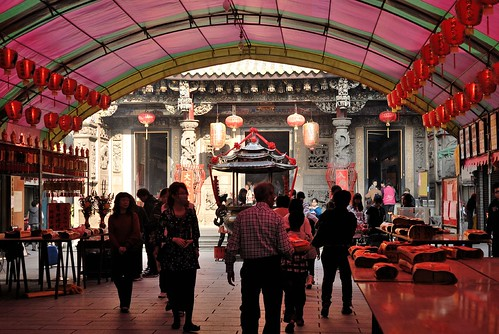

其實我們根本不懂拜拜的規矩 (香點好後兩人不知道從哪拜起 還打電話callout給在公園的張嬤) 也不是很迷信"這方面"  純粹就是覺得有拜有保庇  一個過年的形式意義 希望家人在這一年都能夠平平安安 健健康康 一切順利 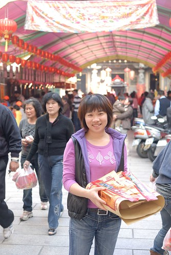

然後我們繼續ㄅㄨ著車到蘭潭逛逛 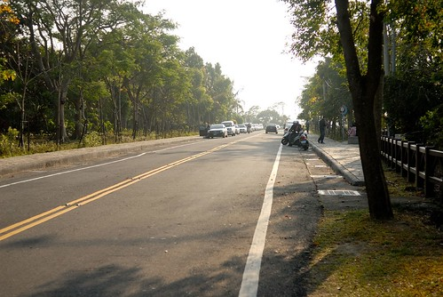

這幾年的蘭潭被重新整理的很漂亮 風光挺明媚的說 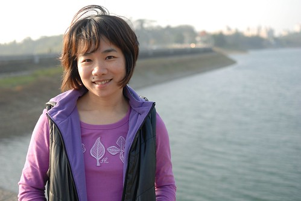

真的! 在南部好像最多的就是水庫類的風景區 烏山頭水庫 曾文水庫 嘉義的仁義潭 蘭潭 好像每個南部人的家庭旅遊或是情侶約會回憶裡 總會有幾張攝於水庫的照片 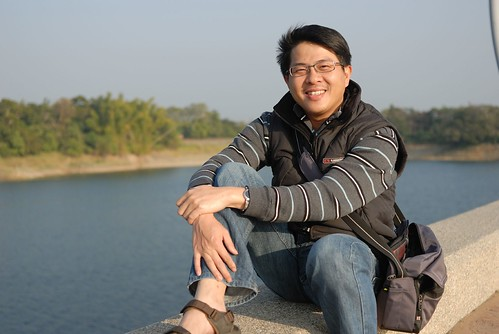

我跟徹爸的回憶則是從壩的這頭散步到那頭 再從那頭慢慢散步回這頭 很是愜意 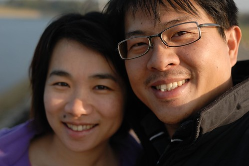

找個機會兩人再來個單車環潭回憶 應該又更是難忘... 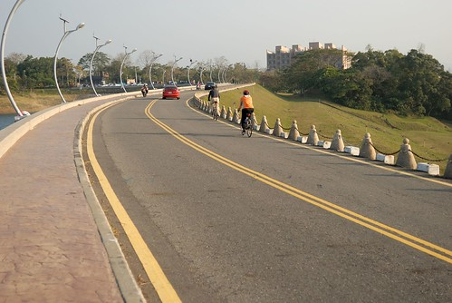

去年買的仙女棒在我家儲藏室堆放了一年 今年加碼徹爸團購的高空煙火 準備讓今年的過年精彩一晚 初二晚上先是拿了一些仙女棒讓小朋友在頂樓小玩 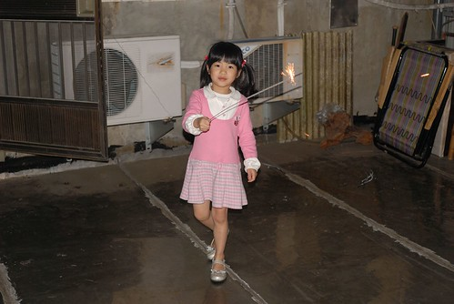

膽大的愛愛玩的開心但是膽小的阿徹卻躲在二樓 標準的惡人無膽 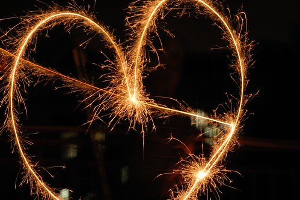

不過阿徹這一年吃的膽識升級不少 辣的酸的越來越百無禁忌 連嘉義的名產炒鱔魚麵(小辣)也跟著吃的津津有味 大呼真是太好吃了 尤其是那個柴魚湯連愛愛也愛 初一晚上三姑姑們回來後便開始的鱔魚麵消夜連開三砲 尤其初二那晚的12碗真是太壯觀了...大家不是都喊太飽吃太多了嗎 怎麼還都照吃不誤阿...過年真的好像在養豬喔 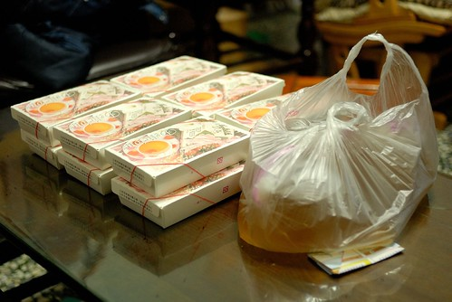

可能看大家在家吃的太不像話 要洗的碗也多的不像話 年初三早上張嬤在接了翁小舅(徹爸的小舅)的電話後 吆喝大家一同去小舅的山上小屋玩去 張嬤說"去給人家請客 就不用一直煮了"  嗯...這真是個好辦法阿... 不過怎麼張嬤說的下梅山交流道後走一陣山路就會到的地方 竟然是連續2小時的山路阿 那個路迢遙的讓大伙有種上當的感覺... 不過辛苦是有代價的  來到的地方真的仿若隔世的原始山林阿 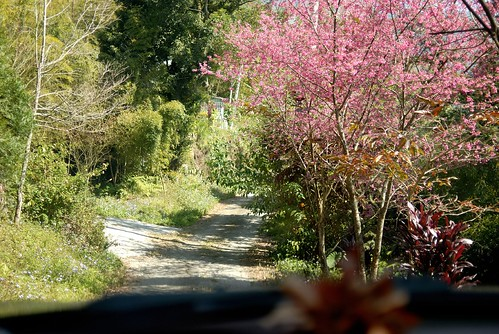

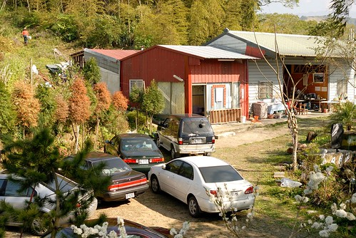

抵達時已是12點多 只要是"女人"趕緊都進廚房幫忙張羅午餐去 祭好大家的五臟廟等會才能好好暢遊 (真的覺得過年就該是這麼多人一起吃飯才熱鬧才有年味阿) 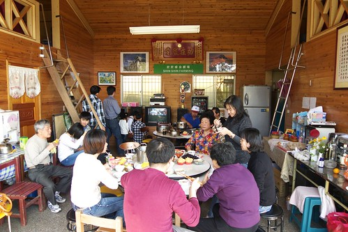

吃飽飯後 翁小舅當起解說員帶著大家逐一解說園裡的一草一木 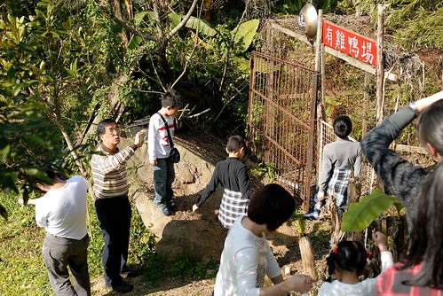

這個時節就如翁小舅媽電話中所言 桃花紅李花白煞是美麗阿 紅的是桃花 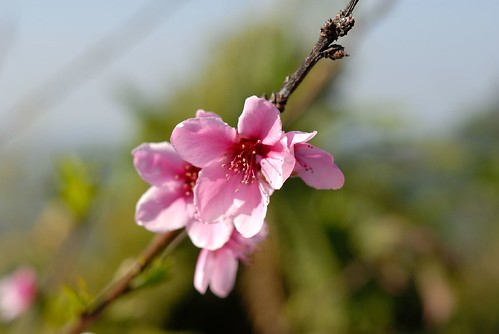

白的是李花 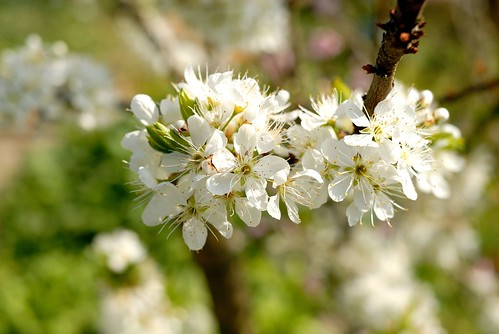

而這是四季豆的花 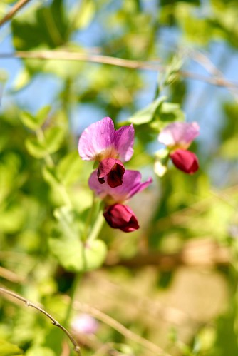

農場裡還有個觀景亭 據說可以看到三個縣市的夜景 雲嘉投 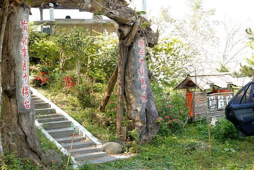

亭子裡還有翁小舅那群文人雅士朋友們的題詩 超有FU的 只是翁小舅這樣投入的解說 卻被我們這群毛頭小子亂提問一通 不知道有沒有秀才遇到兵的無奈 (據說那些書法是由小舅中一中的同事所寫 有名的書法家 一個字市價2萬元) 

翁小舅是張嬤唯一的弟弟 家裡小孩眾多 排行最小的她們兩個從小感情就好 兩家子也一直都有密切的往來 徹爸家的任何大事就也好像是翁小舅家的大事 難得的可以一大家子一起來找小舅聚聚 說說笑笑 我跟徹爸都覺得超讚的 

少了張二姐家的其餘四家子全家福還是很熱鬧 真的 每到過年徹爸的五個兄妹都在同一屋子的時後會讓人深深感覺這就是兒孫滿堂阿! 很恐怖但很幸福 

今天我跟愛愛一起穿母女裝 愛愛開心的說"我們穿一樣的衣服 一樣的牛仔褲 一樣的布鞋 我們是好朋友揶" 

好朋友要多照幾年以茲紀念 

好朋友的共同重要男人也要一起來照個相 

ㄟ..這個哥哥也難得地出現在我們身邊了(其實是硬被媽媽抓來的) 

逛完山莊後大人們坐在園子裡繼續聊天打屁 小人則是在房間裡大玩起來 (徹爸跟張大哥家的小晴晴 很黏叔叔喔...誰都不給抱就是給叔叔抱) 

一群小人就是有本事到哪都可已鬧到屋頂快被掀起來了 

我說這是我看過愛愛最好的一個鬼臉了 

雖然翁小舅一直極力勸大家要留下來住一晚才不枉這一趟 但沒有任何準備的大家還是趁天黑前下山 回到嘉義7點多草草吃個晚餐 一夥人到附近的八掌溪畔放煙火去 第一次玩高空煙火  大家被那猛地煙火聲嚇地心蹦蹦跳 站在煙火下的感覺真的超級震撼的 

然後我們家3個人(徹爸負責照相不算)加張三姐4人 再加張大哥1人 總共8個人玩了3-4輪的仙女棒 首先是畫圈圈 暖身一下 

然後是1-8的數字  愛愛寫1 我寫2 阿徹寫3 寫了好多次 負責寫5的三姑丈一直寫不好被警告 結果好不容易5寫漂亮了 原本該寫8的張大哥卻ㄍㄟ 熬的寫5(而且還寫反了) 所以最終還是沒能留下完美的1 2 3 4 5 6 7 8 不過一群人一起玩仙女棒真的好好玩 明年要多準備些... 

最後的一根用愛心來結尾 可惜困難度太高 大家表現不佳 呵呵! 

小人們聚在一起的最後一晚 把握時間大玩特玩 戰鬥陀螺大戰 

看到愛愛的陀螺一直被哥哥們的打出去 阿嬤說愛愛的下手力氣太小且戰鬥台太小很容易就被打出去  因此阿嬤拿出大臉盆幫助愛愛... 

果然愛愛玩地更開心啦 

年初四白天小人除了玩還是在玩 而我一樣努力地K我的鄰家女孩 最後一天大家都要好好把握 下午後回娘家的姐姐們陸續回家去 原本鬧哄哄永無整潔的家突然間安靜地有點令人不習慣.. 剩下我們與張大哥家一口  晚餐簡單地只煮蘿蔔糕湯(這好像也是過年必吃的一味) 而飯後阿徹也總算拿出他帶回來的大富翁背包客跟阿嬤還有伯母同樂 

玩完這一盤就要早早上床睡覺去 隔天(初五)好再早起早上路回台北了 六天的年假就這樣咻的一下又過完了 謝謝嘉義的好天氣 徹爸家的一大家子人帶給我們這樣的好年!
