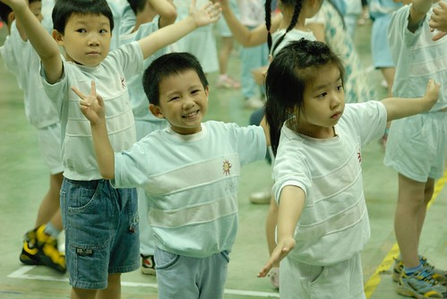
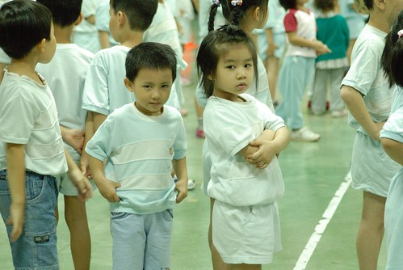
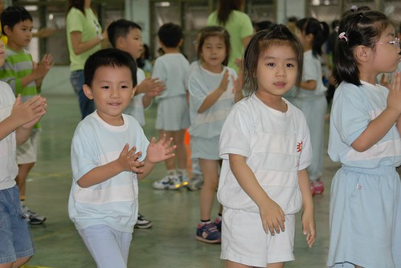
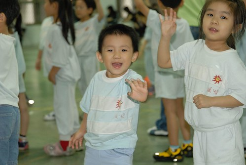
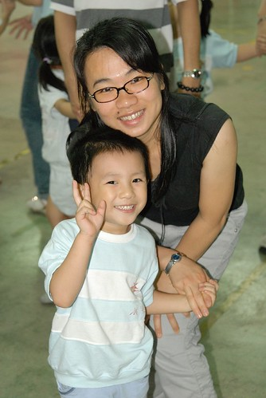
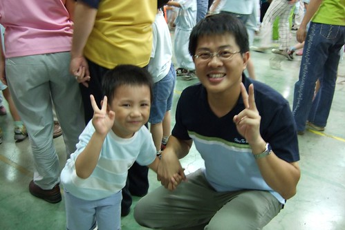
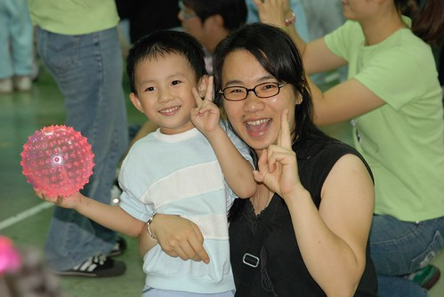
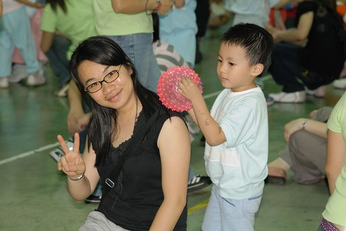

今年阿徹學校慶祝校慶(其實應該是慶祝母親節啦)的方式是運動會  
幼稚園的運動會當然不會有讓大人小孩殺的眼紅的競賽  
倒像是給爸媽上了堂自家小孩每週都會上的體能課  
一個半小時唱唱跳跳 來回奔跑嬉戲下來 還真的有點累人哩  
原來當爸媽不止要會上知天文下通地理 還要有驚人的體力與耐力阿  
  
運動會一開始是各班小朋友的集合及大會入場  
然候是小朋友的大會開場舞  
可能真的太像平日的早操與體能課模式  
小朋友們絲毫不扭捏的搖頭擺手 扭腰甩臀  
每個現場的父母應該都會像我跟徹爸這樣訝異於自己小孩的大方表現  
才明暸"原來小孩子平常在學校是這模樣阿"  
  

第二首大會舞是"足球小子"  曲末小朋友們要擺出個神氣酷酷的POSE  
咱家阿徹卻一附要用眼睛殺人的樣子 凶狠的哩  
而他隔壁的麻吉 Apple小姐的凶狠樣也不輸阿徹  
兩人這樣擺在一起竟然有幾分史密斯任務裏小布夫妻的味道  
殺手出招 眾人小心阿~  
  
  
  
今天的運動會裏 阿徹很high 超high  
也許平常在學校裏就是這模樣吧  
也也許今天跟他的超麻吉密友Apple Elle一直排在一起所以超爽  
班上四個小蜜蜂 二男二女 另一個男生Thomas今天因故未出席  
只留阿徹獨享齊人之福 難怪龍心大悅  
  
  
  
High喔~ 開心喔~  
  
  
  
接著上場的是今日的重頭戲 親子趣味競賽  
第一關  母子牽手大隊接力 雖然娘跑步速度不佳 但在這小朋友的場子還能遊刃有餘啦  
  
  
  
第二關是由兩對親子搭檔 家長如抬轎般的扛著坐在上面的兩個小皇太子或公主  
而且還要邊走邊上下來回  
一聽到這麼苦力的差事 當然馬上喚來徹爸當轎夫  
這是徹爸今日唯一參加的一樣活動  其餘的好康都是讓媽媽我撿去了  
  
  
  
說好康也不如說是犧牲色相 搔首弄姿啦  
打大學離開社團後就再也沒在大庭廣眾之下隨著音樂搖擺 唱唱跳跳  
幸好年紀越大臉皮也越薄 也幸好媽媽反正本來就不走高貴優雅路線  
跟著兒子這樣點點腳 拍拍手 轉圈圈 扭腰擺臀 還不會太難為自己  
  
  
  
辛苦了一下午 喚得寶貝兒子的按摩  這汗算是沒白流啦  
  
  
  
據一旁顧小愛兼照相的徹爸說  
很奇怪 如果是女兒幾乎都是爸爸下場陪玩  
男生的話則就是媽媽搭檔  
難到女兒真的比較親爹 兒子比較親娘 怪怪齋
