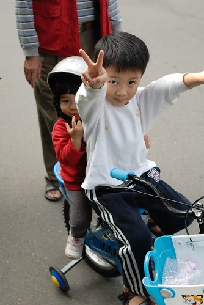
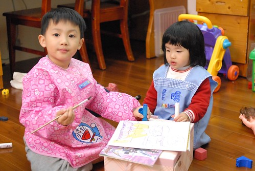
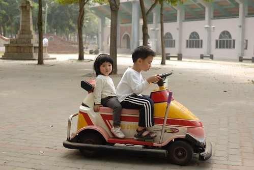
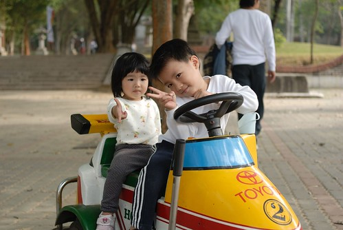

隨著小愛上幼稚園後語言的大爆發與腦袋的大開竅  
阿徹與小愛這對兄妹倆真的越來越有伴也有拌(嘴)了....  
  
哥哥已經可以吆喝妹妹一起去玩辦家家酒  
 一起去做一件事甚至一起反抗爸爸媽媽的嘮叨  
但兄妹倆的爭執不合以致口語上或肢體上的暴發衝突也越來越常見  
尤其當一家子在從嘉義回台北的長途路程上 盼望著趕緊回到小窩的時候  
兄妹倆為了一點誰摸了誰 誰碰了誰而告狀甚至借題發揮哭鬧時  
真的會讓我跟徹爸很想拆散這對兄妹倆  
"既然這麼愛吵 那看誰住在阿公阿嬤家好了..."  
問阿徹"你住嘉義好了"  阿徹說"不要"  再問"那妹妹留在嘉義好了" 阿徹又說"不要啦"  那還吵...  
只是小愛比較狠心點 問她住阿嬤家好不 會無辜的說不要   
可是若問"那哥哥住阿嬤家好了" 小妮子有時候會點點頭的說"好呀"  
好勒~妳哥真是白疼妳了~  
  

其實我覺得阿徹哥哥算是蠻疼愛妹妹的  
雖然每每妹妹跟他搶書搶玩具的時候 還是會唉唉叫跟媽媽告狀抱怨  
而爸媽總是說"你可以不要給妹妹 讓她哭也沒關係 但是我們還是希望你讓妹妹..."  
但阿徹心甘情願讓出的頻率越來越常見  
甚至常常可以用點無奈有點愛惜有點無所謂的表情說"好吧" 後拱手讓出  
反倒是小愛妹妹的強烈秩序感  自己的 別人的東西劃分很清  
尤其是自己的東西 連爸媽都很難肖想要碰一下  
所以常可以聽到小愛大喊"妹妹的..." "我自己的..."  
  
當小愛死守著她的聖誕禮物--米妮收銀機   
不讓任何人摸一下更別說玩的時候  
阿徹哥哥只能在一旁猛流口水 眼淚快垂下來的說"為什麼妹妹都不讓我玩"  
甚至拿到禮物的隔天早上竟然很難得的早起半個鐘頭好偷玩妹妹的新玩具  
(我前一天晚上就有猜到 想不到真的發生)  
然後玩了好一會後竟然用著有點無趣的表情跟我說"自己一個人玩好無聊喔 想跟妹妹一起玩"  
可是等妹妹醒了後竟又換得妹妹無情的小氣對待   
講真的 阿徹哥哥真的很受傷....  
  
  
  
那天去接兄妹放學時 剛好聽到阿徹老師Freda說"阿徹很會照顧女生 照顧妹妹哩"  
原來有一次小愛在遊戲區玩球池(球池高度遠高於小愛個子) 阿徹哥哥都在旁邊照應著她   
等到關燈要結束遊戲時間的時候 小愛喊著"哥哥 哥哥..."  
然後哥哥就牽著妹妹的手 小心翼翼的從球池出來  
Freda說看到那一幕 真是"感心"阿....  
  
那天回家後當小愛又不讓哥哥碰她的新玩具時  
我跟小愛說"哥哥在學校是不是都會照顧妳 帶你去玩溜滑梯 玩球池 可是你都不跟哥哥一起玩玩具 他會很難過 以後可能就不想照顧妳了喔"  
小愛沒說話可是願意跟哥哥輪流當老闆玩收銀機了 (我跟徹爸還是不能玩)  
雖然隔二天後小愛又很小氣不讓哥哥玩了  
但起碼似乎有聽進去一點"哥哥有照顧她"這點了  
  
  
  
昨天在車上 阿徹哥哥不知道在跟妹妹說著什麼事情  
然後在前座的我們聽到後座兩人熱烈的爭執著  
阿徹哥哥說"你....沒有...."  
小愛妹妹說"有.."  
阿徹哥哥又說"你..沒有..."  
小愛妹妹用著大人般的堅毅與生氣說"有啦..."  
我跟徹爸聽的又好氣又好笑  
我們家的妹妹真的長大了 已經長大到會跟哥哥用嘴巴吵架了  
看來我跟徹爸的耳根越來越不能清淨了  
不過能有個一起拌嘴的玩伴可是再多的玩具也換不來的  
是當父母的我們所能盡的最大義務與責任了  
  

