聖誕節 在我們家還有一個說法是愛的滿月日 每年過完10月 愛就會開始很期待很開心11月底的生日以及再一個月後的聖誕節 歡欣的情緒因著二個重要日子延續很久... 趁著滿月日前 趕緊補上愛愛的九歲生日小紀錄!  

11/25FB: "今天是愛的生日，雖然不是吃蛋糕的歲，但全家一起度過紮實開心的一晚! 從壽星點餐之海鮮焗飯、爸爸的陪下象棋、徹哥的不能吃蛋糕、搔癢取代枕頭大戰之睡衣趴，到爸媽破例的今晚同房睡覺! 我們家的公主，祝你生日快樂! 許願成真! " 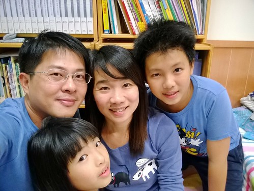 白醬海鮮焗飯是愛愛一個月前就跟媽媽點的生日餐 這是媽媽第一次做的菜色 愛愛說比瑞穗綠精靈的焗飯還讚喔! (對媽媽的莫大鼓勵) 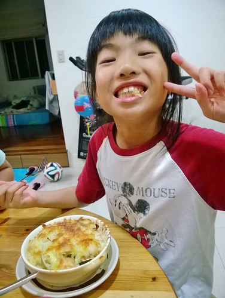 吃飽飯後的空檔 愛愛請爸爸陪她玩了幾盤象棋 窩在我們的房間裡享受甜蜜父女時光! (爸爸還故意學愛愛咧嘴照相的模樣) 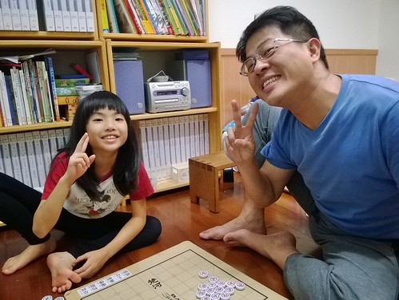 徹哥從好幾天前就開始費心準備妹妹的生日禮物 雖然每天都在捱不住漫畫誘惑下進展緩慢 但總算在生日那天的閉門趕工後端出一盤蛋糕 逢5倍數才能吃蛋糕的小孩  看到這份不能吃但也誠意十足且美麗的蛋糕好開心! 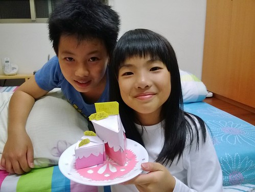 家裡整修完後 徹愛總說爸媽的房間好像民宿好讚 於是媽媽破了十年來的堅持 開放以後每個月一天的讓徹愛來爸媽房間同睡覺 11月徹愛挑了妹妹生日這一天 大家洗完香噴噴後 在這唱生日快樂 舉行小小生日之搔癢趴(媽媽不准枕頭趴 兄妹倆轉而改搔癢趴) 看愛愛被哥哥搔到極處甚至有點被獰虐的感覺  沒想她卻直喊著還要玩 這搔癢遊戲還真虐心但卻甜蜜蜜阿 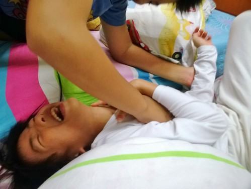 這個生日夜就如我們家向來的風格 平凡但踏實! 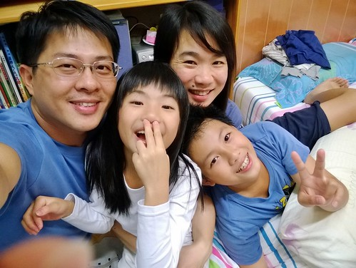 只是話說愛愛越大越調皮 男生性格 完全沒想到也難以接受她在全家福自拍時來這麼一招手插鼻孔  氣質蕩然無存....  愛愛就如她口中說的 要當個有一點愛漂亮但是很帥氣的女生 不只穿著越來越有想法 心思 個性與表現也努力表現她自己! 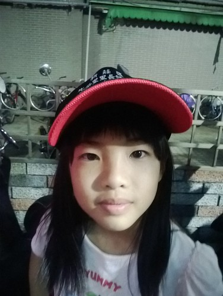 這幾個月媽媽的繁忙加上家裡曬衣場移到廚房邊的可近性 愛愛越來越是媽媽的小幫手 好幫手 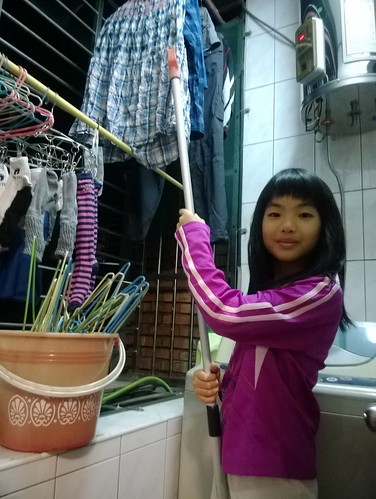 可以獨立作業的幫我收衣服 摺衣服 歸類衣服 也會幫我洗米與已經熟練的撕豆子 揀菜 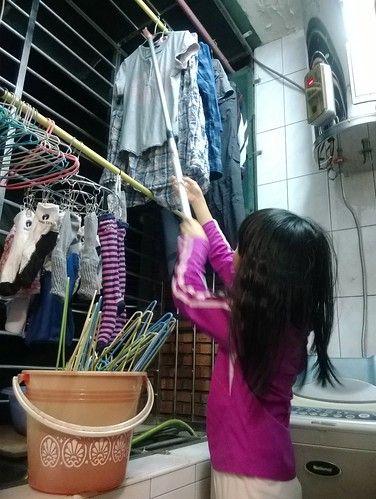 雖然有時也會貪玩的小小抱怨"會做家事好像也不是太好的事" 但愛愛可以接受媽媽說的"如果可以幫忙家事 對她是種學習 對媽媽更是很大的幫助" 然後如在學校般的盡力幫老師 同學 媽媽做她可以做到的事 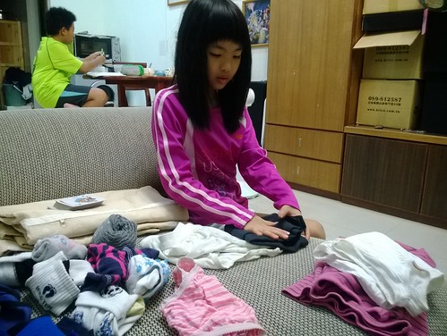 11/20 FB: "昨天陷在百貨週年慶裏的媽媽快趕不上晚飯的備餐時間，靈機一動打電話回家請愛愛先洗米下去煮，於是媽媽回家後半小時，晚平常十來分鐘時間一樣開飯嚕~ 話說電話是徹哥接的，怕他難轉話索性要他讓愛洗3杯米，接到任務的愛還打電話問我"可是平日最後一杯米不是都只有量到120(3/4杯)"，然後幫一家子煮了一鍋份量剛好又軟硬適中的好吃白米飯! 真是多學多做，但媽媽好欣慰也難以置信... " 這是第一次愛愛在沒有我指導下煮了一鍋飯 相信她的成就感絕對不亞於媽媽心中澎拜的欣慰! 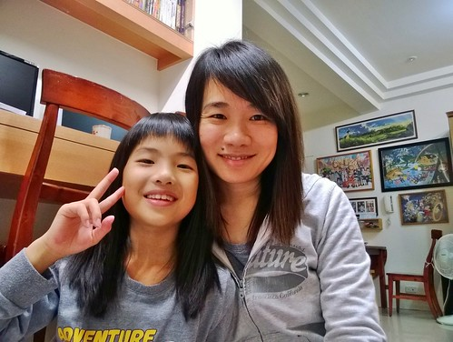 養女兒與兒子不同的成就在於 看著一個女生跟自己越來越像 不論外在還是內在... 有女兒真的很好!!! 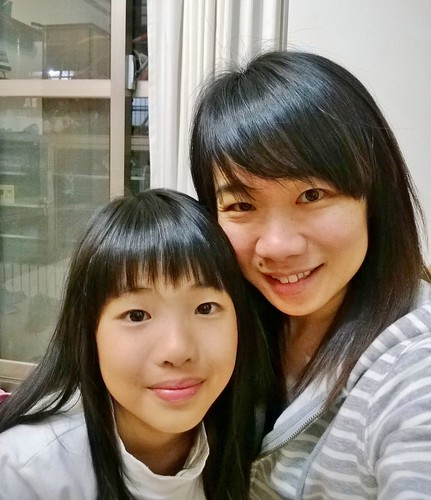 前陣子愛愛的作文題目是"我的家庭" 喜歡她筆下描寫的我們 有她獨門的觀察與特點  而且筆觸又一如我們家風格的平凡踏實 但讓人心頭好暖~ 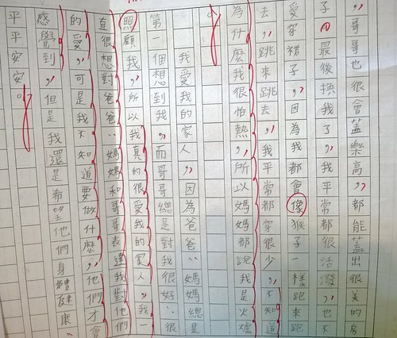 我們都喜歡我們家這個女孩 感謝她是爸爸 媽媽 哥哥的最愛 就如每次女孩總愛問"為什麼我叫這個名字阿" 我說"因為你有好多愛阿!" 因為值得愛 所以有愛真的很有愛! 有愛! 生日快樂!!!  雖然也越來越難以想像女孩接下來的銳變....
