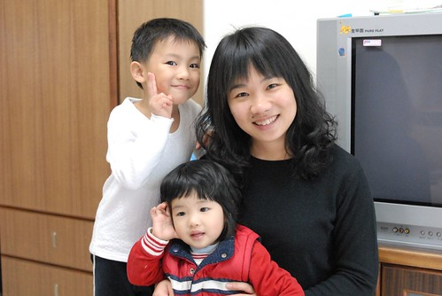
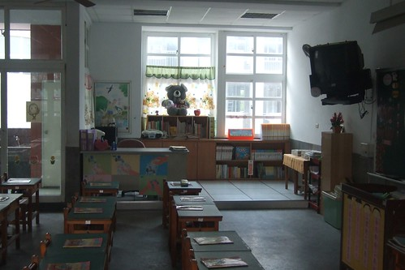

  
  
  
這在做啥 看的出來嗎...    
阿徹蓋的廟啦~ 他說他要拜拜  
可能因為常被罵被處罰所以想要拜拜 請神明多保佑吧  
除了供俸三尊米奇米妮神仙還誠心誠意的準備五果(五樣水果)祭拜  
雖然漏了茶水 但請諸仙們念在阿徹插了一大把香(只差沒燒金紙了)  
就多保佑他吧  阿彌佗佛 善哉善哉~  

  
  
阿徹對於公主一直有著高度喜好與幻想  
所以希望媽媽妹妹頭髮長長的 最好每天都穿上美麗又粉嫩的裙子  
這回媽媽鼓足勇氣改變了好多年的直髮  
燙出捲捲髮當浪漫小女人  
這下子更成了阿徹心目中那美麗的公主了  
趟回來的那天一進們  父子女三人都睜大眼睛看著我  
徹爸的眼神寫著"ㄚ...你怎麼變這樣..."  
小愛害羞的望著我傻笑  
阿徹則是滿臉驚喜的 張大嘴想說卻說不出來的直衝著我笑  
徹爸拿出相機要幫我拍下剛出爐的新造型時  
阿徹又害羞又客氣的問我"我可以跟你一起照嗎"  
哈哈...很像被閃到的情竇初開小男生  
後來用照片時才發現阿徹的表情是多麼的得意ㄚ  
真是好個"吾家有母初長成"的喜悅  
那天下午阿徹還突然說要送我個禮物  
因為他說"媽媽我覺得你太棒了 你的頭髮真是太美麗了"  
呵呵~兒子的填嘴巴果然化解不少媽媽對於新造型的不安   
(等位子吃飯的阿徹未免太愜意了)  
  
  
  
上次回嘉義的時候跟徹爸去他的母校 宣信國小晃了晃  
  
  
  
徹爸說一樣的老樹  
  
  
  
一樣的遊戲設施  
  
  
  
一樣的溜滑梯  
  
  
  
一樣的教室走廊 洗手台  
  
  
  
這是新蓋的教學大樓一樓的一年級教室  
覺得現在小孩真的很幸福 班級人數30左右顯得教室很寬敞  
而且多了很多人性 溫暖的設計  
望著裡面的小桌子小椅子竟然有點感傷起阿徹就也快要上小學了  
很難想像這樣的皮小子有一天得揹起重重的書包  
每天得正經八百的坐在教室裡 過著大團體生活  
真的給他很擔心 很不可思議  
  
  
  
教室佈置完全顯現老師的不同風格與用心度  
能有這種小小讀書區的教室感覺溫暖 活潑許多  
能夠在這樣環境上學應該是件幸福的事吧  
  

