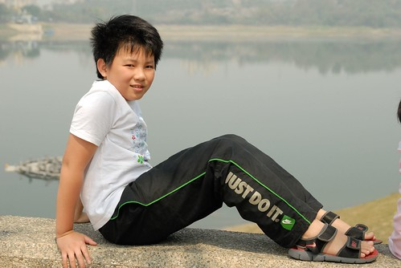

這個三月 阿徹給了自己兩個很大的突破與挑戰 首先是阿徹決定同愛愛一起再去上幼稚園附屬的舞蹈課 再來是自告奮勇 代表班上參加年級語文競賽中的朗讀比賽 雖然朗讀比賽結果不出我們意外的名落孫山 但我們十足肯定阿徹的勇氣與付出 \[youtube https://www.youtube.com/watch?v=4yOcuE4bv38&w=560&h=315\]

幼稚園中班開始到小學一年級結束 阿徹都有上幼稚園裡的舞蹈課 從初階班上到進階 然後國小時後的高階班 高階班的時候阿徹甚至是萬花叢中的一點綠 如他說的每次表演他可都是第一男主角ㄋ 不過在二年級後阿徹還是因為全天課太累 加上害羞吧  決定不上舞蹈課了 那時候舞蹈老師還跟他說"沒關係! 等你想再上的時後 隨時再告訴老師" 這麼一晃眼三年過去了 阿徹的骨頭變硬了不說 連人都一整個壯了起來 雖然我們偶而會鬧他說"因為沒上舞蹈課 所以變胖了" 也給了他再上舞蹈課的誘因 但我們明白他很不可能再去跳了 沒想到過完年後 有天阿徹卻一臉堅毅的告訴我"我要再去上舞蹈課" 哇! 好重要 好另人開心的決定阿!  我趁著他改變心意前趕緊告訴了老師 於是三月的第一個星期四阿徹跟著妹妹一起去幼稚園上舞蹈課 我們光想全部7-8個都是一二年級的小女生 就他一個這麼大個的大男生的畫面 就覺得可愛 而阿徹的心情則是如他告訴我的 期待又緊張阿! 但沒想到當我去接他們下課時 阿徹紅著臉 流著汗 第一句話就告訴我"好好玩喔" 我心裡更是開心又欣慰 也明白阿徹這個舞蹈課是上的下去了  同時也要來幫阿徹買舞褲跟舞鞋了 而接下來的每星期 阿徹也都期待著星期四的舞蹈課 雖然他都說因為可以欺伍小女生很好玩 但我還是想相信他是因為飛揚所以這樣期待與開心!  

話說三月初有天阿徹回家後告訴我他要參加朗讀比賽 我本以為是班級內的資格賽 因為怎樣都難以相信他有資格(能力)可以參加語文類的競賽 跟他再三確認 問詳細後才明白原來四年級有個語文競賽 包含有寫字 查字典 台語  演說 朗讀等項目 班導師在跟班上說明後 請有意願參加的同學舉手 阿徹在朗讀項目舉了手  於是乎在沒有競爭對手情況下 阿徹得以代表班級參加朗讀比賽 說到這 大家是不是都想給阿徹的老師拍拍手 啪啪啪~~~ 阿徹老師沒有為了得獎而選派最優質的同學參加 反倒是徵求有意願的志願者 給像阿徹這樣絕對不算優質的學生一個機會  身為家長的我們怎麼會不感動... 只是說我們還是很訝異阿徹怎麼會突然這麼有"企圖" 有勇氣ㄋ (話說阿徹能參加的項目 也只有朗讀還勉強上的了台面) 短短兩週的準備時間裡 聽說每天都要利用午休時間讓老師指導以及自己練習 回家後也偶而會請我們聽聽他的朗讀 老實說第一次聽他的朗讀時 我聽得滿腦子汗 ㄓㄗ不分加上完全不生動的平鋪直述 還會有點結巴 這....怎麼去跟人家比阿!! 沒想到一週完全沒聽他在家練習後 比賽前兩天當他再請我們聽他的練習時  哇~有模有樣了ㄋ.. 雖然我們心裡當然明白這樣的水準離得獎還有很大一段距離 但看到阿徹認真又誠懇的模樣 還念到汗水直流 我們一家子給予他熱烈掌聲! 而老師也在比賽的通知單上留話告訴我們"阿徹的聲音好好聽 平日也有練習 Good! 如果捲舌音清楚會更好"

最後的比賽結果當然沒出意外 只是比賽那天放學後 當我跟愛愛在校門口接阿徹時 一旁同安親班的女同學(得朗讀第一)竟然在阿徹經過她身旁時 比著阿徹笑著說"哈哈~ 沒有名次的人" 那時候阿徹的臉好失落 雖然我摟著阿徹跟女同學說"願意參加就很有勇氣了 不應該這樣嘲笑人家" 但我明白阿徹的心裡很受傷 果然阿徹低落了好些天(他是那種心情不好就會反映在功課與表現上的人) 甚至還跟我說"早知道沒名次就不要參加了" 我很嚴肅的跟阿徹說"比賽不是那麼容易就能獲獎的 你也都知道自己捲舌音發的不夠好 而且經過這樣的練習 你應該很高興自己可以進步這麼多 念的這麼好聽了 而且我們全家人陪你一起經歷... 不應該因為沒有名次而否定這些過程" 阿徹好像聽懂我說的話 沒再說喪氣的話了 真的!  要感恩老師給了這樣的體驗!

\[youtube https://www.youtube.com/watch?v=c\_exFV9BihU&w=560&h=315\]
