東石漁人碼頭是去年底逛魔鬼甄網站時看到的好景點  
(雖然不是太喜歡那些很夯的網站的風格與\*\*\* 但不可否認偶而可以因此而發現一些好地方好東西)  
雖然冬天的東石海邊應該不適吹風的婦人小孩去的  所以也沒人來瘋的就殺去  
可我卻一直把照片中看到的那片沙地放在心頭上哩  (我的腦袋都拿去裝這種事了)  
  
總算冬天過了  夏天的腳步近了(起碼對南部來說是這樣)  
可以去東石一探究竟  一掃我這幾個月來對她的期盼與好奇了  
讚! 真的讚! 尤其是那大沙灘... 孩子的天堂阿....  
躺在這片沙上的孩子是幸福的  看著孩子躺在沙上的父母也是幸福的  
真的很高興南部有這樣的好地方  個人覺得比台北淡水跟新竹南寮都好太多了...  
  

跟阿徹說我們要去海邊喔 那可以玩沙喔  
阿徹問那可以玩水嗎  我說不知道耶...應該不行吧...那是專門玩沙的地方(奇怪?去海邊不是一定可以玩水嗎)  
4月5號的嘉義果然一如預期的大太陽好天氣  
只是原本預期是一件薄衫的好天氣 這下也未免太熱了...  
進到碼頭區  阿徹急著找玩沙的沙地 在哪在哪? 一直問媽媽   
媽媽也不知道椰  照片上有阿 可是我真的也不敢確定  
倒是看到天空上為數不少的風箏  我想起碼可以放風箏  
阿徹說他也要放風箏  恩! 那就先買個風箏放風箏吧  
買風箏的時候看到老闆也有賣玩沙的工具  
我偷偷跟阿徹說"這裡一定可以玩沙 因為老闆有賣那個耶(我比著玩沙的工具)"   
這更加讓阿徹急於尋找砂地......  
也不管太陽這麼大 天氣這麼熱(我們已經故意2點才出門 3點多到達東石)  
阿徹就是要玩砂 看到砂地當然就給他衝下去啦....連小愛也跟著High下去  
  
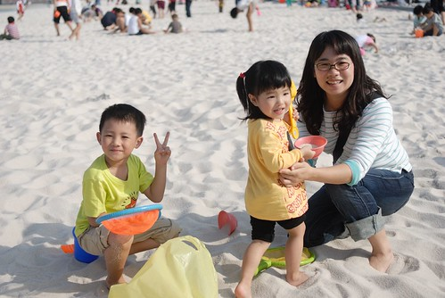  
  
只是太陽真的烈阿....  
徹爸說 要不要去車上拿傘來遮一下阿.....  
  
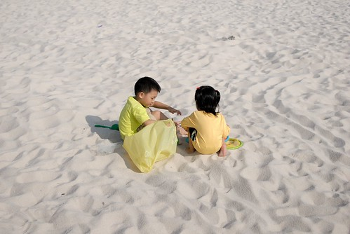  
  
我說不用了吧...小孩曬點黑算什麼  
況且我們家是要當陽光阿徹 陽光小愛的 怕太陽算什麼  
  
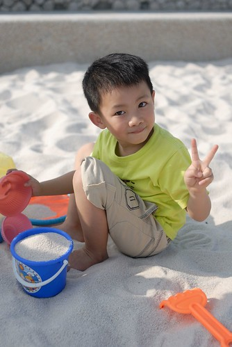  
  
只是真的熱ㄚ....下午4點了 太陽怎麼還這麼大阿...  
穿著長薄衫 披著秀髮的小愛 汗已經從兩旁逐漸滑落  
  
  
  
起碼先把小愛的頭髮全綁起來  免得熱昏了  
  
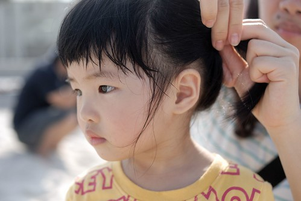  
  
很熱 但是看到很多人在"埋人"  
甚至有小學生姐姐一直想要埋他1-2歲的弟弟  
一手押住想起身的弟弟 一手拼命把沙往她弟弟身上堆  
看到這景象 我想笑到不行...幸好我家阿徹還沒這般殘忍  
  
  
  
汗一直一直流 臉越來越紅... 這麼玩下去好像真的會出人命哩  
而且我想雖然不希望小愛太白 可是太黑真的也不太好哩   
不能一白遮三醜就算了 起碼不要一黑加三醜  
  
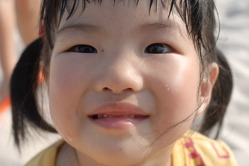  
  
而且這表情真的很矛盾 有點怪  
心裡就是想玩沙 但又熱的有點痛苦的樣子  
所以我們還是下了"收兵令"   留得青山在不怕沒材燒  
  
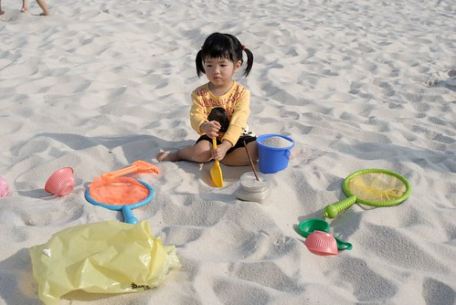  
  
還是先去放放風箏 散散步 等太陽小一點再回來再戰  
只是阿徹千百般個不願意 直問"可以去玩沙了嗎 可以嗎... 我覺得太陽變小了阿..."  
  
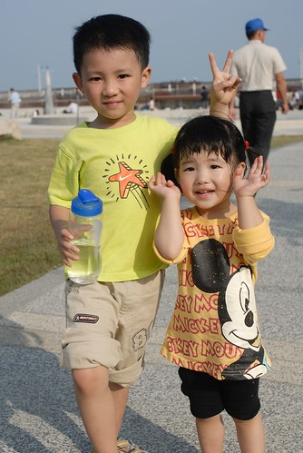  
  
其實東石漁人碼頭只是個風景區名稱　真的不算是個碼頭　  
（不過如果要稱只停了幾鎪小漁船的地方為碼頭我也不會太反對啦）  
區內還有個很適合放風箏的大草坪坡地　（草養的不錯）  
徹伯一下的時間就把風箏放的好高好高　風箏線都到底了  
風速也是那麼剛好的適合放風箏　所以放上高空的風箏只需呆呆拿著就好了（拿久也會無趣的）  
  
  
  
小愛看到一旁的電燈柱好像看到戀人一般　熱情的抱住不放  
  
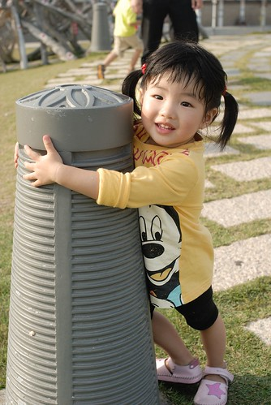  
  
還邊看風箏邊摳嘴角小痘痘 　氣質一整個蕩然無存  
  
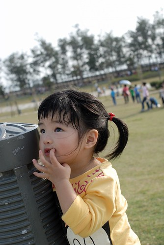  
  
小愛最近很愛張嘴　＂七＂的笑  
  
  
  
放完風箏散步到景觀台看海　消磨時間  
這時候阿徹一直嚕要玩沙了　我們看海時一個人嘟著小嘴坐的遠遠的直嚷著＂這又不好看＂　　  
  
那裏不好看。。。海耶。。。很美　很舒服哩。。。  
  
  
  
而且媽媽我第一次看到蚵是這樣養的  
  
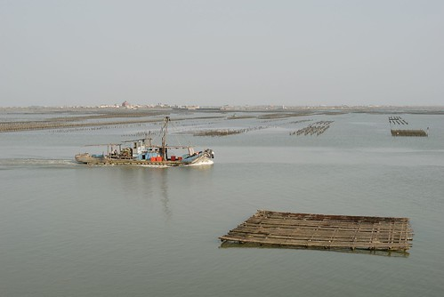  
  
好啦　雖然才４點４５分　還不到徹爸與阿徹約定的５點　但就去玩沙吧  
不過要先跟小愛合照一張  
笑一個...沒有笑...笑的太免強...要笑到露出牙齒...不夠...恩! 好這樣可以了 (實在有點變態的父母  
)  
每次阿徹要結束生氣時候我們都會要求阿徹笑一個  
能露出讓爸媽覺得發自內心的笑容才代表真的不生氣　真的懺悔了  
而且這過程真的可以幫助阿徹情緒上的轉換  
  
  
  
這回在靠近海邊的這頭玩沙  
旁邊一牌苦力的雕像們　是觸動人心的藝術品  
  
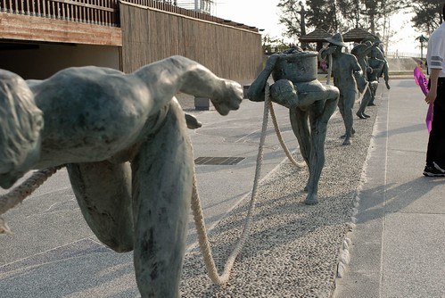  
  
換阿嬤跟妳們玩　媽媽偷懶一下  
而且大概只有阿嬤才有那耐力與心力這麼撩下去陪玩  
  
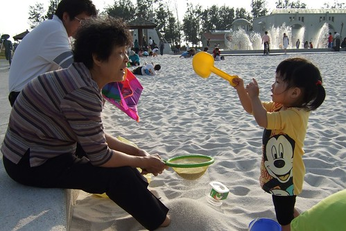  
  
徹爸趁上廁所的時候　偷偷跑去另一個岸邊拍夕照  
這種情景很需要一個人影來增加點氣氛的　很剛好的就有這麼一個路人甲出現  
  
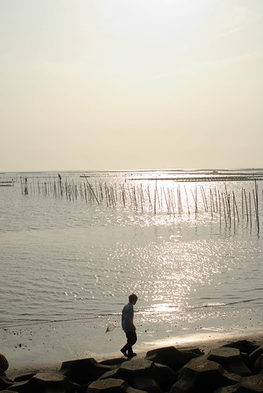  
  
此刻　阿徹與小愛可是卯起來的玩沙...  
  
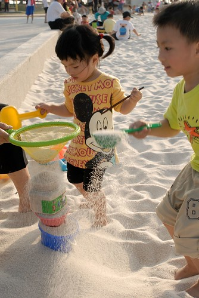  
  
這是在幹麻...我也不知道...  
  
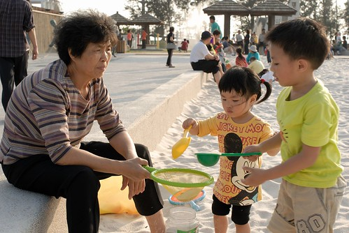  
  
沙灘真的有給他大吧　還有球網可以玩沙灘排球勒  
而且越是傍晚時分　人越是給他多了起來  
  
  
  
這種夕照下玩沙　幸福更是加分  
  
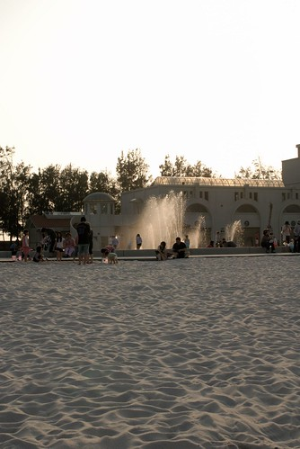  
  
遠遠的天空上還有風箏飄著  
別懷疑那是風箏不是照片的雜訊　剛我們的風箏也在哪飛著　園區夠大吧!!!  
  
  
  
幸福玩沙的小孩之一  
  
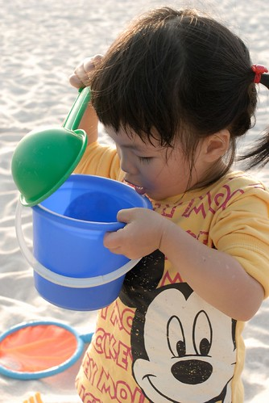  
  
之二  
  
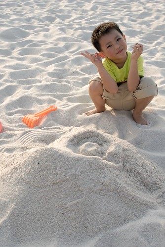  
  
還臥地伏倒勒～  
  
  
  
甚至躺了下去...這也玩的太開心了(這時候媽媽去覓食了　沒親眼見到)  
不過這的沙的顆粒比較大　起身後拍一拍就都沒了  
連頭髮都不會留下沙的痕跡喔　這沙讚！！！  
  
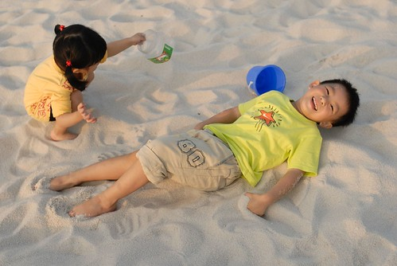  
  
小愛的長褲越摺越短  
  
  
  
就這麼的又玩了１個多鐘頭的沙　好個留得青山在不怕沒材燒  
這裡真的好玩　會讓人想要多多去的地方  
只是阿　這才４月初就這麼熱　真的夏天時還得了(恐怕會死人勒)  
起碼真的要四五點過後才能來...  
  
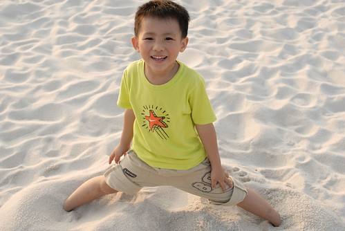  
  
夕陽無限好只是近黃昏　所以還是該回家了...  
  
  
  
掰掰!!!　阿徹說下次還要再來玩沙喔  
(沙地兩側都是戲水區 下回來還可以玩水喔　玩水玩沙真的太爽了啦)  
  
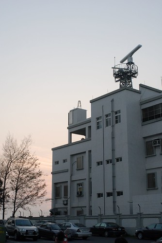
