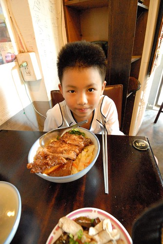

前天晚上發現阿徹的書包上多了個吊飾 我看的忍不住大笑!（看官們知道這是什麼嗎?）  想不到阿徹竟然把曬在窗台上的一片柚子皮做成一個吊飾 而且還掛在自己的書包上! 徹爸有點難以想像他兒子的動機 但我第一眼就明白阿徹一定是想要時常聞到柚子香 因為阿徹常常去窗台偷看曬在那的柚子皮 還常拿著柚子皮來我鼻前跟我說"你聞看看 真的好香喔!" 徹爸忍不住笑阿徹"雖然你常惹麻煩 但不可否認你也常給這個家帶來很多歡樂" 其實我還挺驕傲養出這樣的兒子說! 雖然真的有點"天"

BTW, 話說阿徹的小三蜜月期似已過去 又漸漸故態復萌 前幾天徹爸忍不住對他說重話"你不要都只想以後跟爸爸媽媽開民宿 開民宿是我們自己的事 你自己去工作" (因為徹爸恨鐵不成鋼 覺得阿徹不夠堅強不夠認真) 阿徹聽的好生氣好難過 說"那你們也不要用我說的"旅行廚房" (旅行廚房是有一次在車上聊天時 阿徹突發奇想說的民宿名字 我們四個人都好喜歡) 我跟阿徹說"開民宿是爸爸媽媽的夢想 你不要因為想跟爸爸媽媽永遠在一起便跟著這樣說 就算你以後真的想開民宿 那也是你的工作 你的生活! 所以你該學著多堅強 多認真 多對自己負責任" 聽完 阿徹還是紅著眼問"為什麼不可以?" 其實想想不也是因為我們的教育方式 生活態度 讓阿徹從來沒有顯赫的 偉大的夢想(忍者應該也不算吧) 只因愛我們也依著小孩子"想跟爸爸媽媽永遠在一起"的單純想法 阿徹嚮往著我們的夢想 但我們衷心希望 不管阿徹的夢想是什麼 都絕對要學會做自己的主人 而不單只是我們的孩子... 老實講 我並不會太擔心以後的阿徹 因為養他的這九年裡 我越來越相信他身上正在累積著 儲備著以後過日子的"本" !  很重要的"本"!  補述: 話說"能吃飯"也是人的生存很重要的本阿! 阿徹起碼這本有一定實力了...
