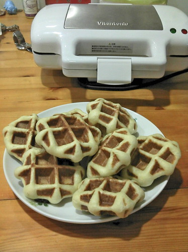

"樂活"這個詞 這幾年很夯 但就像"有機"一樣   某種程度反映著高價位 高社會層次  與平民百姓間其實是有點距離感的.. 前幾天在萬安社區的FB上看到下面這段話: "樂活並不是快樂的生活。來到萬安，就是要吃健康的米、有健康的土地、有健康的人、過健康的生活，這樣的生活才叫做LOHAS...." 我喜歡這樣的闡釋 ! 不過即使現在沒法踏在健康的土地上 吃著全然健康的米(有機的東西真的好貴阿) 我想能力範圍內 用健康的方式  過健康的生活 擁有健康的身心 那也是LOHAS了!

   昨天上床的時後 徹爸問"我怎麼好像聞到麵包的味道" 我把我的手伸過去給他聞"這奶油味嗎?"  徹爸皺皺鼻說"沒錯! 難怪!" 呵呵! 因為臨上床前 我才剛去把我那長了三小時還長不太大的麵糰給分割整圓 處理一下 這樣今天早上 開個鬆餅機 麵糰放下去 不用三分鐘就可以有熱呼呼  鬆軟軟的比利時鬆餅了 加杯脆片牛奶以及1/4顆的蘋果 是阿徹的營養豐盛小學生早餐 而我到辦公室後 投個10元研磨咖啡再沖上家裡帶來的熱牛奶  一口咖啡 一口鬆餅便令我享受不已.....  雖然不若店家賣的那樣佐以美麗好吃的冰淇淋 鮮奶油或是糖霜等.. 但這簡單的味道就是家裡手作獨一無二的味道!

曾經認為離自己世界好遠的麵粉 想不到竟也漸漸變成生活中的一部分 冰箱裡一直有雞蛋 奶油備著 廚櫃裡也一直放著低 中 高的麵粉以及細砂糖 心情對 時間對  簡單的快樂與滿足就這樣透過自己的手產生出來了!  It's magic!!

後記: 話說這種涼爽帶一點點冷的天氣 真的很適合吃比利時鬆餅  我個人這麼認為!
