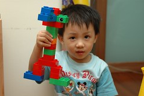
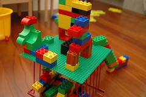
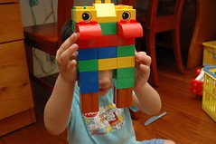
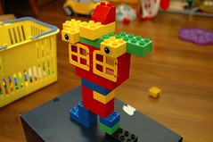
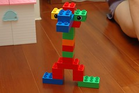
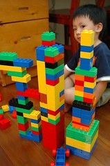
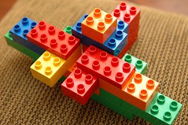
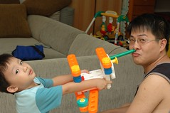

最近阿徹每天都會玩樂高  
可能因為爸爸前陣子用心思做了一些成品  
證明了樂高的可塑性與趣味性  
阿徹最近很愛跟爸爸比賽或是自己一個人玩樂高  
做出來的東西也越來越有模有樣了  
曾做過米奇的妙妙屋 獨角仙的房子 各式各樣的機器人  
還做過高高的101  
其實做出這些東西也沒什麼  
但是看著阿徹慢慢有對稱 整體構造 美學的概念  
一點一滴的慢慢進步 很開心

[獨角仙的家](/photos/hmchen0328/189192860/)

機器人系列

101高樓

飛機

吸鼻器

雪人
