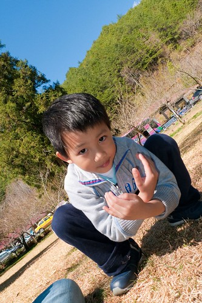
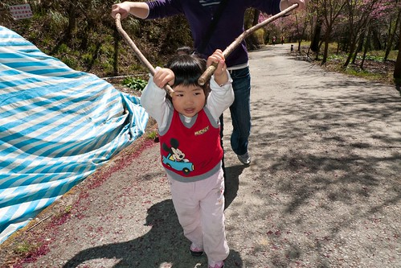

本來答應阿徹2月底的那個週六要帶他去苗栗採草莓泡溫泉的 但是爸媽中毒太深 於是只好想辦法讓小子願意開開心心的一同賞櫻去 從學校回家的路上先是誇張的跟他說"武陵那開滿了櫻花" 然後爸爸回家後又刻意的開電腦讓他看魔鬼甄的櫻花照片 問他"櫻花真的很多 很美吧"  小子說"對阿 好漂亮" 媽媽說"那週六想不想 要不要一起去武陵看櫻花阿" 小子大聲的說"好阿" 但偶而好像還是搞不清去賞櫻就不能去採草莓了(他二月唸了一整月的採草莓)

最後決定出發的週五晚上 媽媽更是下猛藥的跟他說 "我們準備野餐的墊子 還有帶御飯團水果飲料去山上看櫻花野餐 這樣棒不棒?" 小子開心的大叫"棒~" 還問我可以帶小波小莉一起去嗎 然後兄妹倆開心的拿著包 準備小波小莉小花野餐的傢斯頭(就是要去山上辦家家酒啦) 裝了啥不巄東滿滿的兩小袋  ^ ^"" 在平常這種行徑覺對是不會被我們允許的 但為了讓小兄妹倆陪著爸媽起瘋去  只要不是太誇張的事一切都好談啦 

睡前阿徹一臉認真外加一連串手勢輔助的跟我交代說 "明天早上出門的時候我應該還在睡覺 不會醒來 你記得要幫我拿包包 還要把小波小莉(因為要陪他睡覺所以沒有先裝進包)放進去喔" "嗯! 好!!"  這種大事媽媽絕對會給他記得的...

到達武陵後 兄妹倆就急著把小波小莉拿上手嚕

這次夜奔武陵的意義對爸媽來說是"賞櫻" 但對阿徹小愛來說 開心的應該是可以帶小波小花去"野餐"吧 (那也太千里迢迢了)

(小愛這表情似乎有點痛苦 但我記得他當時並沒有不悅阿)

之前就在別人的blog(就是害我中毒很深的那個)看到兩隻天鵝寶寶誕生的消息 所以遊園時先過去行政中心前的池塘看寶寶 不如預期的看到兩隻天鵝寶寶 阿徹疑惑的一直問怎麼只有一隻 於是我們繞了一圈池塘試圖尋找另一隻的身影 可是遍尋不著 阿徹這又更是困惑的連眉頭都皺起來了 一直要我們給他一個交代 我們說也許因為什麼原因所以那隻天鵝寶寶暫時到別的地方去了 阿徹又一直問為什麼要去別的地方 然後徹爸也一直問我"你會不會記錯了 明明只有生一隻天鵝寶寶啦" 唉~我也不知道 我也很困惑阿.... 不過還是給了阿徹這樣的答案: 也許發生了什麼事 讓另外一個天鵝寶寶需要到別的地方特別照顧 只差沒把牠可能"去世"了說出口 (最近阿徹都說 說"死"是沒禮貌的 要說"去世") 所以現在天鵝爸爸媽媽才都跟在這個天鵝寶寶的身邊 保護他照顧他 不希望他有任何意外發生....

而就在我們回來的隔天 水果日報的武陵賞櫻介紹提到有一隻天鵝寶寶在2/25瘁死 難怪我們2/28上武陵時 天鵝爸爸媽媽是這樣亦步亦趨的跟著小天鵝 牠們應該很懊惱很傷心吧

在我們看天鵝寶寶的時候旁邊並沒有其他遊客 天鵝寶寶似乎也不怕人 (也許是視若無睹吧) 期間牠還試著想要爬上小斜坡抖身體

小時後看過一本故事書 說著一個不起眼的醜小天鵝最後變成展翅高飛的美麗天鵝 今日看到這隻天鵝寶寶突然很能體會那故事的意境 因為小天鵝的毛真的毛茸茸的而且一臉稚氣 跟爸爸媽媽那發亮的羽毛  昂與非凡的氣質完全不同  (可是我比較喜歡小天鵝) 希望這可愛的小天鵝可以平安健康的長大 蛻變成跟爸爸媽媽一樣的美麗天鵝 祝福牠 牠們一家人~~~

選擇電動車賞櫻除了因為速度慢可以好好賞櫻拍照外 另一考慮也是不想阿徹小愛走酸腿唉唉叫 壞了全家賞櫻的興致

這回賞櫻可見爸爸媽媽從過去經驗一再省思反省所做的小改變喔

要不然小子姑娘起叛哭鬧的話 我跟徹爸夜奔的疲勞應該很快就會爆發吧

這又應驗了我跟徹爸常說的那句話 "錢能解決的事都好解決" 如果花點小錢就可以讓一家四口都開開心心的  那又何妨

電動車逛完大街後 本來是打算先去走茶莊步道那段的 然後走累累之後再大口大口滿足的野餐吃飯團的 但是阿徹小愛早已經在嚷著肚子餓要野餐 於是爸媽又見風轉舵的決定那就去遊客中心前的那片草地上野餐 只是11點鐘就吃起中餐還真有點早 呵呵~

草坪旁有一排的高聳大松樹  陽光照射映在草坪上的樹蔭構成一幅美麗的圖案

我與阿徹去車上拿野餐包 小愛則與爸爸先去"佔地" (其實根本沒人這麼早野餐 也沒人在這玩耍)

佔地為王的小愛迫不及待的從她包包裏拿出小花 還有小花野餐的ㄎ一ㄎ一ㄎㄡˋㄎㄡˋ

(我跟徹爸很喜歡這張照片) 

帶著棒球棍的阿徹哥哥更是有備而來嚕

到達這草坪後 徹爸就熱切的喚著我"媽媽 快來 我幫你在這照一張"

徹爸自己還已經先搞自拍了 襯著的藍天以及M字型山頭美阿

不等我舖好野餐巾 小鬼們已經迫不及待把所有東西搬到草坪上了 媽媽不得不加緊速度 先打發他們要緊

阿徹出門賞櫻還帶書哩~~ 不過這書是要給他心愛的小波看的...

小愛認真的陪著小花野餐: 喝飲料吃東西 我跟徹爸兩人一致認為兄妹兩其實不是急著要野餐吃東西 而是急著野餐辦家家酒阿

今日野餐的東西有早上在小7買的御飯團(一人一顆) 純喫茶 以及從家裏帶的芭樂 橘子 海苔 AMO千層蛋糕 還算是不寒酸啦

其實對於不講究美食的我們來說  東西只要不難吃 吃的飽不要餓肚子就好 野餐的Fu才是最重要的

填飽肚子後的阿徹開始四處跑 找他爸比賽 玩棒球

還發起火影忍者的各式忍功

小愛則吹著備在車上的泡泡

鼓氣一吹的樣子 臉好圓阿...

看到下面照片背景的那一家人嗎 起先只有他們的爸爸出現 一一搬出小桌子 兩張小椅子 還有外出型小瓦斯爐鍋子等 我們猛偷瞧 好奇她們會煮出什麼美味 起碼應該是一鍋熱騰騰的有料湯麵吧 結果後來看到她們的桌上擺出兩三碗泡麵 ㄟ.........頓時有點小失望 (哈! 人家吃泡麵我們失望個啥) 就是有點雷聲大雨點小的感覺ㄇㄟ.... 但重點是後來這家人在一旁舖起墊子毛毯 還拿出小枕頭 然後就這麼大辣辣趟上去..........哇勒...........這...未免太爽了... 這下 我們真的輸了!!! 阿徹說"下次我們也帶棉被枕頭來野餐好不好?" 看來要來加強一下我們野餐的"裝備"了

只能枕著包包 蓋著背心的阿徹怎能不羨慕人家阿...

別再看別人啦.. 你的渴望需求為娘的有收到啦...

懊惱徹說"知道就要做到阿"  (哈哈以上純屬媽媽瞎掰 醜化阿徹)

"來~娘抱抱" 母子二人搞噁心深情相擁 (徹爸嚷著說"你們都沒這樣抱我照相")

小愛果然年紀還小 還不懂搞Fu這回事

之前賞櫻篇中的照片大部分都是小P所拍的 因為比較廣 徹爸拍的很爽很得意 不過小兩拍的人像還是比較有Fu...

都要結束野餐了 兄妹倆又嘴饞的自己拿海苔出來吃 阿徹已經長大了 很多事可以不用拜託媽媽求媽媽了

一大早玩到現在看的出小愛已經略顯疲態 所以特恩准在武陵內可以跟媽媽一起坐前座

櫻花看到中午 徹爸已經開始嚷著"喔~好噁心 到處都是櫻花"快膩了 更別說阿徹小愛嚕 應該已經過了賞花的興奮期了吧

所以媽媽要更賣力找樂子娛樂兩小了 第一招: 小波小莉的外景照

第二招: 先找好等會要走步道的"輔助工具" 除了可以開火車外 還可以比賽誰比較像老婆婆 (小愛你最像 你第一名啦)

有了柺杖加持 小人開開心心走步道去

(看的出來媽媽很賣力在開火車吧) 

火車上車 下車就可以讓她們玩好久 沿路笑呵呵的

其實..其實現在是中午1點鐘 熱阿.... 可是小愛火車開的不亦樂乎

不知不覺(其實後來要連哄帶騙啦)就走到茶園的小涼亭

走了一個多鐘頭好累 而且好熱喔 好想睡覺喔~~

涼亭裏微風徐徐好讚  好想在這睡一場午覺

今天玩到現在還真的有點累了 但可以這麼坐在這涼亭裏吹風賞花 真的再累都値得

阿徹今天的心情很好 沒有什麼"意外"情緒發生 很好! 這樣下次才會再帶你出來玩阿~~

走走玩玩 今日的賞櫻郊遊野餐行開開心心的畫下句點~~~ 跟阿徹說明年花最盛開的時候我們要想辦法來武陵住上一晚 阿徹開心的說"OH~好耶~" OH~好耶~ 我也好期待喔~

順道貼一些徹爸在武陵的隨手照五四三:

茶花 

剛冒出頭的梅子 

覺得這紫色的小花很漂亮 一大早徹爸趴在地上拍這花時 徹爸笑說等下會不會有人跟著趴下來拍這花阿 我說這是小菜 大家應該只愛櫻花那大菜 阿徹聽到急著問說"這是什麼菜 什麼小菜" ㄟ....媽媽只好想辦法跟他解釋小菜大菜的差別

