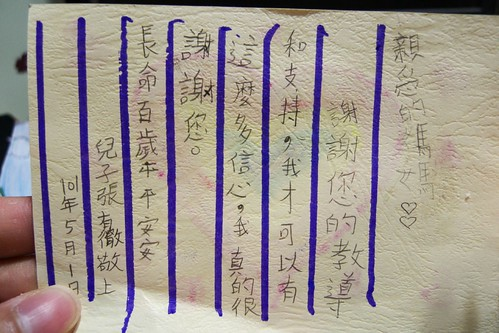
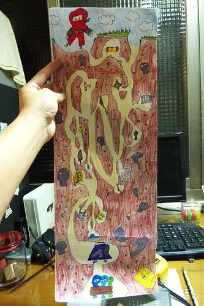
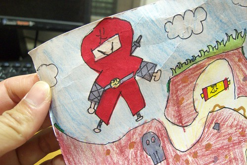

母親節那個週末 阿徹害羞的跑進廚房送給我一張卡片 雖然卡片一樣是學校裡的"作業"  但我看著上頭的文字竟忍不住紅了眼眶 我家兒子總算不再只是謝謝我生下他以及煮飯給他吃而已! 我家兒子總算大到似乎明白阿母的苦心 泣~~~ 

我明白阿徹會有這樣的感言 應該是有鑒於他最近與爸爸間的不和睦 而雖然有時候我也真會被阿徹氣的五孔生煙 奈不住性子的大爆炸 但我還是堅信阿徹是個好小孩  只是他照著自己的節奏在成長... 最近我稍微放慢節奏 多些時間多些耐性多些好心情 聽他說以及說給他聽 阿徹說"媽媽最近表現很好" 嗯~我也希望可以持續下去...  只是兒子阿也真的別太考驗媽媽了! (還有媽媽與爸爸的感情)

附帶紀錄阿徹上學期學校美術課的作品 同學們的迷宮圖幾乎都是仿若進入桃花源般的尋寶圖 而阿徹畫的是忍者營救大考驗  在這個一身紅的小忍者上 我彷彿看見阿徹他的影子... 我Orz的同時也想高喊"Bravo" 真是很矛盾的心情 我這個媽真的需要多鍛鍊鍛鍊! 
