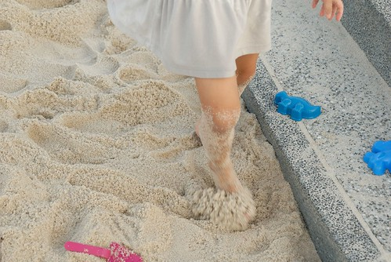

這陣子阿徹嘟嚷了幾次這個暑假都沒什麼玩因為夏天裡 他最喜歡且總是一廂情願列為"必去"的自來水博物館 外澳沙灘及東石漁人碼頭 我們一個都沒去其實媽媽我也很是喜歡這些地方 尤其東石漁...

從2008年的第一次 到現在已經是第五年的每年連續造訪 只是我們還真沒有在7-8月時候來過  想不到暑假的東石這樣搶搶滾 玩水的人很多 玩沙的人更多  雖然徹愛直嚷著要去清涼玩水 但一踏進沙地後 腳似乎就被沙黏住了  玩沙經驗已經很豐富的兄妹倆 火力全開馬上進入狀況  徹爸幫忙阿徹堆沙堡  但礙於這回攜帶的工具有限 只能做簡易版  雖然看起來沒什麼 還是引起許多過路人的嘖嘖稱奇  我們很是得意一家子的共同創作  而完成沙堡的阿徹 跑到沙灘的另一頭試圖挖掘水池與引道  想要把水引到 30公尺遠外的沙堡 我說阿徹你會不會太天真太傻阿  但傻小子依舊揮汗 賣力且執著的挖阿挖  另一邊的愛愛則在親水區與沙區來回玩著  我坐在一旁欣賞著小女生認真又開心的模樣   最後愛愛的手工蛋糕 特要媽媽幫她拍照留念  徹愛玩沙期間 被風吹的忙酥酥的我又忍不住喚了徹爸來個兩老自拍  徹爸突然提議的"一跳"  要跳美跳高真的不容易阿  玩了2個多小時 徹愛在太陽公公的催促下總算願意起身離去 看著徹愛仿若補了一劑營養針般的好氣色 好滿足 我心中也開心 滿意不已  雖然今天雲厚沒能看見美麗的夕陽西下  但最後的蚵仔煎大大解了我這幾個月的饞 那個充滿鮮味 海味的蚵仔煎 讓我一分鐘不到就呼嚕呼嚕吞下一盤 (可惜吃下肚才想到沒照相 下回一定要來個特寫) 就如徹爸說的如果有人來嘉義玩 他一定要帶他們來這吃蚵仔煎 真是太amazing了~

PS.話說有誰會來嘉義找我們玩阿?! 不過真的歡迎大家來嘉義玩 我真的覺得嘉義是個很有潛力的地方 只是怎麼除了阿里山外 嘉義給人的印象卻寥寥無幾 完全沒法跟台南 南投這些地方比 唉~
