其實本來對於花蓮的安排只有兩大重點想找個地方玩沙以及去海洋公園 其他的時間與地方都算是"填空"式的把路線填滿 把時間用完 後來因為那陣子徹爸在看"比賽開始" 他很想一探劇中的磯崎國小以及阿嬤照相館 於是問我可以去磯崎國小嗎 我說好阿 反正行程很鬆很好安排 而且我們要住的後湖水月就在磯崎應該很順路 仔細再查了一下地圖才發現 這麼巧! 後湖水月距離磯崎國小竟然不到1KM (正確的說法是從台11線(海線)要轉往後湖水月山上的路口就在磯崎國小路口的對面 ) 而光復糖廠也剛好在從壽豐走台9線前往磯崎的路上 既然地利人和都配合的這麼好 於是徹爸的"比賽開始"追星之旅就這麼成真了 而阿徹殷殷期盼的"玩沙"重頭大戲也同步上場著... 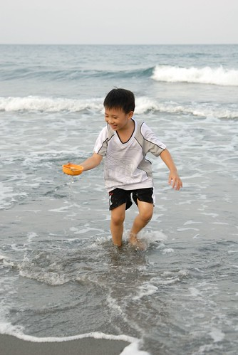 

阿徹7個月大我們第一次來光復糖廠時 糖廠內還很荒涼簡陋 隔了4年後小愛一歲多我們再來光復糖廠買冰吃時  糖廠內擠著滿坑滿谷坐遊覽車來吃冰的遊客 當時只是順道路過的進去買冰吃 可是著實的被那人潮給嚇到 不愛商業化的我心裡偷偷的給糖廠給貼了個黑標籤 這回因為感動於徹爸那難得的追星熱情 加上想想好像小愛還沒有過那種在糖廠大口嗑冰的經驗 因此徹家第三次探訪光復糖廠~~~

糖廠這幾年變了(整修) 很多  唯一沒啥變的就是販冰處旁的魚池涼亭造景

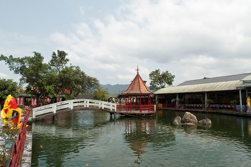

魚池四周的紅欄杆是唯一讓我覺得"有變老"的東西

至於賣冰領冰處一樣的房間一樣的動線  只是怎麼越來越制式化的感覺  買票..領冰...

出門三天小愛開始出現些微感冒徵狀 所以這冰是沒法讓她吃的太盡興的了

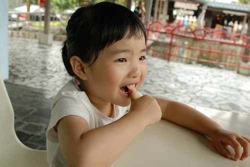

不過小妮子不貪心 一口一口好好珍惜品嘗她能有的"coda"

至於沒生病的阿徹則是大口大口的享受她的香草草莓冰

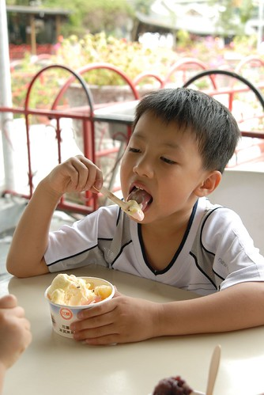

不過阿徹吃了半杯後竟然就停匙說"這樣就夠了"   看來平日少吃冰品甜食果然有讓她們不耐吃甜阿

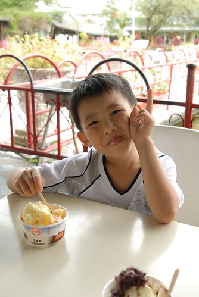

吃完冰本來想要租腳踏車在糖廠裏晃晃順道找"阿嬤照相館" 可是大白天的下午3點多 糖廠內的腳踏車出租站竟然休息(還是暫停營業) 難得這樣剛剛好的天氣 這樣稀少的人潮 很適合騎車吹風納涼的說.... ㄘㄟˊ 沒腳踏車騎又不想再多逛糖廠的我們只好找糖廠員工問阿嬤照相館在哪阿 被我們問的阿伯會意的/懂門道的/笑咪咪的告訴我們  就在前面...左轉..就是了 照著阿伯的指示我們如願的來到阿嬤照相館嚕

窗內展示櫃內展示著劇中磯崎國小少棒隊大合照   中間那個就是男主角啟明教練啦

嘿嘿~ 當然不能免俗的給徹爸來張標準追星照

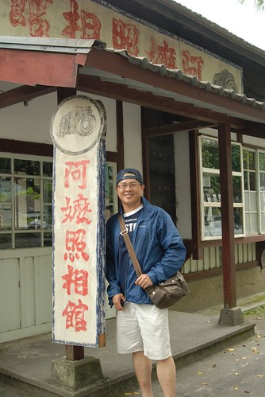

還硬要跟啟明教練很像的阿徹也來合照一張

而我這個追星幕後推手當然也得來一張嚕

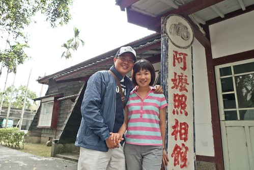

其實阿徹很搞不懂這有什麼好看的  呵呵~

小愛就更不用說了   一臉的狐疑...

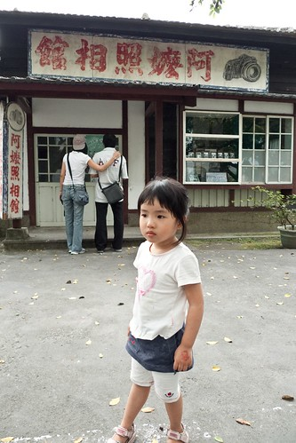

滿足徹爸的小小願望後 阿徹們就不迫急待的吵著要去玩滑梯 玩平衡木

在糖廠短暫停留一小時後我們便又趕緊上路往磯崎去 其實從光復糖廠到磯崎的路程大約只要1個小時多一些 但是從台9穿到台11的   公路也是條不容小看的彎曲山路 沒有吃暈車藥的小愛當然又不出乎意外的暈車抓兔子了 (有沒有阿姨覺得小愛玩的好辛苦的...) 不過小愛在稍微有點不適時便先告訴我 然後乖乖的把我交給他的塑膠袋掛在他的嘴下 以致當糖廠的草莓冰淇淋倒出來還老闆時還能滴水不漏的的全裝進袋子裏 看的我跟徹爸益加佩服小妮子"堅毅"的玩性

下午4點半多抵達後湖水月checkin後 縱使小愛她們對於房間內的蕾絲蚊帳愛不釋手還是趕緊離開民宿去磯崎國小 從後湖水月到磯崎國小出乎我們意外的只要5分鐘車程實在有夠近 莫非這也是一種緣分/天意

磯崎國小多年前已廢校 現由海巡處代管(?我沒記錯的話) 聽說"比賽開始"的粱修身導演當初還在構思劇本時 一看到這校地就愛上這 開拍前還花費一大番人力勞力整理這荒廢的校園.. 雖然現今教室內早已又空曠封閉未使用 但教室外的走廊還蠻乾淨的 沒有"廢校"好像該有的"頹廢感"

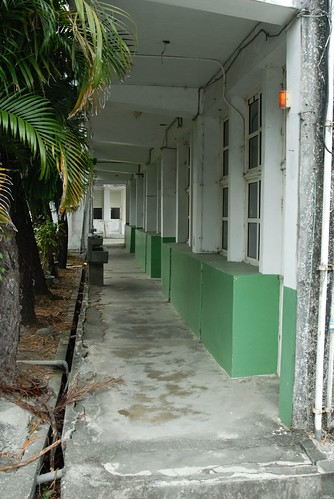

教室的後方是學校的升旗場 這時阿徹小愛拿著車上備用的泡泡罐到校園中猛吹 不知道是不是這的風特好 吹的泡泡又多又大又持久

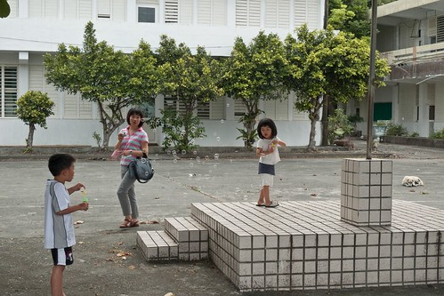

小愛站在升旗台上盡情的吹泡泡 而她的背景就是學校的操場 堤防 還有那一望無際的太平洋

因為劇中的某人曾經站在這階梯上以校園為背景照了一張很有FU的照片 徹爸依樣畫胡盧的想要也來一張 可惜老婆不才完全照不出他要的那個FU

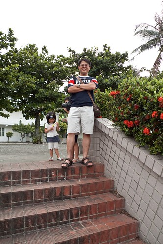

從升旗台後方的階梯下去是學校的操場 劇中的這個操場很乾淨很漂亮 讓人感覺就是一個學校該有的且一直在使用的操場 而當我們站在這早已又雜草叢生的操場上時 很驚訝且很好奇當初劇組到底動員多少人力及鋤草機才能有那樣的"正在使用感"

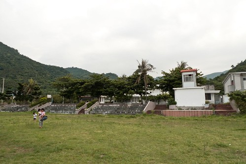

而緊接著操場的另一端是堤防

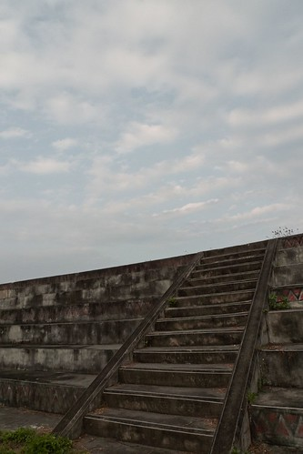

走上堤防...眼界 心界頓時豁然全開了...

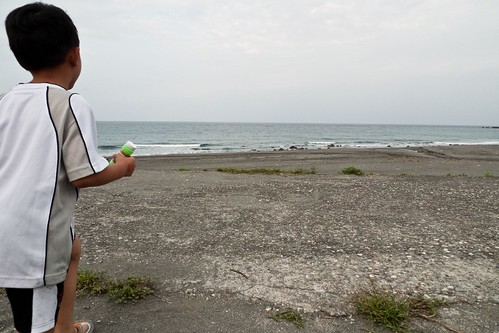

堤防上還有劇中教練休息的涼亭以及練習打擊的輪胎

全台去哪找這種教練休息亭阿....太美太爽了吧

到此我們算是陪完徹爸的追星之旅了 我們母子三人迫不及待要下沙去玩沙嚕....

可..可...這時候竟然才發現我們忘了拿玩沙的工具 只好麻煩徹爸再回車上拿 趁著這機會徹爸應該還在堤防上好好享受這想望很久的景 所以才能留下這張我們母子三人早已走向大海的照片

工具還沒送達時 我們只好用手用腳"摸摸"沙 等工具到手時 阿徹小愛兄妹倆便開始大玩特玩

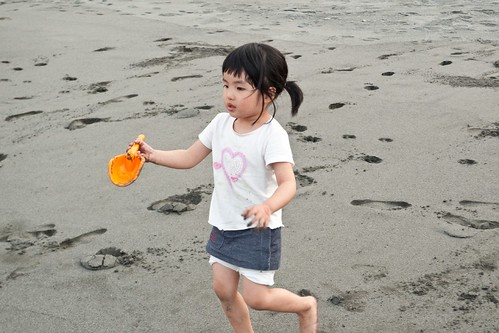

有經驗的小愛已經不若去年第一次去海邊時那樣的謹慎小心 這回很快的就自己下海舀水去了

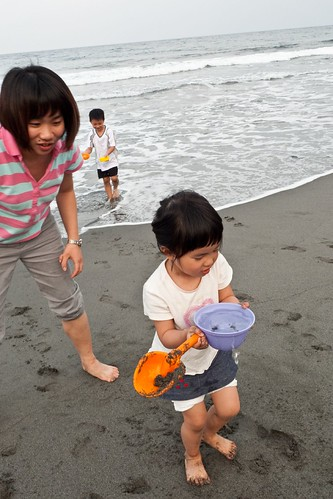

這個阿徹哥哥就更不用說了...

今天整個沙灘  整片沙海山連成一片的美景只有徹家獨享 好像被我們包場了一樣   那種感覺真不是一個爽字可以形容的

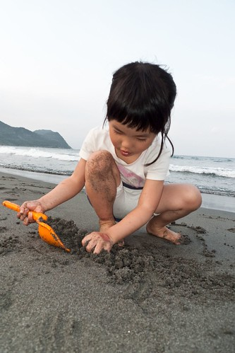

只有花東才有這樣依山傍海的好地方阿~ 就算請假扣薪也值得阿...

來到海邊的阿徹不再悲情  心花朵朵開  開到最多朵

兄妹倆超賣力的要做攔砂壩  不過知識技術不足 完全的在'瞎忙'

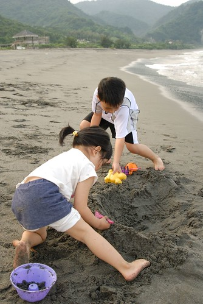

兩個小人使勁的玩沙 我跟徹爸樂得輕鬆的好好休息

那天有點陰  沒有爆藍的天空 但淡的很舒服

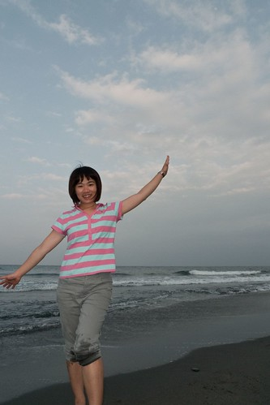

拍了好一會照 徹爸也撩下去玩沙了

六年前阿徹第一次面對太平洋的背影還這麼的小

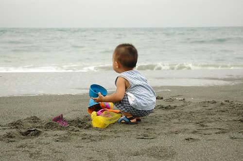

現在已經是小小美少男了

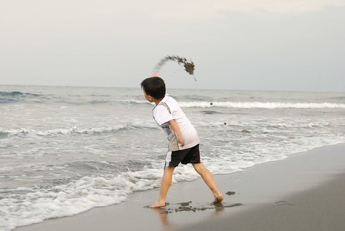

不變的是當初的那跟杓子...

現在還握在阿徹的手上   在每次阿徹出門玩沙時都還有跟到

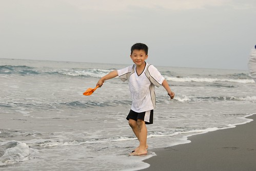

徹爸總算看不下去  下手做"大"且真的可以用的攔砂壩 爸爸的大手果然不同凡響阿!!!

小愛的褲裙已經玩到變短裙了  (小愛身材看起來有像縮小版妙齡女子喔)

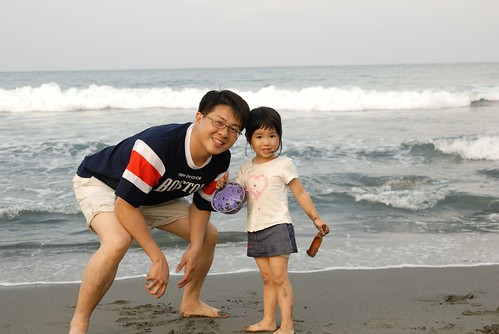

沒有人的沙灘+不熱又微風徐徐的天氣 讓一家子都玩的很盡興

媽媽變成這樣 ...

小愛變成這樣...

阿徹變成這樣...

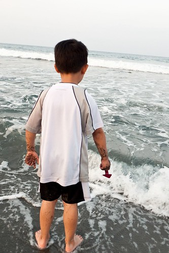

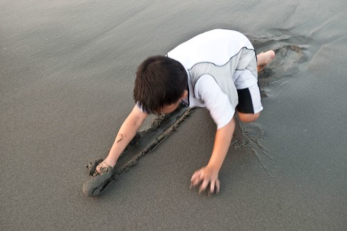

好玩嗎? 真的很好玩!!!

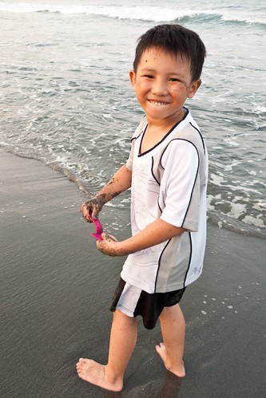

雖然實在很想再玩 可是因為民宿的晚餐六點半放飯 加上天黑後要摸黑走過那一大片雜草叢生的操場就又更加困難了 因此在阿徹小愛們很多的"再一下下"後 依依不捨的離開這片沙灘 因為是"秘密"沙灘 所以當然沒有可以沖水沖沙的設備 因此阿徹小愛只好帶著一身沙 "站"車回民宿   算是ending的有點狼狽  呵呵~
