總算寫到最後一篇池上了.... 池上算是我們台東裡走得蠻勤的一個地方 特別是稻米原鄉館已經來第三次了 真覺得這裡是個特別的地方 讓人每來一次就又喜愛多一點 不知不覺中好像就中毒了... 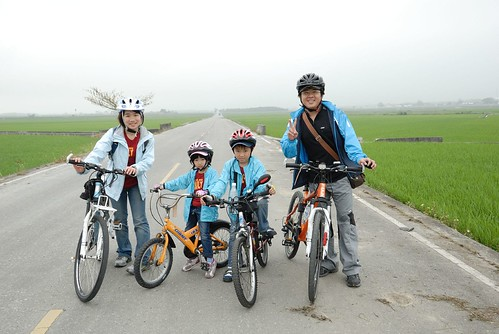

第二天到達池上後 原本徹爸只打算好好在民宿裡休息就好 迫不及待想去伯朗大道的我找他去騎車 他還說"明天不是就要騎了" 我說不出口 因為我好想去阿 因為我怕明天下雨阿 因為我想看黃昏啊 這樣的理由ㄠ他 幸好最後有個讓愛愛騎車的好理由 讓阿徹與徹爸願意拖著疲累再去騎車 於是傍晚時分 我們跟著愛愛一起開始這回的池上一天小旅行 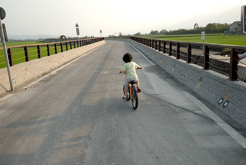 傍晚時分的景緻不同於大白日所見 尤其那個光影 好柔和阿... 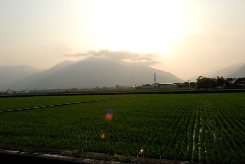 在黃光的催情下 覺得每一景都好美喔 只是每當問徹爸要不要照一下時 徹爸常會回我"這以前不是就照過了" ㄟ...沒有在黃昏時 在稻田綠油油時照過ㄇㄟ...  被載了兩天 悶了兩天的愛愛 可以騎車顯得很高興 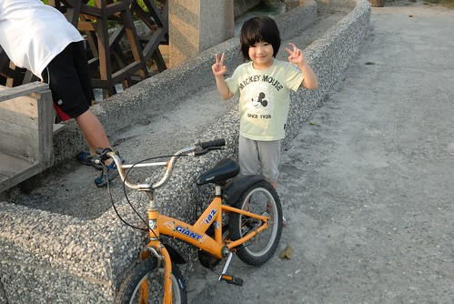 尤其徹爸還把車子調整的很適合她 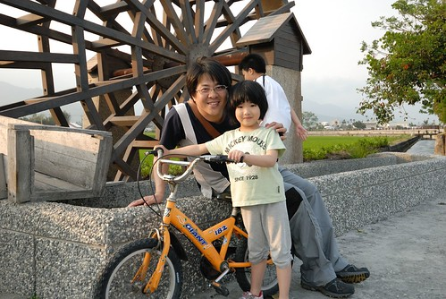 所以愛愛可是衝勁十足 車子雖小 騎快時也是會發出'咻咻咻'聲音的哩  我伴著阿徹小愛騎 而徹爸則在後頭用著更慢的速度邊騎邊照 看到沒? 我們三個正在跟遠方的徹爸揮手 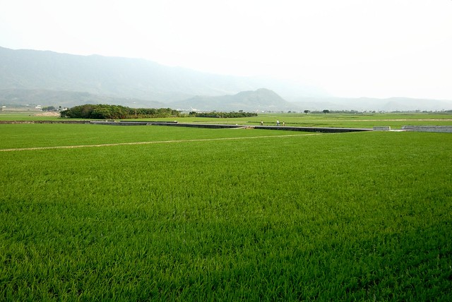 傍晚的溫度雖然很怡人 但今日的風大阿...大到連短短的秧苗也被吹的一片倒 甚至連我們的腳踏車也紛紛被吹倒.. 因為阿徹要撿掉的思樂冰杯子所以停車 而我要幫阿徹所以接著也停車 後來因為杯子隨圳漂流 徹爸她們追到後也停車 所以接連倒了我們三台車 心疼阿..也讓我們嚇得決定就回頭吧! 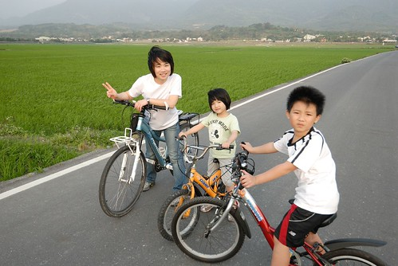 如果說跟阿徹一起騎車是用10-15公里的速度看世界 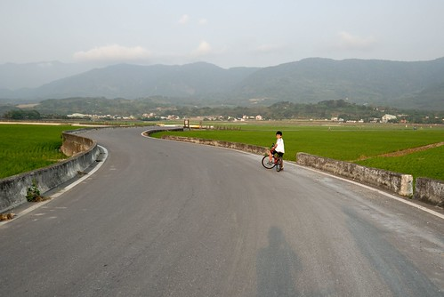 那跟愛愛騎車大概就是用5-10公里的速度吧! 更是可以好好的慢慢遊阿!!! 第一次守護著兩台車的感覺有點微妙... 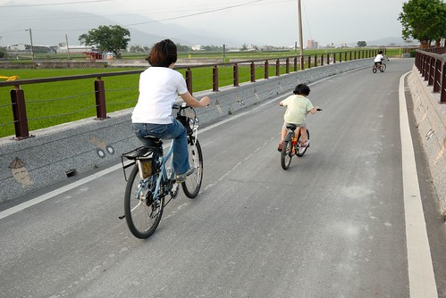 第一次看著兄妹兩尬車 讓人忍不住驚嘆 原來孩子已經這麼大啦! 時間過的真快... 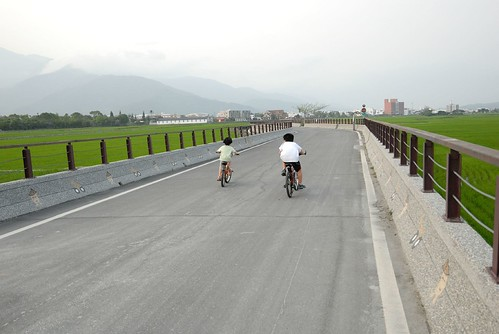 阿徹哥哥 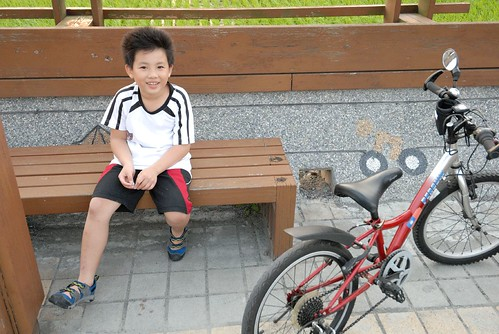 愛愛妹妹 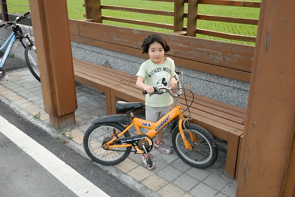 有你們一起遊山玩水真的很棒! 讓我們用你們的高度 你們的速度體驗不同於往的世界!

第三天 我原先的計畫是在池上進行17-19公里的環鎮 除了環圳車道外再去牧野牧場等處晃晃 要不然可能真如徹爸說的 第三天若不騎去關山 要在池上很難混一天哩(其實我們的火車票是打關山到板橋) 後來因為天氣不好 加上機會難得 我們決定讓愛愛繼續自己騎車 來段小小的池上旅行 首先我們要去鎮上的悟饕便當博物館 結果在台九上竟然遇到了自行車環台賽 一批批 一台台的公路車 刷刷刷地過去  搞得我們的小騎士愛愛更是緊張不已 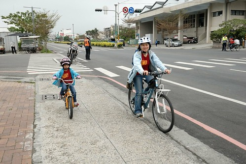 所幸愛愛一如上台表演時的穩健 順利抵達我們的第一站 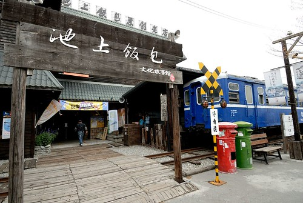 上午十點時分 吃便當的人潮尚未湧現 因此我們玩起賣便當的遊戲 "老闆 我要一個便當" "50元" "給你錢" "好 客人請慢用" 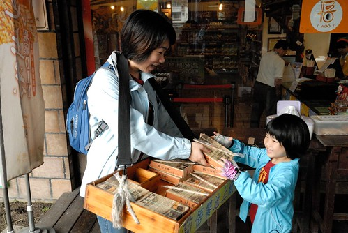 然後客人拿著假便當到火車廂裡好好地享用 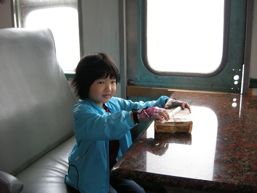 車廂裡 用餐區掛了滿滿的木片許願卡 愛愛跟阿徹也各寫了一張掛上去 愛愛唸著要我寫"希望吃飯乖乖 不要愛生氣 可是我很棒自己騎車" 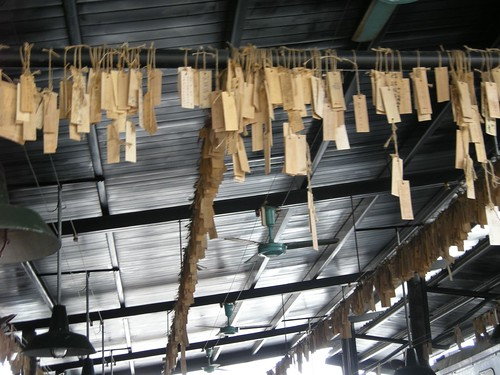 愛愛真的很棒 第一次騎車旅行就表現的超穩超耐 瞧! 多酷的小小騎士阿! 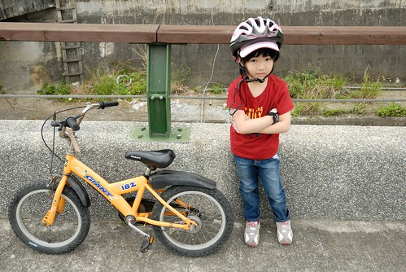 離開便當館後 我們接著前往大波池 順著車道繞了一圈大坡池 然後接著環圳車道 在池上賞稻 除了可以邊騎邊賞外  還可以停下車 在稻米達人的小木屋裡賞 (我一直很好奇這小木屋的作用 給農人休息的嗎? 真是太讚了) 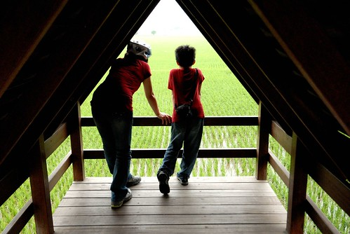 趴在浮圳大觀亭上賞 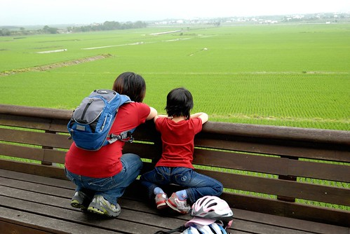 順著上張我們視野中連綿幾公里的稻田望去 有沒有發看不到什麼??? 稻田裡看不到任何的電線桿啦! 當地居民有共識 如果要住在稻田裡那麼請過著點蠟燭的原始生活 因此這裡不會有像蘭陽平原那樣 稻田裡矗立著一棟棟洋房別墅的不協調畫面  台灣西南部跟蘭陽平原到處有稻田可看 我們一家子為什麼還要專程跑來這賞稻 為的就是這一望無際 沒有障礙物 沒有不協調的連綿稻田阿 寫到這我突然想 台灣人不是很愛一窩瘋 一窩風賞櫻 賞油桐花 排夢想館...會不會哪天也一窩風賞起稻阿 不過大部分人好像不愛太平凡 太沒有什麼的東西 再套句老人家常說的"阿 這嘛好看..."  所以我想賞稻要夯還是很難吧! 不過我就愛這樣人少少的南花蓮跟台東 所以賞稻還是不要瘋的好! 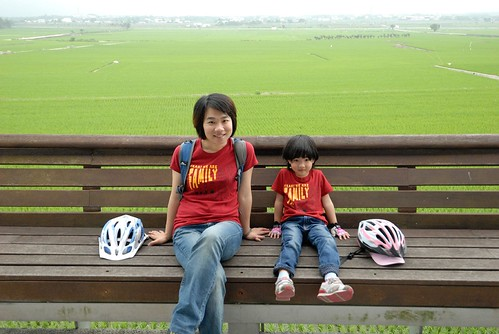 我們的小騎士騎到這已經騎了5-6公里 看起來滿頭大汗 小疲累的模樣了 不過覺得這樣的愛愛又顯得更帥了 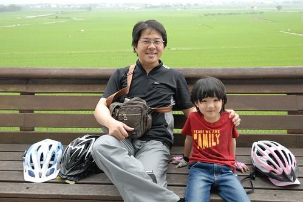 在我們很開心賞稻休息的同時  阿徹正因為之前危險超妹妹的車被罵而生氣難過中 不過躲在下頭的他還是偷偷拍了徹爸照相的模樣  其實常常都是我這媽媽先開罵的 可是很奇怪最後阿徹就是只會生爸爸的氣... 當我下樓時 阿徹要我讓他照一張 我當然很樂意 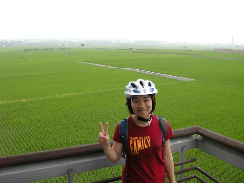 這回的池上小旅行其實跟上回的路線一模一樣 環圳然後萬安村([http://blog.yam.com/hmchen1975/article/26881664](http://blog.yam.com/hmchen1975/article/26881664)) 來池上的話 就會想到萬安的稻米原鄉館吃個飯 每次同樣的窗台 同樣的位置 或許這也是讓我上癮的原因之一吧 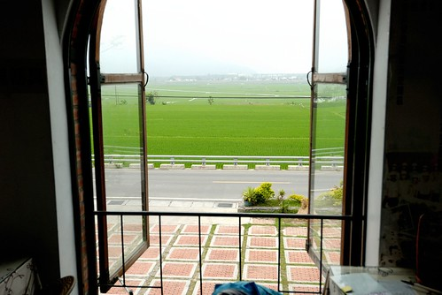 真好! 我總算在這窗台看到綠油油的一片景了  接下來的目標就是金黃色的嚕 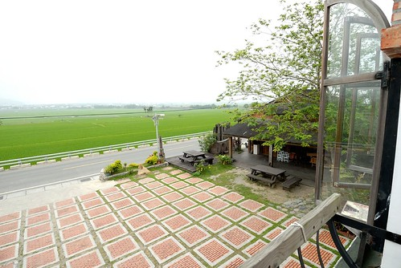 (自拍夫妻又自拍了) 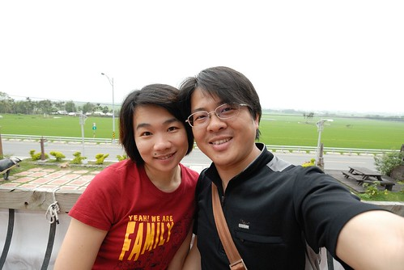 館裡的餐點都是現點現做 所以如果要節省時間 可以一小時前先來電預訂餐 但是我喜歡沒有時間約定 不疾不徐地順著旅遊狀況 到了後再點餐 雖然得等候個半小時左右 但我喜歡在這的等候時間 因為可以徹底地把心歸屬在這裡  專心地感受這裡的氛圍... 時而倚著窗看窗外風景 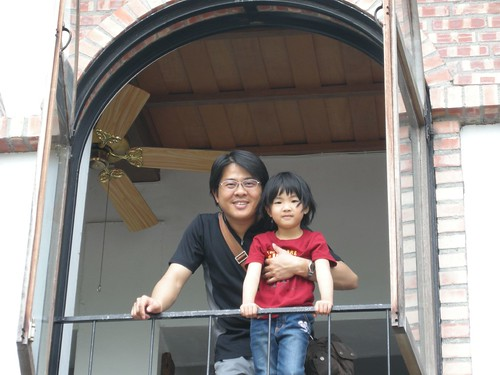 時而到館外晃晃 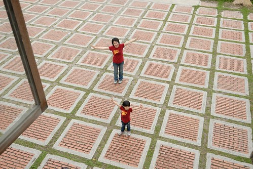 還有到處拍拍照 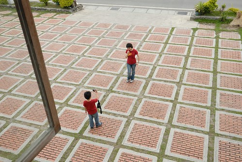 阿徹們從小就都稱這裡是"稻米博物館" 因為那時他們年紀小 為了讓他們多點嚮往以及好記憶 我都跟她們說要去那個飯飯(稻米)博物館 對他們來說 博物館比原鄉館好說也好記多了 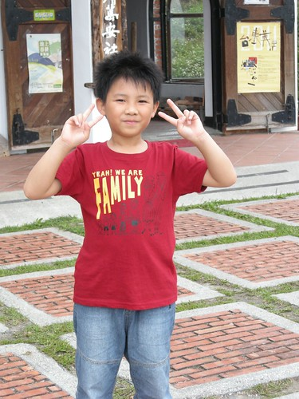 在館內館外晃了20多分鐘後 我們回到座位上專心等候餐點的上桌 我們又包場似的獨享此刻窗外的美景(這回旅行中 包場的機會還真是多阿) 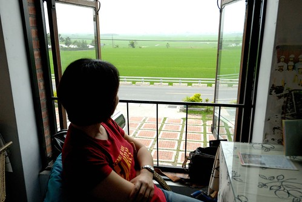 爸媽搞FU的同時間 ㄏㄡˊ 愛愛偷喝爸爸的可樂........ 哈 沒啦 是徹爸讓兄妹倆啜幾口嚐鮮 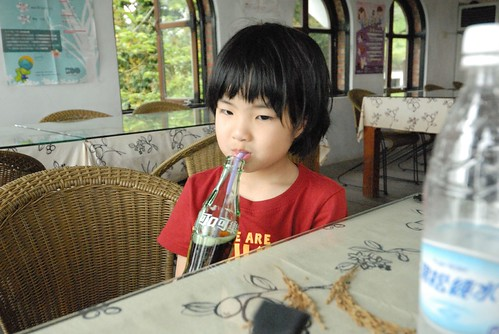 噹! 我們的餐點上來嚕! 大碗公餐 再佐著買的檸檬紅茶跟可樂是我們今日的中餐 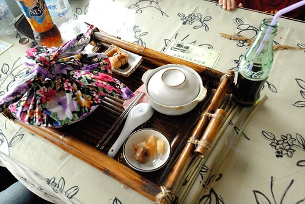 不若之前的餐盤套餐模式 現在這樣的大碗公餐是原鄉館有心發展且推廣為當地的特色美食 碗公餐的創意來自於以前客家人生活的方式與情感 以前阿公每天一大早就到田裡農作  中午時分阿嬤便會用這樣的大碗公裝好滿滿的飯菜送當田裡去 為了讓飯菜不要冷太快於是用這樣的花布把碗公包住以保持溫度... 這份餐除了極富農家特色同時也蘊含著對於這些食材的美好回憶 希望食客吃的每一口 口口都是好滋味的幸福! 我們共點了3個大碗公 香Q的當地有機米加上鹹豬肉還有超下飯的炒小魚乾 真的是O.E.C.阿 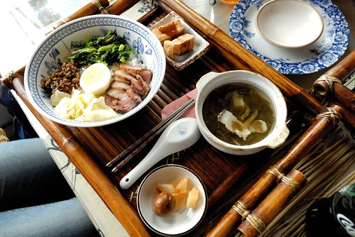 不過急於吃飯的愛愛 在把炸豆腐塞到嘴裡後突然臉色一變  一付豆腐該吞還該吐 進退兩難的樣子 原來豆腐沾醬裡有哇沙米啦! (我們在愛愛吞了後才發現的) 雖然我們覺得醬調的很好吃 但真的不是愛愛的口味  不過愛愛很棒 完全沒吭聲的還是把豆腐吃進去了 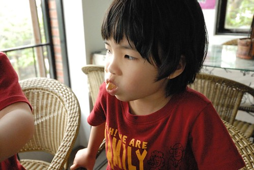 飯後 再來個水果 香艾茶(香茅+艾草煮的茶) 還有特濃的茶凍 哎! 真的感覺超級"  "的 我實在不想再用那兩個平凡到不行的字來形容 但就真的感覺除了ㄒㄧㄥˋ ㄈㄨˊ外還是ㄒㄧㄥˋ ㄈㄨˊ 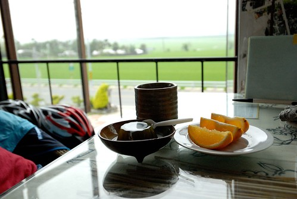 茶凍好吃到愛愛不用換氣似的咕嚕咕嚕全進嘴巴了 (幸好還有一份我跟徹爸可以一人一半) 最後還加碼 倒點檸檬紅茶進去 拌著剩餘的奶 呼嚕呼嚕再進肚子裡 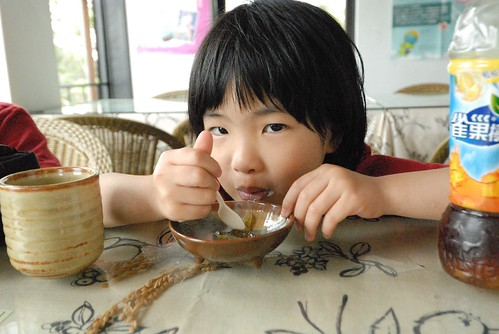 而阿徹則是先拿出他的相機 幫每份點心拍照紀念  最後再來個自拍自己的滿足樣 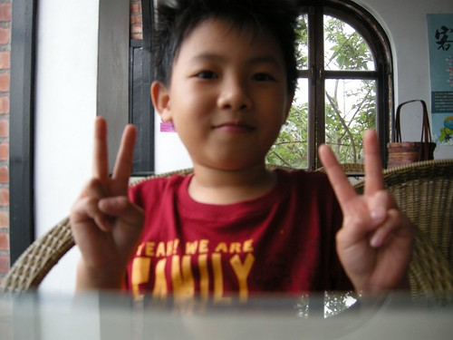 用餐的期間 看到門口外陸續有些遊客到訪 但大家都是看看 拍拍照然後就走了 我真覺得沒停住腳步 在這好好用個餐很是可惜 或許餐點的內容真的很平淡很平凡 但那份心情那份愜意 到哪也替代不了... 飯後靠著椅子時才注意到桌子玻璃下的一張書卡 嗯~ 說的真好阿~ 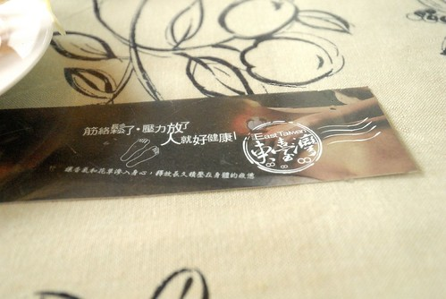 稻米原鄉館就位在197縣道上  一旁牆上有四個字很是喜歡"慢漫197" 池上萬安社區 很值得讓人慢慢漫遊的地方喔! 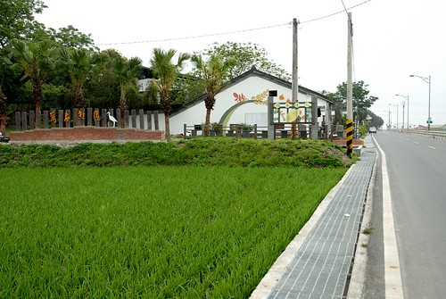 在原鄉館呆了一個半鐘頭後 接著我們要去伯朗大道了 往伯朗大道的路上 一個站在自家門口的阿嬤對著從前面騎過去的阿徹說了句"架細漢 厲害" 當時騎在後頭的我心裡偷笑著"後面還有一個哩" 果然當愛愛也從他前面騎過去時  我看到阿嬤張大了眼說了句"這哩嚕厲害" 哈哈! 我想我那時後的臉上一定有不小心露出了驕傲的神情...

伯朗大道的官方正式名稱是"錦新三號道路" 之所以被稱為伯朗大道既不是因為產咖啡也沒有賣伯朗咖啡 而是因為這裡景觀純粹、視野極佳 多次成為伯朗咖啡的廣告拍攝場景... 也有人稱這條看不到盡頭的路為"通往天堂之路" 不管叫哪個名稱都好 這條路真的美呆了... 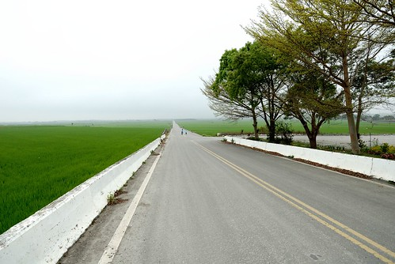 只可惜今天天候不佳  沒能有藍天白雲襯著 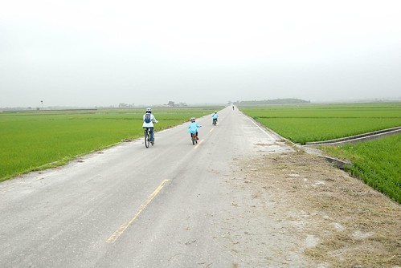 當我們轉進這條路時 有位獨自旅行的女生向徹爸問了路 後來騎在大道上時 我們藉著要幫她拍照 不好意思地也讓她幫我們拍了一張全家福 第一次我們四個人四台車一起照相說! 真是太有紀念價值的一張照阿  拍照聊天中才發現 女生跟我一樣是新莊人說 他鄉遇原鄉真是倍感親切阿 而再聊後 才知道原來兩三年前她隻身來到花蓮工作 目前是花蓮唯一童書店凱風卡瑪的店長 她是因為要參加下午的野餐會 提前到池上自己騎著車到處逛逛 很勇敢的獨立自主女生 要加油! 要幸福!!

之前網路上看到人家在這跳著拍照 我跟徹爸交代說"這次我一定也要跳~" 跳了後才發現 原來要跳的高 跳的美可真是不容易阿 (堅持不跳的愛愛一臉看好戲的樣子) 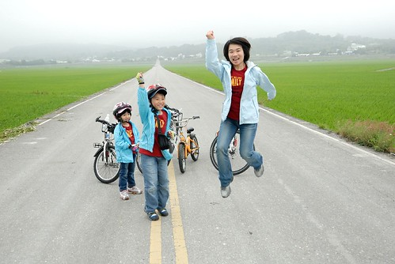 徹爸一下喊"不"夠高啦" 一下喊"阿徹舉錯手 遮住自己啦" 結果等到阿徹OK時 我卻已經跳不起來了 Orz (自然產生過兩胎後真的不耐跳阿) 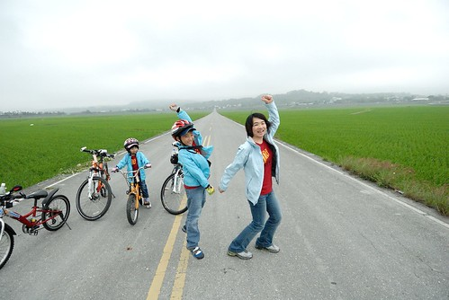 徹爸嫌到不行 於是我要徹爸下去跳 換我來拍來喊"不對 不對 不夠高 不夠帥..." 不過徹爸真的跳的比我們高多了 表情也好多了 呵呵! 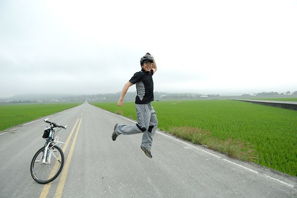 既然我沒能在大道上留下帥氣的跳姿  那好歹站著美美的照張相紀念一下 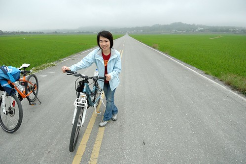 其實我們本來可能會跳更久 玩更瘋的 因為有一對開車的情侶在前方路口被我們擋住 後來他們也下車拍照了 所以我們不好意思佔用馬路太久 不過騎轉個彎後 我跟徹爸說"這裡再來跳一張吧" 於是徹爸代老婆出征 先是跳右邊 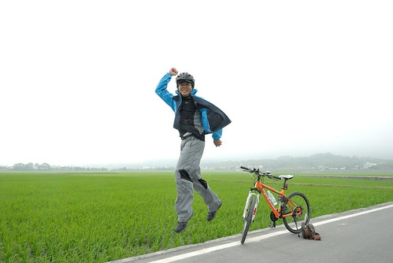 再來跳左邊  嗯! 跳的不錯 老婆很滿意 老公可以休息了... 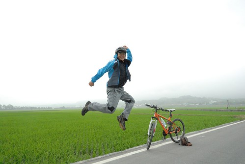 後來的路就是前一天傍晚騎的那段了 我們便沒再多做停留直接騎回民宿了 看了看阿徹的碼表 愛愛這兩天騎下來應該也有12公里左右了說 我們家的愛愛真是棒 好好訓練的話 相信真的很快就能四台車一起從家裡出發旅行去了!

一點半多回到民宿休息到2點多 還了愛愛的車 載了我們的行李  等會參加完野餐要直接去搭火車了 野餐前 我們先去大地飯店吃米冰淇淋 我們分別點了原味 紅豆以及桑葚口味 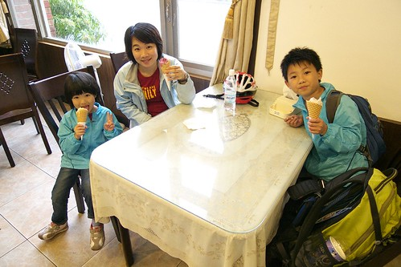 愛愛的原味冰淇淋有好香濃的米麩味道 而且還吃的到些許的米粒 真是好吃! 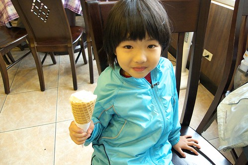 好吃到愛愛看著我分食時 一直喊"太大口 太大口" 甚至最後的脆皮一口也不給我 阿! 有分我一口 可是真的只有一口  阿徹的紅豆冰淇淋則表現普普 不過愛紅豆的阿徹還是吃的很開心  吃完冰淇淋接著是我們旅行的最後壓軸與不小心變成重要主角的春耕野餐會  原本預訂是4/22去騎車時 心想真是可惜 錯過了 後來改15號那週去時  心裡竊喜著且盤算著有機會可以去參加喔 只是因為回程的班次是4點30分的車 實在很趕 因此我也沒很積極地先訂野餐卷 想說一切屆時隨緣吧 結果在賢情玉緻時 潘姐知道我們是下午的火車後說可以去參加野餐阿 他可以幫我們買票 聽說票完全售罄 潘姐要他的好朋友 池上書局老闆娘無論如何生個兩張票給我們 於是我更有理由在池上待一整天直到參加3點的野餐會... 我們冒著雨 騎著車來到活動會場 大坡池 先是拿著野餐卷去領餐盒  然後找一個地方坐下來"野餐"  早上聽潘姐說會有個用花布包著的便當跟小點心的 結果只領到一盒點心盒跟米冰淇淋讓我小小失落了一下(潘姐說的一定是去年第一屆的好康) 其實活動的意義也不在於吃了多少東西啦! 參與盛會 慶春耕成功 今年能有個好收成的心情最重要 不過當地婦女透早開始做的米食小點心看起來好好吃的樣子喔 也真的很好吃! 除了蛋糕外 整盒東西在回家後都進了我的肚子了 (家裡只有我愛這類米食點心 所以我獨自解決一盒 另外一盒幸好在火車上送給周爸爸了)  野餐沒能有好天氣真的很掃興也很不方便 不過活動主持人說"春耕節逢春雨 這是好兆頭 更具有意義阿"  對我來講 參與野餐會跟去稻米原鄉館用餐的心情一樣 都算是自己能小小回饋當地的一種方式 希望以後能夠有機會把池上「春耕、夏耘、秋收、冬藏」四季文化活動都參加過一輪!  雨真的還不小 而大家冒著雨穿著雨衣坐在這... 或許這也不過是場形勢上的活動而已 不過能讓地方一起投入是件好事 (這兩天在池上 到很多店家或地方都可見著野餐會的海報 )  愛愛穿著自己雨衣的可愛模樣也引來地方電台錄影師的注意 被偷拍了..  哈! 如果在網路上或電視上看到愛愛 可不要太訝異喔!  後來雨實在越下越大 趁著我們的褲子跟鞋子還沒溼淋淋前 我們在會場待了40分鐘後就離開 提前去火車站準備搭車了 搭車前 在火車站前的全美行買便當是我們在池上一日小旅行的最後一站  全美行是目前唯一准許在月台販賣的便當 在這買便當很簡單 老闆只會問"要幾份?" 因為只有一種口味 叫"鐵路便當"  櫃台付錢領餐票後 然後到後台領餐處拿便當  多麼復古的便當造型阿!  口味當然也是很復古很當地的嚕...   

總算~ 我總算寫完了我們短短的三天賞稻旅行了 真的是收穫很豐 感受很豐的一家子的簡單旅行 !!!
