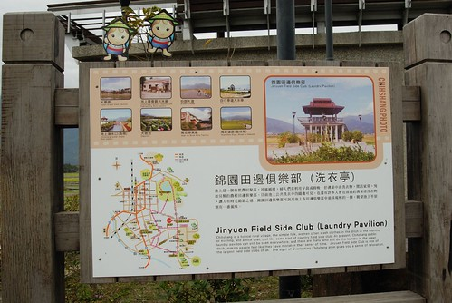
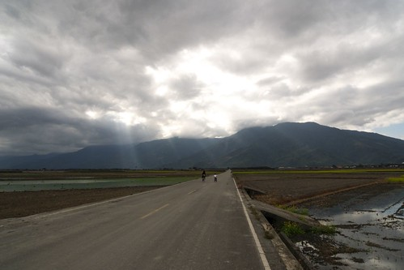

先穿插說一件阿徹前幾天的事 看著年曆的阿徹發現大陸似的說"3月3號星期三 2月2號星期二椰" 徹爸跟我頓了一下說"然後ㄋ"  阿徹說"好巧喔" 我越想還真越是覺得巧阿!!!  有沒有人跟阿徹有一樣的發現ㄋ?! ---------------------------------------------------------------------------------------------------- 哈哈~ 果然我的遊記生生慢  幸好有了那篇概述撐著  或許也因為那篇所以怠惰了...... Anyway, 趁著有心情也還有點力氣時寫點東西 盡盡徹家自許的"花東觀光大使"使命 今日就來介紹池上的環圳自行車道 還有我最愛的油菜花~~~

 

不若關山環鎮車道的入口處有著接連著數十家的腳踏車出租店 每家店的員工還都會熱情賣力的在自家門口搖旗揮手昭引客人上門 池上的腳踏車出租店零星散落在鎮上  我們甚至沒有看到比較像樣 專門的腳踏車店 最後只好去了書上介紹的大地飯店租車  選了三台還可以的車上路 租車時問了店員是否有介紹景點的DM的可參考 竟然要用10元押金才能"借" DM竟然要還 還真頭一遭遇到 (不還的話就等於是花10元買DM) 還沒開始騎 光是租車這事就讓我跟徹爸兩人不禁質疑起池上自行車道的"盛行/推廣率"...

離開大地飯店沒多久便可看到大坡池的入口指引

從台九轉進沒車的鄉間小道 那當下我四眼望去不是山就是田 還真懷疑怎麼可能有大池在這

沒想到路的盡頭轉個灣後 還真就是"大"坡池了 雖然沒有網路照片上那樣"大"的印象   不過一片寧靜安祥 有種人間樂土的FU

坐在草地上享受大波池美景時  對岸處剛好有列火車經過土地公廟 以前的油菜花季活動會場就是都在土地公廟那舉辦的 多少攝影者就為了等候火車經過土地公廟的那瞬間 橘色的車身+四周一大片黃澄澄的油菜花田真的很美....

當媽媽美景當前 吹風納涼不想動的時候 阿徹跟小愛便在現成的石桌上玩起炒菜遊戲

離開大坡池 環圳車道才算正式開始...

原本以為池上週日的遊客應該會不少 想不到騎車的還真少

沿途陸續看到幾片油菜花田 雖然都不若3年前看到的那樣茂密但比起第一天在花蓮看到的好太多了

****

環圳車道沿途有數個小景點可停車休憩 例如像這樣的洗衣亭 可是其實我們對這種純展示用的地方沒太大興趣... 不過倒是覺得牌架上的兩個小稻米娃娃粉可愛 

沿途有不少路段在修補 不知道是不是因為農曆年的旅遊旺季將到來 進行最後的補修  一路騎過來 路況並不是太好

連木枕道也是騎的吱吱作響

要抵達萬安稻米原鄉館的馬路甚至在進行刨除修路的大工程 費了一番力氣及繞路的時間我們總算在一點多抵達萬安村的稻米原鄉館

館內的一樓陳設依舊

2樓的用餐環境也依然 (連桌巾花色也一樣)

稻田的景色當然也依舊嚕~ 萬安村是池上良質米的原產地之一  水源來自東側的萬安溪 因無污染 且農民回復早期農耕的方式 用人工下田除草 施放有機肥料 不用化學肥料及農藥 因而生產岀道地的萬安有機米

可能因為遊客太少 餐點得預約的關係吧 外場人員在問過廚房阿姨後才敢接受我們的用餐要求 且我們得等候30分鐘 等候的空檔 我們便買了一個"米畫"的材料製作

原本以為很簡單的米畫 下手後才發現大不易阿 沒法像沙畫那樣 把沙子倒上去後抖一抖即可 米畫得先上白膠在紙上 倒上米粒後再撥平一顆顆使其均勻黏附在白膠上

媽媽果然不太善於勞作  手忙腳亂還不盡理想 讓向來很自豪手工藝技巧不錯的徹爸看不下去 下手幫忙 果然徹爸的巧手 加快速度也美化了米畫

只是半小時的時間只夠上了這些色  而且近看真是慘不忍睹阿

用米畫除新鮮外 其實主要是為了打發時間  下午一點半肚子早已咕嚕咕嚕叫不停了 今日主菜有兩樣選擇 烤鹹豬肉跟鹹魚肉餅(粉特別的組合 還挺不賴的) 在台灣很多餐廳/地方最大的問題在於 "maintain"的不易 我很高興稻米園鄉館 除了景物依舊外  餐點也依然精緻可口 (除了現打蔬果汁被綠茶取代外)

扒幾口飯 望望幾眼窗外的田野風光  這種愜意真的會讓人上癮  迷上這裡...

吃飽飯休息的時候 突然發現阿徹這麼的倚著窗 望向窗外 很好奇那時候他在想什麼 或許什麼也沒想就只是單純的望著外面也很好 徹爸說這張照片的缺點是左邊的那個柱子 阿徹如果再往右挪一點那就更讚了 可是徹爸怕請阿徹挪點過去後 那份感覺就沒有了 所以還是就這樣的按下了快門

雖然3年前就覺得萬安磚窯場荒涼的沒有什麼  但是我們還是騎車上去晃了晃

上回看到這模樣 以為在整修修復中 這回來還是一樣的模樣 我總算明白這鐵皮屋頂是為了保護已經整修好的前面五目

其實來這最主要的目的是想留下一張愛愛在這磚窯前的"倩影" 想看看徹爸可以再這激盪出什麼樣的照片

可惜愛愛不愛這 不願配合裝可愛照相   只是認真的看著我跟阿徹間的鬼針草大戰

小時後很愛跟鄰居拔鬼針草大戰 難得有機會我也把這武功傳授給自己的兒子了

徹爸看到我的慘樣 笑我說"你就愛喔......."   哈哈~ 媽媽我是手下留情 好不..........

走嚕~走嚕 要回池上鎮上了

可是阿徹竟然還不放手 猛追著要射鬼針草

在稻米原鄉館吃飯時 看到一條超筆直的田間小徑 我跟徹爸兩人研究導覽圖好一會後 推測這應該就是DM上寫的伯朗大道(真好奇 為什麼要叫伯朗阿) 於是兩人決定走這伯朗大道切回環圳車道 一進入伯朗大道沒多久 竟然就看到遠方天邊雲朵處有道"耶穌光"

於是我們朝著這道光騎去嚕~  OH 這條路啦...

耶穌光下的油菜花  美吧!!!

趁著徹爸慢慢拍照的時候 我們母子又當起採花賊了 一大片的油菜花 偷摘幾朵應該沒關係吧

愛愛不願意下田採花 只好等在一旁當拿花小姑娘

拿著花束的愛愛好像"新娘"上身 嬌羞了起來

輕易的我們採了兩小把的油菜花  打算可以如3年一樣的放在徹爸當乾燥花

繼續沿著路 往光的方向前進...

果然耶穌光帶來好運氣   我們在這大道上看到了一片片美麗的油菜花

就是那個光~ 就是這個花~~ 這才是我記憶中那數大就是美的油菜花阿

我很愛一張3年前阿徹在油菜花當背景的照片 這回很想再如法砲製一張阿徹七歲版 愛愛四歲版的油菜花照 可惜兄妹兩完全的不配合不捧場  所以只好我跟徹爸兩個老人家自己下場 拍過癮了

小女生好像都比較容易有潔癖 怕蟲怕髒 愛愛不太喜歡下田近距離接觸花田  可是很享受拿著花束的感覺 (吼~ 那表情好像在拍婚紗阿)

雖然我的眼睛依然瞇瞇張不太開的樣子 可是這的油菜花真的讓我超開心超滿足的

看到田裡農人黝黑的皮膚 心裡忍不住欽佩起他們來 甚至羨幕起他們來 突然覺得自己是隻坐在冷氣房辦公桌的飼料雞 好渺小 好渾渾噩噩

農人用他們的汗水灌溉著自己的田 每一位都是令人欽佩的稻米達人 !!!

阿徹沿途還是會陸續拔些鬼針草 拔到的草就順手的往後黏在他的衣服上  很有創意也很有效果的收集方式

離開萬安村回到環圳車道 又是另一番的景色

****

車道兩旁也有可愛的小稻米人陪伴著我們

****

那三條小彎線讓人覺得小稻米人笑的真可愛 真慧心

沿途看到的稻田大部分都已插秧 抑或正在插秧中 整齊有序的小秧苗 看起來很是青翠 可愛 (一種很淡很輕的舒服感)

途中看到這棟建築物 徹爸大呼著"好美的房子阿" 近看門排才知道原來這是間民宿 看著看著我跟徹爸兩人忍不住又作起民宿大夢 哈哈~

最後回到出發的大地飯店 品嘗了自研發自產的米冰淇淋 (好吃的ㄋㄟ~) 結束我們今日的池上環圳自行車之旅

這回我們花了4小時時間慢遊/享受池上/萬安之美....
