話說去年一月我們來池上時 在環圳車道旁看到了一戶好漂亮的房子 徹爸猜"那一定是民宿" 後來果真在網路上看到人家提起這家民宿 而且還很剛好的是徹爸員工旅遊補助PAYEASY上的合作民宿 總歸一切的天時地利人和 促成我們與賢情玉緻的這段美麗邂逅 風景很棒  房間很舒服 主人很健談 三餐很好吃...令人回味無窮的好民宿 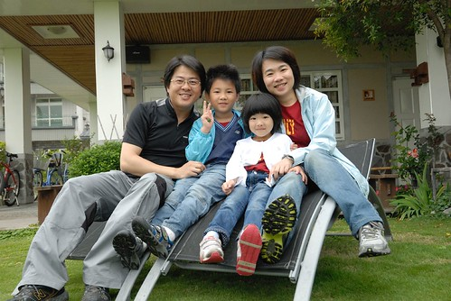

當下午1點多我們還在花75上熱戰時 接到民宿打來的電話問"我們到哪了? 預計什麼時後到池上?" 簡單的問候卻是民宿給人的第一溫暖好印象 我們3點抵達池上後也迫不及待地直接去民宿check in 抵達後民宿主人潘姐熱情地問候關切我們這一家子到底是怎樣瘋狂的騎來後 連登記都不用 便給了房間鑰匙讓我們趕緊進房休息 我們被安排的房間是"南閣"房 從名字猜想應該是南向的小閣樓 阿徹跟愛愛進房後一看到這樣的閣樓房間開心到不行 童話故事裡常出現的小閣樓原來就是這模樣 這感覺阿! 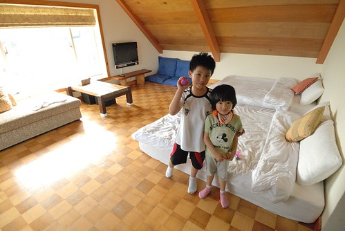 其實我們迫不及待地到民宿是因為想要洗個澡 沖去一身熱 幸運的是民宿房間的浴室還真夠大 讓我們一家子一起泡澡都不是問題 (哎呀! 不小心讓阿徹跟愛愛曝"光"了 一個肥滋滋一個沒屁股 ) 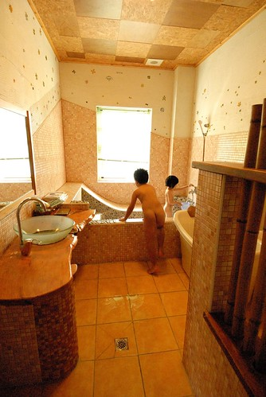 一身清爽後 我們開著冷氣蓋被子吃零食 (這種天開冷氣其實真的很不環保 但因為徹爸每次騎車後都像是超馬力發熱機 汗流的誇張...)  還有坐躺在床上看著窗外的美景 美景? 美景在哪? 有多美? 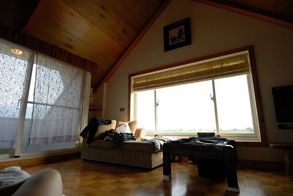 美景有這麼美.... 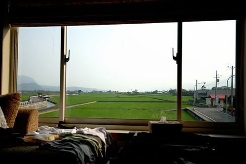 其實房間裡最好的賞景處是窗台旁的貴妃椅 這裡是我們待在房間裡一家人最愛坐 還搶著坐的"寶位" (補充: 那個衣服之所以在椅子上鋪成那樣實在不是因為邋踏 是因為要曬乾等會穿 再補充: 因為行李一切從簡 身上穿的乾淨衣服是隔天要穿的 所以得繼續穿流過汗的衣服...) 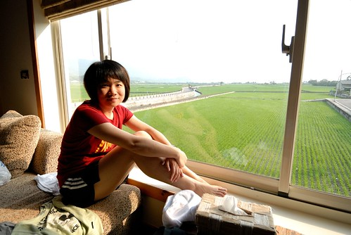 房間裡很舒服 阿徹跟愛愛待的完全不想再動了 可是我跟徹爸的肚子好餓好餓 只能苦苦哀求兄妹倆離開溫暖的房 出門覓食去 結果到庭園後 兄妹倆又被吸引住了... (我們就住在最左邊的2樓小閣樓裡 VIEW超讚 可是潘姐說 我們住的那間VIEW只能排第二 第一好的是最右邊的二樓閣樓 以後有機會再住住看! ) 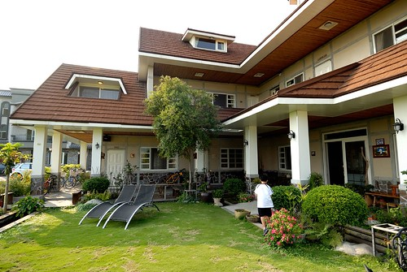 特別是這兩張椅子... 這兩張躺椅是我們一家子在庭園時最愛也搶著坐的地方(怎麼民宿到處讓我們搶著坐阿) 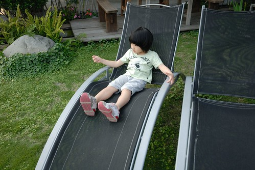 民宿的住宿除了基本的早餐外 還有下午茶跟晚餐喔 下午茶跟晚餐的地方是在民宿主人的"潘的店" 店在距離民宿1-2分鐘路程的地方 一個就像一般農村的地方突然坐落這樣一棟屋子一家店 很是令人驚喜 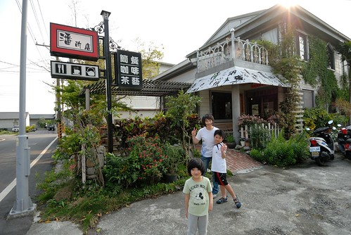 而走進店裡後 哎~心裡忍不住讚嘆這裡也是個好地方阿 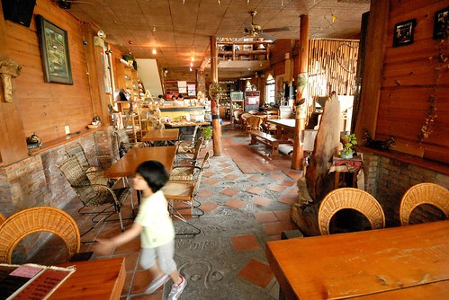 其實店裡沒有過多的裝飾也沒有什麼氣派或時尚或峇里島風的 就是很簡單 很清爽 很個人但又帶著濃濃在地味道的一家店 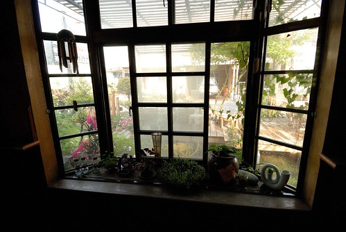 我們選了個靠窗的位置準備享用我們的下午茶 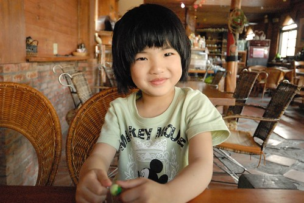 店裡優閒的氣氛讓熱血青春的阿徹 臉上線條也一整個的放鬆柔和了  直到冰涼的檸檬洛神花茶上桌.......越喝越好喝 肚子也越餓... 飲料都快喝完了 不見再有其他東西上桌 我們開始懷疑 莫非下午茶就只有這麼一杯飲料? 肚子很餓說...於是我們決定那就去點個鬆餅來吃吃吧 結果去櫃檯要點餐時 招呼我們的熱情大姐說"有土司再吃鬆餅 怕你們晚餐會吃不下喔" 原來土司還在烤阿! 那鬆餅就不必了啦! 吐司送上來後 我們四個人狼吞虎嚥的像是餓很久... 來的正好的奶酥甜味 烤的恰恰好的酥脆 覺得這好像是這輩子吃過最好吃的土司阿 愛愛嘴巴小 吃的比較慢 吃完的我們一直跟愛說"如果吃不下 可以給我吃" 愛愛邊啃她的土司邊搖頭 總算吃完時還用手把掉在桌上的奶酥黏起來吃 在店裡吃完下午茶的那一刻 四個人都覺得好滿足好回味阿! (不過吐司如果可以再多一點點那就更棒了) 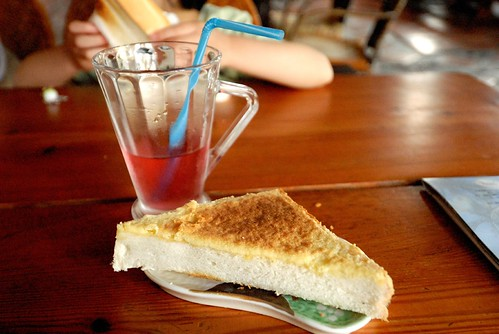 吃完下午茶 阿徹還是堅持要去7-11兌換他的慰勞獎-思樂冰中杯一杯 其實阿徹平常是不敢喝汽水的 但他竟覺得汽水口味的思樂冰好好吃 加上我們家對冰品向來管控嚴格 所以這思樂冰對阿徹來講可是誘惑力十足 (話說平常對小孩看電視及零食冰品的嚴格管控 可是出門在外時父母對付小孩的最好利器阿 說威脅也好 利誘也沒錯 反正就是皆大歡喜 超級好用的啦) 裝思樂冰的時候 徹爸說"要邊裝邊抖 這樣可以裝比較多" 可是阿徹說"不能抖 要讓冰自己裝滿 不要消泡 這樣才好喝" 阿徹很堅持... 因為seven裡沒有座椅可以坐 於是我們只好回民宿裡再讓阿徹享用他的冰 我故意鬧阿徹說"我要帶你去騎坑坑洞洞的路 讓你的冰沒氣" 阿徹急著大喊"你很壞耶" 我沒有壞到真的帶阿徹去騎不好的路啦 可是他自己因為太過於專心看他的冰以致不小心騎過一個坑 然後水壺架上的杯子咖拉的掉了出去 幸好杯子滾了好幾圈後竟然沒破 飲料也沒什麼灑出來 可是一杯變半杯了... 看到變成半杯的思樂冰 阿徹沒有生氣但是滿臉的心疼 阿徹那模樣超可愛超好笑的 直到現在我跟徹爸還是常想起那模樣的阿徹 真的超寶的

民宿旁有個洗衣亭 趁著在用愛愛車子時 我陪著阿徹在這好好的享用他剩餘的思樂冰 話說這個洗衣亭 可不只是造景用的喔! 店裡的大姐說真的還是有人習慣來這種亭子洗衣服的 即時寒流也來 我完全地難以想像 覺得這年頭家裡水龍頭打開就有自來水啦 誰還要像以前古代那樣不管晴雨寒冷去溪邊洗衣服阿 (聽說陳嬤以前坐月子時 還得去溪邊洗衣服) 不過就在我們7點要去吃晚餐時 還真的看到有婦人在這裡洗衣服哩 而且洗衣服的時候 還有路過的鄰居停下來聊天話家常哩! 真的好鄉村! 讚!!! 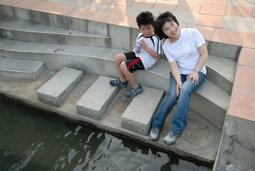 民宿剛好有一輛16吋的小車可以讓愛愛騎 而且剛好我們也有隨身帶些修車工具 調整好高度跟煞車後 這台小車就是接下來一天一夜愛愛在池上的座騎啦 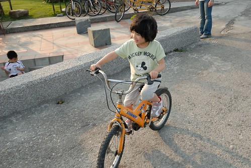 趁著天黑前 我們四個人騎著四輛車沿著民宿旁的環圳車道小騎一番 車道上回頭一看 瞧! 我們住的民宿多漂亮但又多融合阿 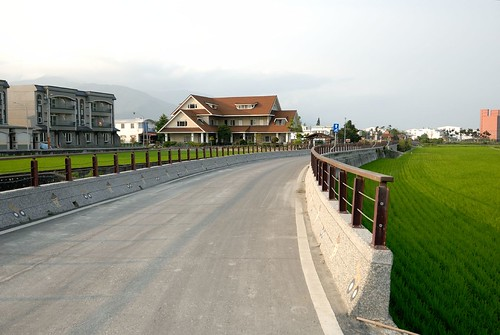 (單車環圳另述) 5點多騎完車後 我們再次迫不及待地回到民宿 回到房間我忙著整理東西時 突然阿徹喊了我 "媽媽 你拿我的相機幫我拍一張" 我轉身一看 哇! 阿徹這POSE還擺的真好哩 而且小子竟然也會搞FU了 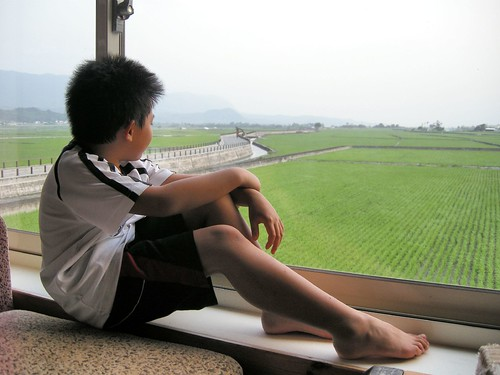 照完一張後 我說那轉個頭再一張吧 阿徹下半身不動 脖子以上努力地扭轉過來 哈!短脖子的他脖子完全不見了 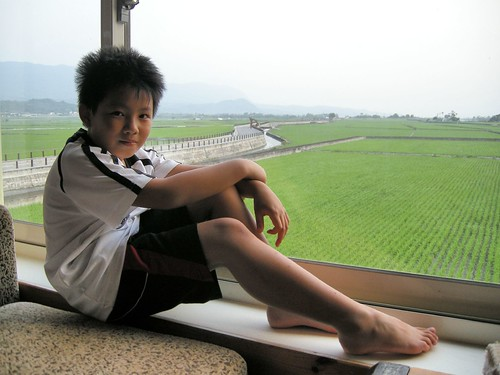 後來愛愛也要如法泡製一張 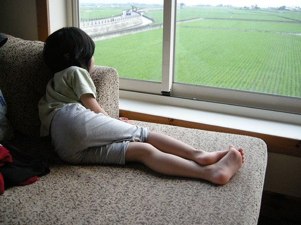 真的不是只有擺擺樣子啦 這個寶座真的很舒服很讚 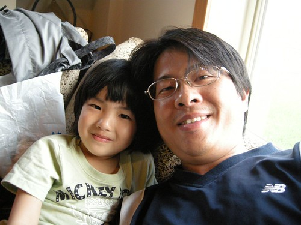 去店裡吃下午茶時 店裡大姐便先要我們點晚上的餐也預訂了用餐時間 晚上七點我們去店裡享用我們的晚餐 當晚的住宿客人加上其他來用餐的客人 滿屋子很熱鬧 因為我們住四人房 所以我們可以點四個套餐 分別是海鮮義大利麵 梅仔雞鍋 豬腳飯還有豆漿鍋 阿徹她們的義大利麵最先上 有荷包蛋有配菜的非義大利麵條的義大利麵套餐 很特別但很好吃說... 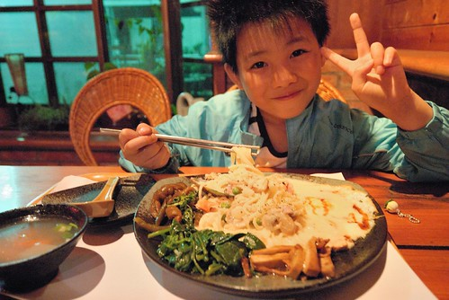 我們努力地嗑完四套餐 還有餐後的飲料跟手工豆花 好飽好滿足喔~ 而步出餐廳後看到天上的月亮如月暈般 更覺今晚真是個好夜啊!  回到民宿後 我們又在庭院納涼賞月好一會 晚風徐徐 一身飽 攤著肥油躺在椅子上 舒服地讓人好想睡覺阿 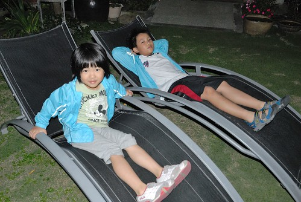 回到房間後 那晚上我們一家子都睡了個舒服的好覺...(這是阿徹的自拍 這小子相機玩的比媽媽好) 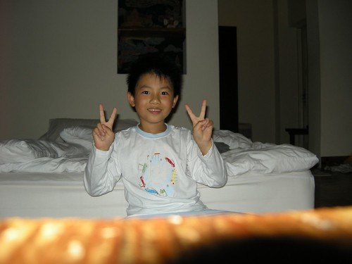 隔天七點起床後 窗外美景依舊 可是天氣陰還飄著細雨 ㄋㄟ阿捏 我們還沒要回台北哩.. 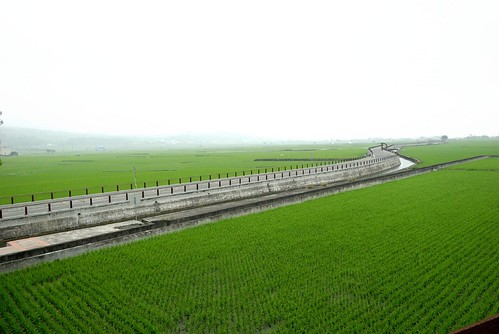 之前在網路上就耳聞民宿提供的中式早餐很豐盛 真的果然很豐富! 溫度與稠度剛剛好的地瓜粥 5樣以上的青菜 當地新鮮有名的豆皮 炒蛋炒豆干 還有手工包子及豆漿 除了肉鬆外 沒有任何的罐頭醬料 (第一次住外面附的是沒有醬料的中式早餐) 多樣但簡單清炒的青菜 營養又好吃 這早餐又讓我們吃得好滿足好飽 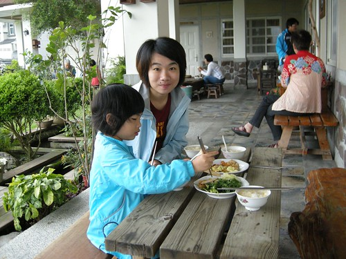 瞧! 好吃到連愛愛也大口大口的吃 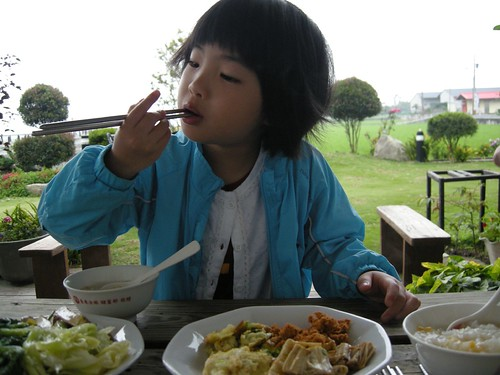 我們四個人來來回回吃了4盤多的菜 三顆包子 好多杯的豆漿 ... 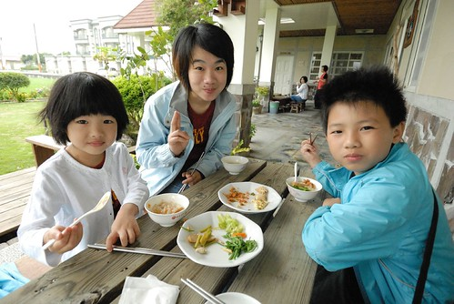 我跟徹爸兩人討論著 一個周六晚上的這樣四人房這樣早晚餐費用4千初 其實真的不算貴說... 真的推薦大家旅遊時多多支持鼓勵像這樣的當地民宿! (那種賣FU高貴的民宿就不特別推了) 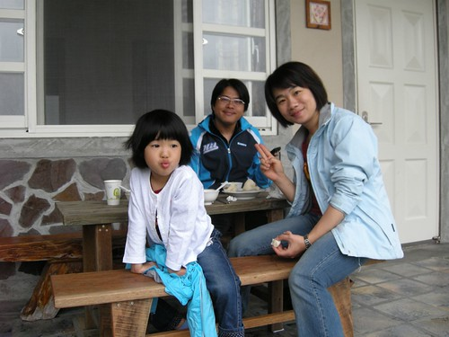 早餐時間後客人陸續退房離開或是騎車去逛逛　而我們一家子繼續賴在庭院裡的..躺椅上 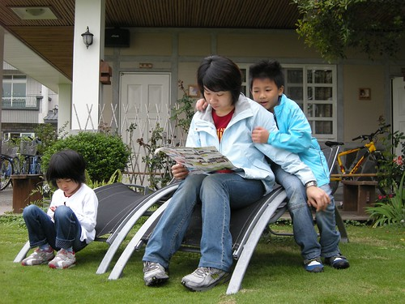 然後阿徹說要拍全家福 首先用他自己的相機設定 效果意外的還不錯說 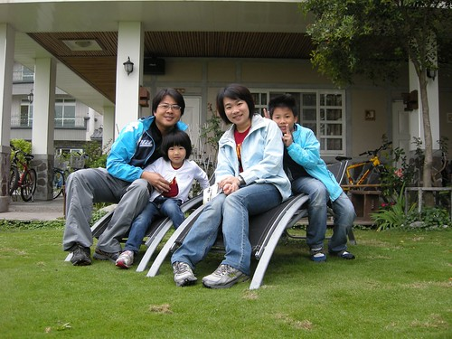 後來我們把小兩放好在椅子上 很high的玩了好幾張全家福 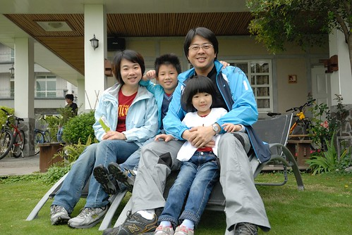 然後我又說 再來張以稻田為背景的吧! 於是我們又大費周章的搬了要坐的椅子 要放相機的椅子.. 發現沒! 我們母子三人穿了一樣的衣服哩'Yeah! We are family' 之前在Lativ買的家庭服第一次出動..至於爲什麼爸爸沒穿? 因為行前我整理行李時 爸爸說這衣服顏色跟他長褲不搭哩 而且春耕野餐會應該會有記者 這樣太招搖了 於是我默默地把徹爸的衣服給拿了起來 當日徹爸看到我們的衣服問'那我的哩'  我說沒帶阿 徹爸臉上小小的Orz一下(ps 不知道老婆向來很乾脆的嗎) 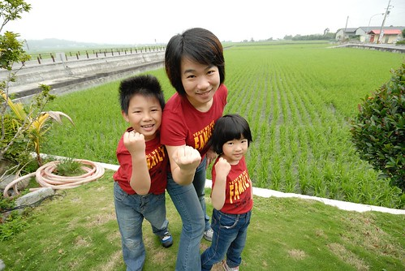 我們一家子自拍玩的正高興時 主人潘姐突然出現說要幫我們照 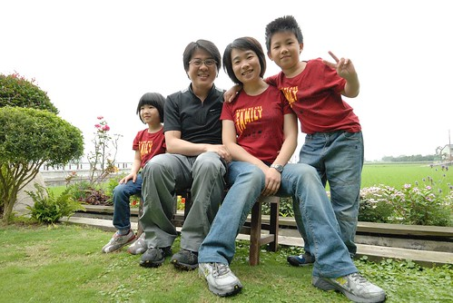 邊照邊數落一下 怎麼爸爸沒有穿一樣的ㄋ 還說鏡頭內的爸爸表現最不好... 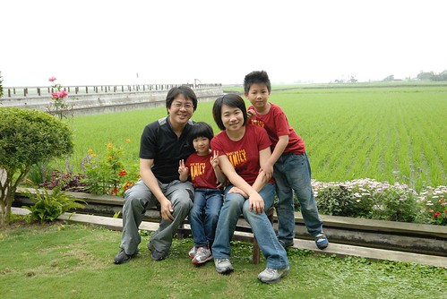 潘姐也照的很開心 還說'這快門聲音聽來真不錯阿' 然後一直按一直幫我們拍 難得地我們拍了這麼多的全家福! 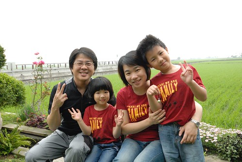 拍完照後 阿徹小愛回房進行她們的秘密遊戲 我們則在院子裡跟潘姐聊天 原來潘的店已經開了15年嚕 而民宿是三年前才開的 開民宿的原因是潘姐的老公想要在警察退休之後有事情可以忙 但潘姐老公覺得潘的店是女人家的廚房事 民宿的話則有好多的活可以做.. 原來潘的店裡或是民宿裡的大部分木桌椅或是櫃子啥的都是潘姐老公做的阿 從潘的店的笨拙成品到現在民宿裡的精巧 我們不客氣地問了蓋這樣一個民宿花多少錢 潘姐也很熱心的跟我們分享她們的經驗 原來她們本來預算是1千萬內 可是看到建築師畫的設計圖後 潘姐覺得怎麼房間 廁所看起來都這麼小 她跟建築師說可以大一些嗎 建築師說OK但沒講清楚大一些是等比例的全部放大 於是他們的預算大大超乎他們的預期一路追加上去 而他老公的退休計畫也只好視貸款清償情況而定... 發現很多民宿主人真的都像潘姐她們這樣 從一開始的小小夢想到後來變成不問成本的投注下去 真不知道該說是熱情如火還是傻 或許因為傻才能支撐熱情吧!

我們也打探了民宿後方樓房的價位 聽說是600萬喔! 很讓台北人衝動的價格 600萬在台北連公寓都買不起了 結果這邊好山好水好樓房阿 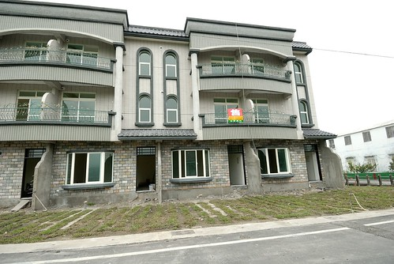 我跟徹爸兩人還很無聊的跑去房子內 感受客廳所見的視野  嗯!還不錯 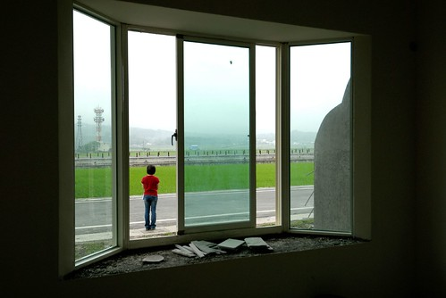 不過就如潘姐說的 如果有600萬那不如去買塊地自己蓋   我們問'可是要找到view這麼好的建地很難吧' 真巧! 潘姐說 她們隔壁的這塊田就是建地.. 哈! 再發生一次像921或311這樣的大地震 或許我就真來投資這樣的建地了 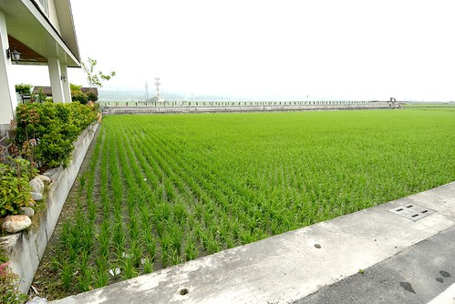 我們問潘姐 如果民宿旁邊那大塊建地被蓋起來了 那民宿的view不就很受影響了 潘姐說 就算以後蓋了房子 他相信這片田 這些好view還是會被保留給所有人的 我喜歡潘姐這樣的樂觀! 讓我打從心底感動&佩服! 回家後我跟徹爸說 我覺得潘姐好像一個人 好熟悉的感覺 徹爸說"對! 我也一直這麼覺得" 可是我們兩個人就想不起來到底潘姐是像誰... 像誰不重要 我喜歡潘姐這樣樂觀 自然坦率但又氣質優雅的女性! 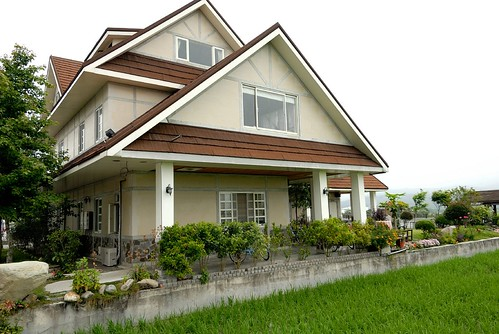 跟潘姐聊了蠻久直到9點半多才上樓收拾行李辦理退房 因為接著要進行幾小時的池上小旅行 於是我們先辦理退房並把行李寄放在大廳 等我們一點多結束環圳後再回到民宿小憩等著3點參加大波池的春耕野餐會 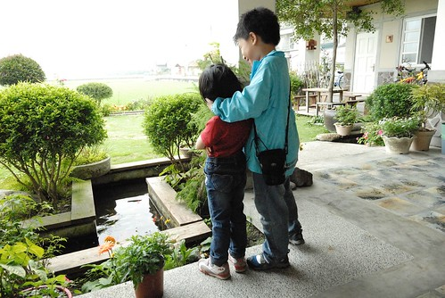 這時候下著不算小的雨 於是我們窩在簷廊下玩牌 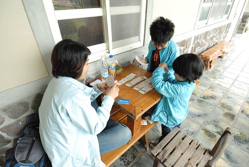 還有睡覺... 徹爸還真的睡到打呼了 害我們母子三人邊玩邊笑 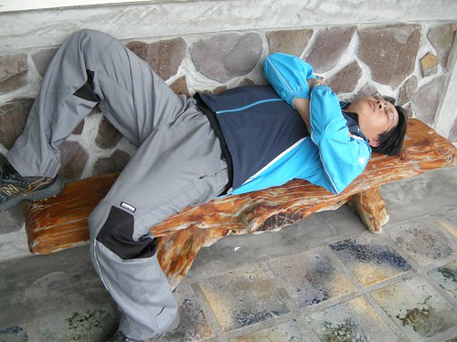 第一次在一個民宿待這麼長的時間 跟主人聊這麼多的話 被主人餵這麼多好吃的東西.... 我們全家人都很喜歡這! 希望以後也能有機會在結滿稻穗的金黃色稻田裡再次來訪! 我期待著...............

後記: 我寫完後徹爸才跟我說 民宿的blog裡有我們的照片喔 [http://blog.sina.com.tw/tt089864877/article.php?pbgid=59473&entryid=598097](http://blog.sina.com.tw/tt089864877/article.php?pbgid=59473&entryid=598097)

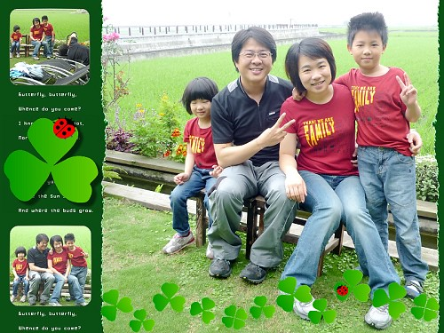 大概因為那時候潘姐一直說我們這家人感覺真好 還用他的相機幫我們拍了好幾張...
