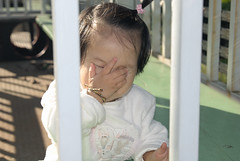
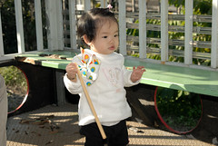

第二站泰安鐵道文化園區  
  
第一次感覺鐵道是完完全全的屬於自己  
不用擔心有火車追撞  
不用擔心小孩霸佔了軌道與火車  
不用擔心小孩淹沒在人潮中  
就這樣恣意的直直走在鐵軌上 走到自己開心自己爽  
讓阿徹自己一個人隨意的走的遠遠的  
讓小愛當個霸道的火車小駕駛  
  

阿徹叫火車是"QQ train"  
不知道這又是哪聽來的  
但讓人感覺火車很Q 很cute  
QQ train的魅力真的很大  
讓阿徹願意在軌道上這樣來回走了兩小時  
沒喊累沒喊酸

讚!我喜歡這裡  
喜歡沒有人的泰安舊站(假日的泰安不敢想像)~  
  
後記: 冬天裡暖暖的太陽 讓人忘情的直接暴露於其下   
         回來後才發現小愛被曬黑了~  
  
  
郊遊野餐 壽司+金蘋果   
(車庫口賣的壽司成了徹家出門在外趴趴造最方便也最好吃的食物)  
  
  
  
  
  
QQ Train上 蠢蠢欲動不安份的小愛  
  
  
原來小妮子想要開火車啦 開的可認真 可開心的  (徹哥 把門關好啦)  
  
  
  
  
  
  
一家四口就這樣隨意在鐵道上亂走亂逛  
  
  
  
  
隨意在鐵道旁偷尿尿 也不用害羞  
  
  
不知不覺走了好遠  原來在鐵道上走路還真不是件輕鬆的事  
  
  
這是啥咪東西 紅綠燈嗎?  
  
  
難得有平坦的道路可以讓小愛下去走走 短短一段路小愛走走蹲蹲了數十分鐘  
沒關係  難得沒人又不趕 您就慢慢走ㄅㄟ~  
  
  
最愛的還是這QQ Train  開始了兩個小孩的駕駛權之爭  
其實今天阿徹很棒沒有跟妹妹搶 因為現在每當阿徹不讓妹妹  
徹爸都會說"哎 你不喜歡妹妹 那把妹妹送人啦"  
然後阿徹就會說"好啦 然後甘願的讓給妹妹"  
  
先用手搶                                               不夠力 身體趴上去比較快啦  
  
  
看到哥哥玩著手排檔            也不讓哥哥碰 被念了後開始耍賴大哭  
  
  
哥哥站在後方也不行 努力的要把哥哥撥走   妹你真的太霸道啦 到後方乘客區反省一下  
  
  
阿徹口中的QQ Train  

