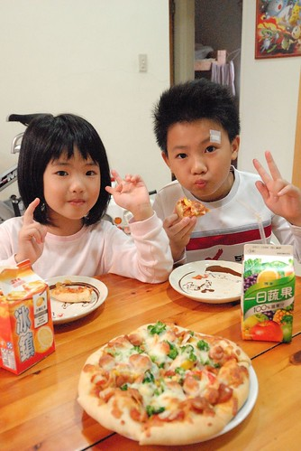

前個禮拜六在從阿徹學校回來的路上 不知道聊到什麼話題 我問徹愛"你們最喜歡吃媽媽做的哪樣菜" 想了兩秒鐘 徹跟愛兩人便開始你一言我一句的接著說"pizza" "焗烤麵" "媽媽做的焗烤麵超好吃" "像雞蛋糕的蛋糕"... 我說"有沒有正常一點三餐的菜阿" 徹愛這下又偏頭多想了幾秒鐘 而且列出的不若剛剛那些有的沒有的來的多 可是阿徹最後下了個這樣的結論"媽媽煮的東西都好吃 我都喜歡吃"  果真是貼心的雙魚好兒子阿! 不過其實就算徹愛說不上到底喜歡媽媽那樣菜 從平常她們吃飯的樣子 我清楚明白他們對我的支持! 

最近週六徹爸都不在家 剩下的我們母子三人剛好好好地呆在家裡勞作 游戲著 那天我們的中餐 有時後是清冰箱的鹹粥 炒飯 有時候是徹愛在週間隨口提出的"想吃焗烤麵" "好久沒吃pizza了" 真套句電視廣告上的台詞"爸爸都買給你"  徹愛要吃的 媽媽都變給你! 不過好久沒吃pizza了 家裡做的有嚼勁的厚餅皮, 洋蔥+番茄的濃郁紅醬, 玉米+甜椒+青花菜的繽紛又營養青菜, 以及香濃的起士絲 真的很好吃阿!  難怪我們母子三人就這樣嗑掉一個半的八吋pizza  

雖然很多親職專家提倡要讓小孩從小參與家事 學習家事 但我們家只要求徹愛負責收拾好他們的玩具 書櫃以及小床 其餘的家事 我總覺得年紀到了 心態正確了 給個環境 便自然地能上手了 要不然我每天分秒必爭的忙著一堆家事 還要多花一倍的時間陪著小孩洗碗或是清理灑滿桌滿地的麵粉 講真的 目前的我沒有心力與耐性去這樣"培養"小孩 不過我很在乎徹愛吃飯的態度以及對食物的感受與喜好 除了吃東西必需好好坐在餐桌以及得在不是太快(阿徹)但也不會太慢(愛愛)的時間內吃完的基本要求外 我希望他們懂得珍惜每一個食物的得來不易以及真實味道 我相信一個喜歡吃飯 廣泛接受各種食材(尤其是青菜) 且認真的把吃飯當作一回事的小孩 以後的身心必然健康! 而且家的味道必將引領著他們日後的生活態度與人生 這是我想給他們 最重要的東西! 

平常自己固定會去幾個親職專家網站巡田水 對於她們的主張 我未必全然接受也不見起身效法 純粹作為經驗的分享 今天在BoBo老師的網站看到一段話 很心有戚戚焉 "今天台灣的大環境並不缺新觀念，但缺少好的風氣。當觀念只停留在認同卻不能轉成行動之前，無論它有多麼深刻，都不會變成風氣、形成影響... 現在的孩子也許物質上是夠富足、也或許是太富足了，他們小小的年紀就有各種享受與豐富的經驗，但為什麼我總覺得他們離「生活」是遠的呢？好像少了一種屬於生活與家庭的特質──穩..." 所以她提出把孩子帶回生活這樣的標題 希望每個大人都有這樣的心意與努力  這讓我想到前陣子某個週六下午 等阿徹上完扯鈴課的時候我帶著愛愛去文化中心聽故事 那是我們第一次去文化中心聽故事媽媽說故事  我跟愛愛兩人還挺期待的 只是故事才聽一半 我跟愛愛兩人便有默契似的想要提早離開 因為現場不斷有小孩或跑或跳 或是繞到小舞台後方偷玩小道具 或是用著高於說故事者的音量興奮著 而故事媽媽也因此中斷了好幾次的故事 但不消一分鐘依舊一片混亂 而我最難以想像的是 大部分小孩的家長都坐在外圈陪著 那怎麼會這樣ㄋ? 我一整個難以理解 不過我很訝異愛愛的感受竟然跟我一樣 愛聽故事的她竟也因為現場的吵雜而想離開 後來跟愛愛牽著手 提早去學校接阿徹時 兩人走在安靜的巷子裡反倒有種逃過戰火的解脫阿  我一直覺得養小孩這件事是隨著小孩越大而越沉重的 雖然我們的教養方式也不全然恰當 但我很欣慰起碼我們有努力實踐我們的原則 而徹愛也似乎有走在範圍內的道路上 (套統計說法 有在信賴區間內) 
