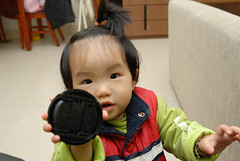

  
  
難道這就叫做"被小孩追老"嗎  
每每看著小愛每日的小變化小成長  
除了訝異 高興於他的學習外 便是感嘆歲月如梭  

已經可以健步如飛的小愛  
大腦神經元也正"顯著"的接受刺激連結中  
聽懂的話越來越多  
雖然能明確發出的音 用五根手指頭都數的完  
但是已經越來越董得利用肢體語言讓人明白他的需求  
肚子餓想要吃餅乾 自己去抱來餅乾桶 海苔桶給媽媽開  
聽到媽媽喊哥哥要吃飯了 去放餐椅的地方努力地搬動  
拉著媽媽的手去他想拿東西的地方  
看到哥哥開始放DVD  便拿著一根遙控器坐在沙發等待  
拿著書跟哥哥排隊等待坐到媽媽大腿上共讀  
  
尤其哥哥做的事 都會好奇的湊在一旁看 甚至想要有樣學樣  
由此可見哥哥的重要性  
所以說啦 對阿徹哥哥更加寵不得 她可是妹妹的小老師ㄋ...  
  
  
對於適合她的觸摸書不太愛  
總是喜歡看哥哥看的書 尤其是哥哥剛閱畢的書  
常可見到小愛等在一旁接收 還是默默靜悄悄的喔  
可以隨便席地而坐的看起書  
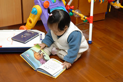  
  
也愛坐在飛碟台上看書  
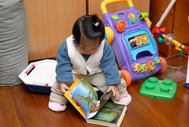  
  
站著看書也Ok啦  
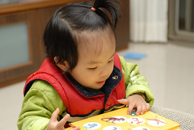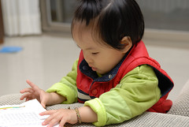  
  
最常拿著書要坐到小桌子前的小椅子上看(在保母家也是這樣)  
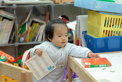  
  
"爸~家裡椅子太高 我又穿的太笨重上不去啦"  
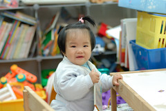  
  
坐定後 自個安靜的看起書來   
雖然常只停留在同一頁 然後咿咿唔唔 指指點點的  
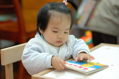  
  
  
現在出門很難抓了 四處走四處逛  
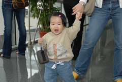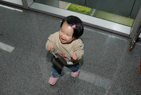  
  
很愛拿著刀子玩具+碗  逛大街  好像隨時準備好要去吃大餐  
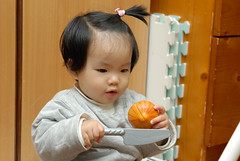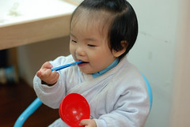  
  
每次偷戴哥哥的蜜蜂帽都很開心  
乖~等你長大再買蝴蝶帽給你  
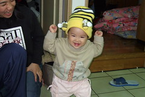
