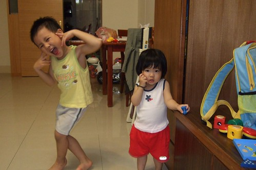
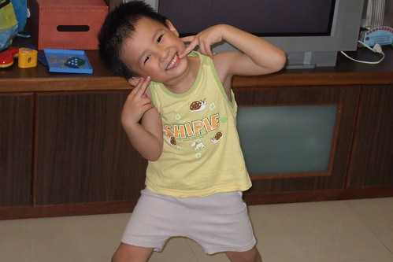
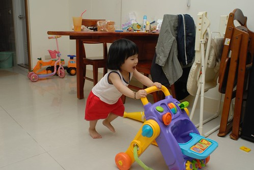
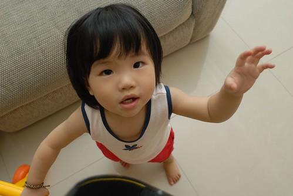
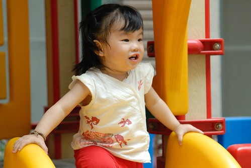
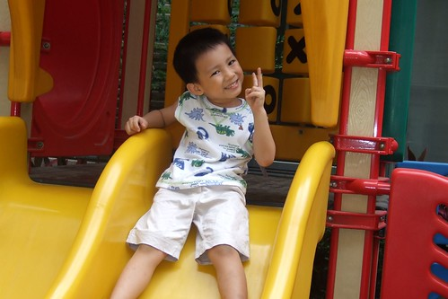
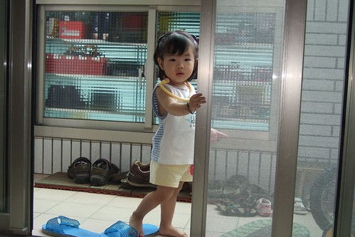
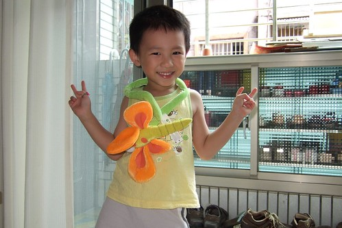
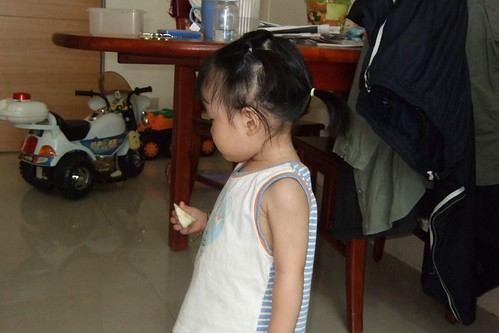
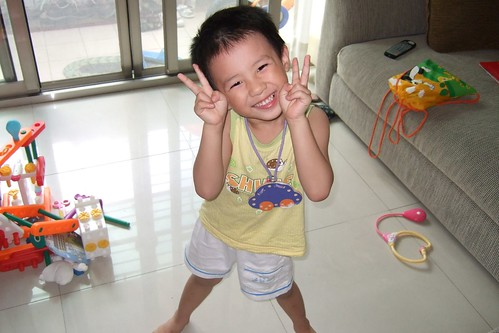

這個夏天阿徹愛上了小背心  
媽媽連帶的也戀上了穿著小背心的小孩  
這個炎熱的晚上也給小愛換上今夏的第一件小背心  
露出小肚南以及纖細但還算健美的臂膀  
小背心 讓人涼爽多一些 額頭汗水少一些 冷氣電費也省一些  
  

阿徹最近照相很愛擺這手勢  
兩個在臉頰旁的YA 很像滿滿笑容的延伸  
似乎在詔告天下 我是皮小子 我很開心 我很High~  
  
  
  
徹爸說像不像豬哥亮在工作  
哈哈~黑黑馬桶蓋頭加上五分小寬褲 的確很台味  
  
  
  
發現小愛的胸膛也是蠻有厚度的  
完全之遺傳到徹爸家 圓厚的上半身搭配著纖細的四肢  
  
  
  
換個味道 今日改走中國風  
但沒有風的夏日午後 一樣讓人玩的滿頭汗阿  
  
  
  
阿徹會愛上小背心 就是因為這系列的恐龍背心  
花花 滿滿的動物圖案 加上胳ㄗ窩下微風徐徐 難怪阿徹這麼愛  
有了小背心加持  汗水濕透頭髮的速度緩慢許多  
  
  
  
給小愛穿上哥哥小時候穿過的小背心 小短褲  更是有種時光飛逝的感覺  
雖然人家都說"看別人養小孩都很快"  但我看自己養小孩也覺得很快阿  
快到讓人覺得無法細細品嚐回味小孩的變化  
腦袋中快速流轉著小孩從小到大的身影 就像影片被4倍甚至8倍16倍的快轉了  
就像最近牽著小愛去幼稚園接阿徹 或是去飯包店打飯  
很多婆婆媽媽看到健走如飛的小愛都用著訝異的眼神與語氣說  
"這麼快會走啦 那時候還都揹著而已 怎麼現在都會走了"  
老天好像真的把我們的人生給加速快轉了....  
  
  
  
有天上課老師講到背心 阿徹急於分享的說著"我也有穿背心耶"  
老師說"背心是西裝裡面穿的那件背心 你那是沒有袖子的t-shirt"  
我跟老師說 跟阿徹說"那是嘎ㄚ~"  
嘎ㄚ~ 哇哈哈 突然絕淂蠻可愛的說法 就像阿徹們的小背心那樣可愛  
  
  
  
接近中午時分 越來越熱 而媽媽還在撐 撐著不要開冷氣(爸爸打球不在家 要不然應該早就開了)  
看著小愛脖上頭髮漸漸黏濕   忍不住幫他紥上小馬尾  
哇 清涼清涼~ 不過怎覺得小愛後頭髮際很高 顯得頭圓的像顆球 怪怪的  
  
  
  
很熱 熱的讓人不想出門 不想動 但阿徹卻還是精力旺盛  
奇怪~小孩子為什麼永遠有驚人的體力與耐力ㄚ  
  

