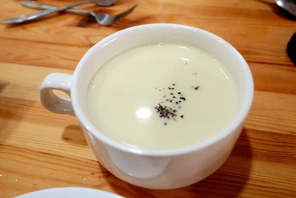

一個多月不見的寒流讓上個週末冷颼颼  可是週日徹爸卻說"明明溫度很低 可是我怎麼沒有覺得冷" 我笑說"因為你早上喝了地瓜濃湯 讓你身子整個暖了" 雖然徹爸心裡應該有點不以為然 但我們母子三人一致肯定早上那碗湯的效果! 多方嘗試早餐食譜後 更是體會一碗熱呼呼 暖洋洋 甜滋滋的濃湯帶來的溫暖! 一碗濃湯配上媽媽牌土司或餐包 簡單又營養 是我與徹愛的最愛!

不若以前只能去義式或西餐廳才能喝到濃湯 再不就只能有康寶濃湯 自從半年前廚房添了手持式攪拌器後 煮出香濃細緻好喝的濃湯再也不是難以做到的事 以洋蔥為基底(炒過多份焦甜味) 搭配根莖類煮熟打泥 最後大量牛奶的調整濃稠是煮湯的簡單步驟 套用以上公式 加入南瓜是金黃色的南瓜湯 加入馬鈴薯 花椰菜是令人意想不到美味的白色蔬菜湯 就算簡單的只有奶油炒麵粉加牛奶與前一天晚餐剩下的玉米剝粒放入都好喝 康寶濃湯再也沒機會上家裡餐桌 就連玉米粒 玉米醬罐頭也越來越不使用... 而越來越熟悉也習慣濃湯後 開始嘗試不同的食材 做了前陣子網路上看到農友分享的地瓜濃湯 想不到一直以為很台 只能烤地瓜 地瓜飯 地瓜酥的地瓜竟然也可以是好喝濃湯的主角 好喝到徹愛一喝就睜亮眼問"這是什麼湯? 好好喝喔" 阿徹甚至形容好像玉米濃湯的味道 卻又更香更甜....  就如我常跟愛愛說的 以後你也要像媽媽這樣煮好喝的湯給你孩子喝 一鍋熱騰騰的湯帶給家人的不只是營養更是份從心升起的溫暖...

補充: 話說上個週末中餐煮青醬義大利麵時 我也煮了個綠色的濃湯 我神秘的不肯先說到底是什麼材料讓湯跟義大利麵一樣是綠色 父子三人的答案從一開始的 跟義大利麵一樣的青醬 猜到綠花椰菜 蔥 長年菜... 我最後答案揭曉是常跟皇帝豆一起煮湯的青蒜 父子三人一臉的不可思議 所幸味道雖然特別但真的還不錯 阿徹邊喝邊說"有皇帝豆湯的味道揶 好喝!" 我那個沒有打的很細緻的馬鈴薯就這麼化身成阿徹口中與嘴上的黃帝豆沙 呵呵~ PS. 這道湯是看BuBu老師的書學來的  老師真是太厲害了 想出這樣異想天開的組合
