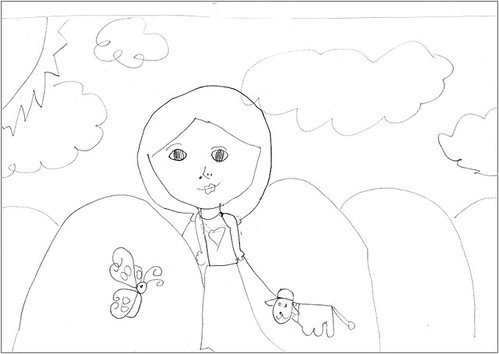

這半年來阿徹很愛畫畫 而且特愛畫人 上小學前她畫了張"媽媽"送給我   畫上的媽媽感覺好溫柔阿 前幾週有一天他才很認真的告訴我"媽媽我覺得你好嘮叨" 所以看到這溫柔媽媽後 我問他"媽媽有這麼溫柔嗎 還是你希望你媽媽可以變溫柔" 阿徹歪著頭想了一下後回答我"你現在這樣子就好了 沒關係"

孩子~ 媽媽會努力當個不嘮叨的溫柔媽媽的 !!!

可是每天早上得叫賴床的小學生起床然後督促他吃早餐換衣服出門 講真的還真考驗小學生的媽哩~

