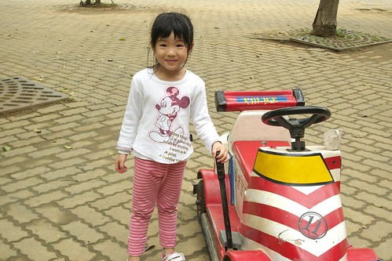

我們家的愛愛又多一歲!  實實的滿五歲嚕!! 

每個月學校的慶生會愛愛總是羨慕著別的小朋友過生日 好不容易等到她的11月  月初慶生會那天放學時看到我便開心的喊著'今天我生日 我有吃蛋糕喔' 我說'小朋友 今天不是你生日 只是慶生會'  愛愛的臉一如以往的卡住了 不過是不是今天不重要 能吃到自己的生日蛋糕最開心... 除了執行一年兩次之一的買大玩具外 我們家其實不過生日了 可偏偏阿徹哥哥滿五歲時 不知怎樣的竟買了個蛋糕幫他過 而且還有血淋淋為證的照片 看著照片裡的阿徹壽星跟蛋糕 愛愛羨慕的問著'爲什麼哥哥可以有蛋糕 可以吹蠟燭' ㄟ....這下真的很難解釋清楚...所以我們家有了條新規定  '每逢5 10 15...可以買蛋糕過生日' OHYA! 愛愛好開心今年的生日有蠟燭吹 蛋糕吃嚕~  

11/25生日那天媽媽因為有跟以前同事的聚餐所以愛愛的生日提早前一天過 跟愛愛約定好我下班時會買個蛋糕回家 愛愛在學校一看到我就問我'蛋糕ㄋ' 其實已經先把蛋糕拿回家冰的我假裝說''老闆都賣光了 買不到' 愛愛那失望的表情真是讓人再多想逗逗她 她說'那我規定你星期日之前要買喔' 狠心的媽媽繼續一連串的戲弄她'乖乖吃飽飯後我們再去買買看' '我先打電話問老闆看看好了'... 最後確定今日是沒蛋糕可吃時 愛愛的臉失望到極點 可憐的模樣連爸爸都忍不住嘀咕我'好好的生日要這樣搞'  哈哈! 而就在一切家事打理妥當拿出蛋糕時 愛愛那不可置信的表情 老實說讓我有點懺悔真的不應該這樣戲弄她的 嗯! 下回就從早到晚都沉浸在生日吃蛋糕的愉悅氛圍中吧 

準備的是愛愛最喜歡的巧克力蛋糕 虧媽媽年初的時候還曾經雄心壯志的希望在愛愛生日前學會做黑森林蛋糕了 最終還是因為懶而無疾而終了 明年 明年...繼續期許明年..如果阿母可以這麼賢慧的學會那每年都吃蛋糕過生日還有啥問題ㄋ... 

巧克力+鮮奶油+草莓 愛愛最愛的組合 

一口接一口 口口皆美味阿! 

而剛吃完妹妹生日蛋糕的阿徹則開心 我們家下一個吃蛋糕的是他 阿徹問'媽媽 下次我可以吃蛋糕時候 我幾年級'  媽媽算了算說'四年級'   阿徹說'好' 孩子...我們家的日子都過很快的 相信我們很快就又可以吃到生日蛋糕了! 

我們母子三人吃蛋糕吃的多開心阿! 

結果吃完蛋糕才發現還沒送愛愛生日卡片跟禮物說.. 卡片是阿徹哥哥月初便完成的精心之作 上頭還寫了密密麻麻祝福的話 希望她妹妹 快樂 健康 但是不要愛生氣 

而禮物則是前陣子我跟徹爸休假時去買的小美樂衣服 因著這套衣服 兄妹倆最近又瘋狂重新沉浸在洋娃娃的樂趣中了 

順道再貼一下愛的近照 ~ 覺得愛愛最近照相很好看 尤其那含蓄但又自然的笑容實在加分很多 尤其穿上小裙子 小洋裝 算稱的上氣質小美女啦 

愛愛自己也越來越愛漂亮 對於漂亮裙子 美麗靴子的渴望與讚賞一點都不失女人的天性 不過好在還不到不可控管 無法理喻的地步 規定她平常上學時只有週一跟週五可以穿裙子 欣然接受 不過可以穿裙子那天早上都會特開心 肯定不會賴床 而週末則往往因戶外活動 自然而然的都是選擇褲裝  深深明白穿褲子才方便活動 

爸爸最愛最希望的就是這樣的 陽光運動路線 

自從有天徹爸在他的小手上畫花小妝飾後 愛愛喜歡上這樣的"打扮"方式 某天 爸爸跟哥哥各自貢獻畫了隻小狐狸(阿徹因為看不下爸爸畫的 所以才也畫了一隻) 

有時候愛愛索性拿起筆自己畫她一通 

畫了畫的手似乎讓愛愛有如皇冠上身那樣開心榮耀 

"HAY 你在說什麼" 愛愛的口頭禪之一 

隨著愛愛的長大 媽媽越來越能感受到女兒的"貼心"與不同 

不是說女兒就真的比較貼心 而是女兒的女生特質讓媽媽好有"同伴"的感覺 哥哥爸爸不愛的逛街 喝喜酒這些事 女兒卻都很樂意的奉陪 尤其媽媽從小就一直好羨慕人家有姐姐妹妹可以一起逛街一起進廚房進更衣室 所以真的會欣慰"有個女兒真好" 

打扮成小淑女要陪著媽媽一起去喝酒嚕 

喜歡婚禮氣氛的愛愛不怕舟車勞頓也不怕婚禮的超不準時開始 

而看到美麗的新娘子登場時一切都值得啦!  最後想要藉著這篇愛愛的生日記為跟愛愛同天生日 上週出生的鄭妹妹祈福: 鄭妹妹 你媽媽真是天底下最愛小孩最想要小孩的人了 你很幸運的遇到了你的媽媽 可是可不可以不要再惡作劇下去了 許你媽媽一個特例或奇蹟吧! 所有你媽媽週遭的阿姨們都很愛你媽媽  讓我們一起幫你集氣 你自己也要加油喔!!!
