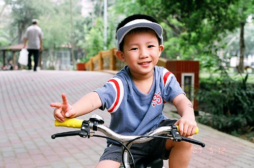
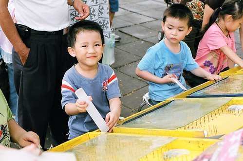
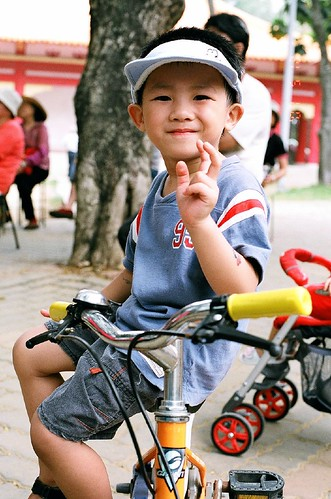
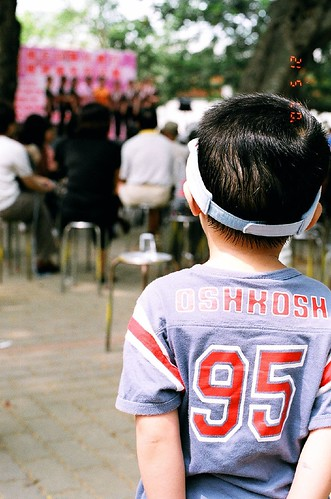

  
  
覺得阿徹很愛玩但也挺會找樂子玩的  
這陣子阿徹很愛找我們跟他演戲  
愛到要他選擇睡前要講故事還是演戲 他會毫不考慮的說演戲  
幾個月下來熱情不減  
反倒越來越講究故事的邏輯性與場景的佈置  
雖然大部分的情況都是阿徹扮演那討喜的主角  
但整場戲往往是需要由扮演壞角的媽媽或爸爸撐全場  
要不然戲會冷場到不行 進行的速度也會宛如跳針的DVD player  
一個場景 一個畫面 卡很久  
也許慢慢跳 倒也勉強困苦的可以看(演)完  
但也也許就當機當在那 逼的人只好關機(爸媽臭臉下令不演了)

  
雖然專家說不可抹煞小孩的原創力  
但我想在阿徹有朝一日成為第二個李安前  
我跟徹爸的演技肯定先精進不少(虎爛的功力也大增)

阿徹戲碼的題材很廣泛 演過  
小紅帽 大力水手 Jerrt&Tommy的貓與老鼠 鹹蛋超人大戰  
睡美人 白雪公主 動物園裡的管理員 警察抓小偷...  
還有最近很愛的三隻小豬 連續上演數十天依舊熱情不減  
演到當阿徹用枕頭做好老三的家 喊著"要演戲了"  
小愛就也會開心的拿著浴巾往身上披(因為演老二的媽媽都用浴巾或棉被假裝是房子)  
等待大野狼爸爸來調戲她  
當大野狼把她一口吃掉或是老二拉她一起躲藏時 笑的花枝亂顫

阿徹的老三家有時候有煙囪可以讓大野狼進入  
但更多的時候他會大喊"我家沒有煙囪"  
ㄟ...這樣子 大野狼演不下去啦 這戲要怎麼收尾哩  
大野狼只好從臭水溝爬入但半途就被燻的落荒而逃  
或是從窗戶跳入但被玻璃刺傷 大量流血身亡  
或是猛撞磚牆但不得而入 只好嚇的逃跑  
也或許大野狼勇猛的破牆而入 一口氣吃掉三隻小豬  
但最終因為吃太飽 跌落水溝 撐破肚皮 三隻小豬又重見天日

真的很白痴 很無厘頭 但每晚就是這麼在我們家上演著

(徹)要演戲嚕 今天是第二舞台 今天要演的是...三隻小豬...  
~卡麥啦~

ps.阿徹說遊戲區是第一舞台 房間是第二舞台  
  
阿徹打珠台的功力還不錯 常可以打到吹泡泡罐或是蘆筍汁 不像爸媽小時候只會打到沙士糖  
  
  
  
坐在從台北扛回的腳踏車上看戲嚕  
  
  
  
小子看的還挺認真 投入的....  
  

