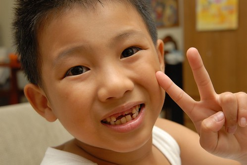
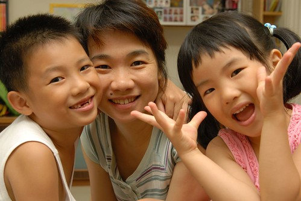
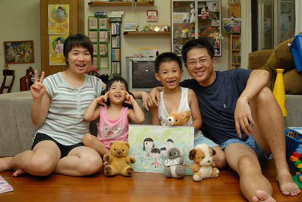
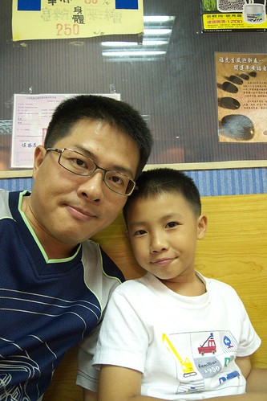

七月初接連的掉三顆牙 尤其是最重要門面的上面兩顆大門牙後  阿徹成了無齒之徒 我說 看著無齒之徒阿徹總讓人忍不住發笑 美賢阿姨說 我這媽媽這樣說真是太沒良心 太傷小孩子了心了 結果阿姨在看了阿徹的照片後下了這樣的結論: " 原來....牙齒...真的....很重要   沒了兩齒、就很有諧星的特質ㄝ" 哈哈~ 連阿姨光看照片都覺得好笑 更何況是我這每天都能看到無齒之徒的阿母ㄋ

看著阿徹乳牙一顆顆的掉 新的恆牙一顆顆的長出 又更不得去面對阿徹"變老"長大了 希望牙越換越多 我們家的阿徹也越來越脫胎換骨 是個成熟懂事的美男子阿!!!

呵呵 無齒之徒的照片還是太駭人  所以沒敢擺在首頁嚇人  

真的 每當看到無齒之徒這樣衝著我笑  我都會忍不住笑場 因此調皮阿徹那陣子很愛突然的衝著我裂嘴笑 我問他 會覺得這樣不好看 不好意思嗎 他說不會阿  還說看到媽媽這樣看到他的牙齒就開心笑不停 讓他也覺得好開心 

好久沒來張全家福了   一家三代同堂來替阿徹的無齒留下見證 PS. 前面的哪幾隻熊跟狗就是愛愛跟阿徹的愛子愛女  我跟徹爸的金柑孫啦 

所謂成長就是又酸又甜的過程結果  所以伴著換牙也是阿徹一陣一陣的情緒起伏 叛逆反抗 小子每次的叛逆期強度都很夠也很明顯 雖然可以明顯感受到他的逐漸長智慧 長腦袋 但.....耐性不佳的我們還是希望他可以"白目"少一點 很多事多用點腦袋想一想 換個角度想一想 問題就都不是問題了 徹爸都說 阿徹跟他很像 真的很像... 請問 還要經歷多少的起伏成長才能變得像爸爸這樣強壯阿?! 阿母好期待喔.... 
