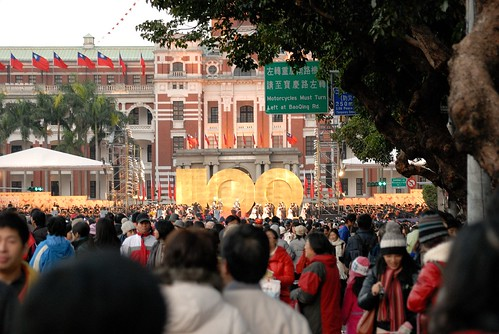
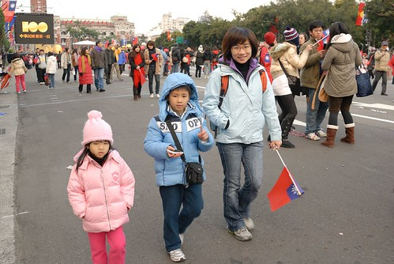

跟徹爸兩人唸著元旦來去總統府升旗已經連續好多年了 但一次也沒去過 而今年我們倆人搭著開國百年的熱潮總算真的在元旦日早起去總統府升旗 這也算是種'百年難得一見'吧! 

基於我們家晚出早歸的生活習慣 跨年 日出 升旗這些事當然絕對是不太可能發生 不過今年這'100年'的氣氛實在吵的太火熱 連愛愛有時候都會像是在講大消息般的告訴我 '我跟你說喔 再過幾天就是100年了'  有一次還接著說'是台灣100歲的生日喔' 雖然被徹爸認真的更正說'是中華民國100歲生日 不是台灣' 不過可見這從老到少 從大到小全都知道今年的跨年與元旦特別不一樣 百年難得一見阿!

不過會去升旗起因於徹爸在11月底還12月初看到希望基金會的元旦健走活動 夫妻倆人看到那豐富的活動紀念品實在很心動於是便很熱血地報了名 甚至兩人還說去總統府升旗完剛好去健走 時間接的剛剛好 是很剛好 不過這對夫妻還真'熱血'的連自己都很懷疑自己 不過最最起碼的情況就是只去參加8點半的健走 這絕對不會是問題吧 而年底前如果我們跟人家提起打算去參加元旦升旗也總會招來質疑的眼光'小孩起的來' 我都說'我家小孩晚睡絕對不行但早起應該還可以' 因此經過這回 讓媽媽我對於日後透早出門這件事是越來越有信心的啦 瞧 清晨5點初阿徹跟愛愛起床不過10分鐘而已 卻已是這麼精神抖擻 這兩個年輕人果真是好樣的阿 

12/31的台北是個不夜城 連捷運也不打烊 從12/31透早營業到1/1午夜才休息 光這件事就讓人絕得跨年是件瘋狂的事.. 

撘捷運往台北車站時人潮並未太多 我還以為人應該都在跨年後睡昏只剩小比例的台北人來升旗 結果沒想到從公園路往凱達格蘭大道的方向是越走人越多阿 

這時候天還是暗的 還看的到高掛的月亮跟金星 怎麼這城市就已經這麼熱鬧了 

抵達大道時 天阿! 滿坑滿谷的人潮...有沒有這麼誇張阿 

站在公園路與凱達大道的交叉口時 身後的人潮讓我們沒有多少時間思考到底要往左還是往右 最後毅然決定還是往右 往總統府方向挺進...而這越是挺進人是越多阿 好不容易有個可以立身之處了 即使看的不怎麼清楚 而且還有點擁擠 但是因為擔心若往前會不會情況更糟 所以人就只能尷尬又不怎麼舒服的處在那 這讓向來怕擁擠人潮的我們 熱血都快被急速冷凍了 所幸後來因為阿徹跟徹爸的勇敢前進 讓我跟愛愛最後得以在228公園側門處舒服的參加升旗 

6點到6點半的升旗前有三軍儀隊表演 但是電視牆的效果實在讓人感受不到那磅礡的氣勢 不過反正就是等待那六點三十分起五分鐘的升旗儀式 我好久好久沒有這樣肅穆地一起唱著國歌 感受國旗冉冉升起的升旗歌(看不到只能用聽的感受) 以及那一大片的國旗海.... 好久沒有"我以國家為榮的悸動了" 那感覺真的挺棒的說...呵呵

只是升旗一結束現場人潮開始快速的散去... 咦 升旗活動不是到七點半嗎 大家這怎麼都散的這麼快阿 而且還不到10分鐘就走光大半的人 這效率跟秩序還真是令我吃驚 

我們因為反正也得等著銜接8點多在台大的健走 所以我們留在大道上繼續感受這氛圍 尤其自從上次的10月圍城後就再也沒機會隨意走在凱達格蘭大道上了 而阿徹則趁機會撿拾地上那些升旗過後遺後的藍紅白綵帶 

只是突然間看到後方幾顆大球滾滾而來 我嚇得快帶阿徹跟小愛躲回人行道上 真的! 熱情之下的人潮是很容易發生意外的   所以還是帶著小人閃遠些安全點 

升旗之後是100對新人的證婚儀式 電視牆上接連播放著新人雙嘴用印 穿過劍門進入總統府 新人們的婚紗照 以及在府內與正副總統合照的影片... 

愛愛大概是全場裡最專注於這場聯合婚禮的觀眾了 

我問愛愛"你以後要不要也來總統府結婚" 愛愛點點頭說"好阿" 

反正愛愛就是從頭到尾都超級專注地看著大電視上的新人 而我們則是努力的拍照 

期間爸爸還自己一個人更往前一探究竟 趁著幫情侶檔拍照的機會也請對方拍下這見證的一張 

同時間在後方的我們 阿徹突然問我"媽媽 要不要我幫你拍照?"  我高興的說好阿 結果一旁的單眼級攝影伯伯好心的問了我們"要不要幫你們照" 我說"謝謝 爸爸去前面 而他(阿徹)純粹拍好玩的而已"  不過感受到台灣人濃濃的人情味阿 

今天徹爸把他收藏&預留很久的一台小DC慎重地交給阿徹 從100年1月1日起阿徹成了這台小相機的主人 讓他可以在以後出門的時後用著自己的相機隨時隨手的紀錄下他想紀念的事情 看了這張 徹爸說"構圖不錯喔 比你媽媽強多了" 

徹爸還說 有了阿徹的相機那爸爸的照片就可以多一些了(媽媽越來越懶得帶小DC出門跟拍照了) 

後來讓阿徹小愛坐在人行道上休習 順道讓喝牛奶補充體力 (愛愛的眼睛還是盯著大電視) 

而我們則又趁機跑去來了這麼一張照  徹爸說這張角度好阿 

結果等我們拍完照趕緊跑回小人處時 正好看到一個中年爸爸(同行的不知道是老婆還是女兒)熱烈地將他們手上僅有的二隻國旗交給了阿徹他們 這讓一早上都只能看著羨慕著別人手上國旗的我們好生感動阿 

OHYA! 我們也有國旗了  建國百年元旦紀念版的喔

有了國旗 我跟徹爸當然得再來補個一張照嚕 (真的很愛照的夫妻倆 也難怪徹爸要給阿徹一台相機 擺明目的是要讓他兒子可以多幫他照些相) 

休息到7點半活動也都差不多結束了 我們準備往我們今日下一站前進... 

走前 再補個4人的大合照  今日元旦升旗成功! 

我問阿徹 "升旗精彩嗎" 阿徹說"很精彩 不過以後不要再帶我來了" 哈哈! 不知道阿徹是不喜歡早起還是被人潮嚇到了 或者都有吧! 不過媽媽也是一樣不會想再去參加升旗了 這種盛會百年來一次就夠了.. 

真的覺得升旗之後的大道上就像一場熱鬧的嘉年華   大家不知道在High什麼 反正就是開心地一直想照相 尤其那些刻意打扮 精心呈現的愛國人士更增添熱鬧的氣氛 偶而參加這樣深刻感受到"國家"的嘉年華會感覺真的還挺不錯的啦! 

我們沿著大道往中正紀念堂捷運站前進.. 

一小時前這大道上還是滿坑滿谷的人海而現在卻已是散場後的三三兩兩 我喜歡這樣的早晨 這樣的街道 感覺連空氣都跟平常吸的不太一樣了 

而途中經過中正紀念堂時不小心又被這樣的大景給閃到了 

此時內心的澎拜真是難以形容阿 呵呵~    感覺自己這輩子大概就屬這一天最愛國了 

雖然對於這建國百年到底該不該花那麼多錢舉行相關活動很有爭議 但我覺得能趁一些特別日子讓國人歡舞一下 甚至或多或少的喚醒/凝聚一下大家愛國的熱情那也算是好事一件 而且竟然連我們家的五歲愛愛也都很開心100了喔 (今天不管在捷運站或是台大內看到聖誕老公公 愛愛都超開心 要求來一張) 

今日徹家的第二個熱血就是早上九點在台大開步走的元旦健走活動 

我們報名了兩個名額  報名費一個人300元為的就是那紀念卡套以及歐都納紀念帽 (這張是阿徹照的) 

8點到9點是報到時間 我們8點半完成報到後在舊體育館門口階梯休息等著開步

阿徹趁這機會拿出他早上撿的彩帶 不知道搞什麼的忙了好一會 

忙完後再拿出他的相機把玩一下 

幫媽媽妹妹照一張 

幫妹妹來一張時難得地捕捉到愛愛豪爽的笑容 其實愛愛很常這樣豪邁的笑著只是照相時超會假的 

也幫爸爸來一張 爸爸說"阿徹果然比媽媽上進多了" 不過想當初媽媽在相機蜜月期時也是很勤勞的阿 所以阿徹現在還算在新師好棒賽街段啦 不準不準 

九點在基金會董事長紀政以及一堆名人(後來看電視才知道還來了不少哩)帶領下大家開步走嚕 4000名的報名人數加上沒報名的人= 好長的隊伍 

走了半小時後 隊伍才漸漸拉開可以照著自己的速度走 只是今日目標萬步 所以在台大裡的路線規劃繞來繞去的 遇到小徑時便又嚴重塞車了 

阿徹早上忙了好一會的事就是把彩帶這樣纏在國旗上 我自己不知道有這麼的顯眼 徹爸說她忍不住在我後面偷拍了好幾張 

雖然自己只在總區上過一堂課但好歹也算是個校友 所以走在台大校園裡心頭別有一番感受阿 不過這時後的台大校園真的很漂亮 那深秋的景緻真的一點也不比林場遜色哩 

尤其校園內到處的老樹林蔭 搭配上那一棟棟的舊建築物真的超有FU的 

跟阿徹說這是台灣第一名的大學喔 阿徹問那會很難念嗎? ㄟ... 阿徹又問離我們家最近的大學是哪一所 我想了想 咦...好像就是台大哩... 小子努力吧! (講真的他以後若能跟爸媽一樣念個中興我們就很感恩了) 

阿徹今天有很勤勞的練習他的新機 尤其在台大校園內有很多的美麗景色讓他直嚷著要拍下來 

下面這也是阿徹經過時突然說這面綠色的牆真美麗要幫我們照一張而照的 或許因著相機可以讓阿徹更能享受走路的樂趣 以後去爬山時不要那麼唉唉叫了 

健行的時後愛愛說了好幾次"我的腳好痠喔" 講真的從清早到現在媽媽的腳也有點痠了 尤其不能照著自己速度走路時更容易覺得腳累 所以我們都跟愛愛說"那抱一下休息一下好了" 可是愛愛卻又說"可是我想要好棒 想要都自己走  等到我撐不住的時候你再抱我" 我們只好說"好 等到你真的不行的時候要說喔 不要逞強喔" 可是愛愛最終還是靠自己走跟我們一樣多的路 而且沿途一如以往的說說唱唱 我跟她說 "我覺得你的嘴巴比你的吸盤腿還要厲害哩 真的很厲害" 

活動路線本來的規劃是一萬步 且在兩小時內 11點前回到起點開始抽獎活動 可是走到中間的蓋章點時(大約一半的路程 在總圖)就已經是10點半多 於是蓋完章確保可以領到紀念品後 健走的隊伍突然間就不見了 剎! 大家鳥獸散 各自亂竄回起點處   而我們則趁機去活動中心解放以及買東西吃解餓 (台大活動中心內的聖誕樹) 

最後如活動規劃的時間回到起點領取今日的紀念品 平安御守 每日健行一萬步保你健康又美麗! (這張也是阿徹拍的 徹爸好像常會忘記要拍這類的紀念照)  等著抽完講確定沒有那樣的好運後 我們總算回板橋吃M叔叔 結束我們這百年元旦熱血活動 希望元旦那日的感動能讓我們家在民國一百年裡都熱血滿滿阿~
