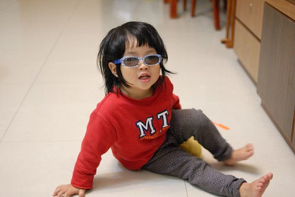
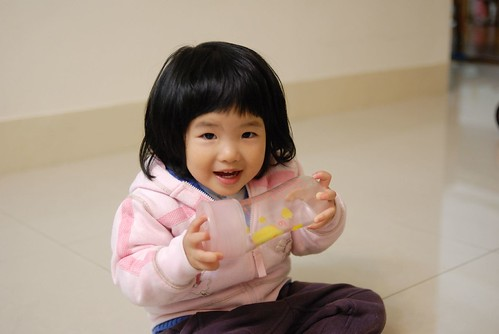
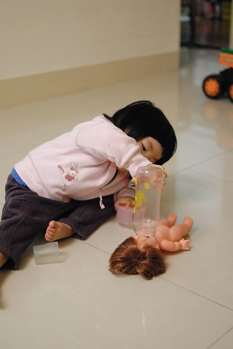
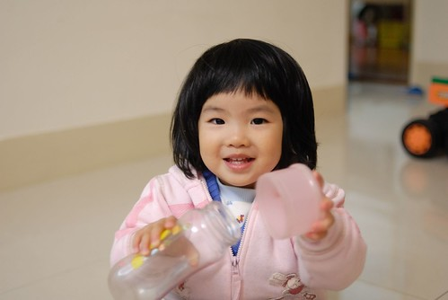
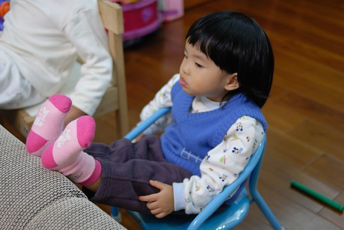
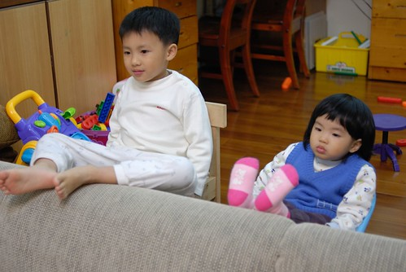
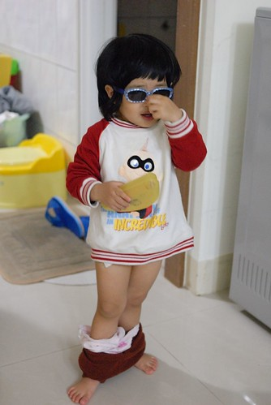
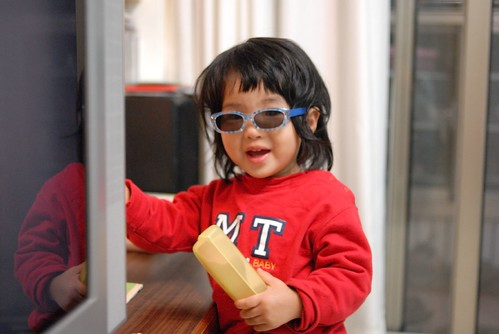

這陣子小愛的語言表達又越來越流利與豐富了  
除了已經可以幾乎通暢無阻的表達她的意見外  
更學著哥哥的語氣說著”好 我知道”  “…知道沒?”  “好好笑 真的好好笑”  
加上偶而”念冊歌”似的念著”1, 2, 3,…10” “one two three four eight”  
以及一句很常講可是我們百思不得其解的”at 包包”   
我們真的只能讚嘆學校環境對於小孩語言影響竟是如此之大

  
  

話越說越溜 個性當然也伴隨著越來越機車(徹爸說只能用機車來形容)  
凡事都得先請示過小姐意見  
雖然大半時後她會妥協或是善體人意的悠悠說著”好吧”以表達她的無奈接受  
但有時卻堅持的讓人失去耐心  
而且”個性”也越來越捍衛自己(實在不願意接受我女兒很”恰”這事實)  
甚至連阿徹哥哥都可能會慘遭她的毒手  
(某天一起洗澡時小愛要不到東西就狠狠的從哥哥屁股咬下去 痛的哥哥哀嚎大哭)  
不過幸好小愛還算是可受教 也許該說是長眼  
嚴厲的教訓後皮會繃的緊一點  行為會收斂一點  
只是看到阿徹哥哥這幾年的逢半必番 且番了這麼多輪迴後現在還是番  
對於小愛真的會有點”挫” 不知道還要被她”折磨”幾年   
  
這陣子剛滿二歲的小愛應該就在番期吧  
昨天徹爸回家看到我在罵小愛 用著驚訝的表情問我"你今天比較兇喔"  
我說"沒有吧 是真的覺得有需要罵"  
過沒多久我也聽到徹爸拉開嗓門喊"妹 #@@#..."  
我說"爸爸 今天脾氣也不太好喔"  
徹爸總算願意承認 真的需要對小愛嚴厲點 盯緊一點了  
總不能在女兒甜蜜蜜的傻笑裝傻後  
只能軟酥酥的摸摸女兒的頭 說著"下次不要了喔"  
一切便歸於平靜...  
所以該是我跟徹爸IN起來的時候了...In In In....   
  
(要泡ㄋㄟㄋㄟ給娃娃喝)  
  
  
  
(娃娃 乖乖喝ㄋㄟㄋㄟ...)  
  
  
  
(娃娃喝飽了)  
  
  
  
看電視的時候很愛翹起她的短腿  
  
  
  
原來都是學哥哥的  
我們跟阿徹哥哥說"你看 你多麼重要 妹妹都學你講話 學你做事情"  
所以這個哥哥不對他嚴厲一點怎行  
  
  
  
除了喜歡把娃娃衣服扒光光外 最近還有戴太陽眼鏡的癖好  
看電視要戴 尿尿要戴  騎車要戴   
  
  
  
披頭散髮的時候更要戴...哈哈  
  

