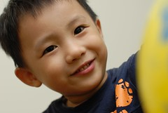
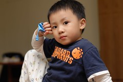

雖然阿徹跟爸爸這小倆口近來還是常因為阿徹不乖爸爸生氣而小冷戰  
但阿徹最近卻常指名要爸爸接送  
甚至為了要讓爸爸帶她去學校上學放棄每天早上必看的5分鐘卡通  
問阿徹"你不愛媽媽接送嗎"  
他說"要輪流阿"  
而徹爸也曾經請假過幾次好早點下班去接他兒子  
頭一兩次老師還會訝異的問怎麼是爸爸來接  
後來老師看到爸爸送去 卻也揶揄的笑說"今天又被點名啦"  
對於這對常像戀人般吵吵鬧鬧卻又甜甜蜜蜜的父子  
我真的只能說夠了喔~

前幾天徹爸在幫阿徹洗澡時  
阿徹又對爸爸說"你明天可以早點下班來接我嗎"  
徹爸說"ㄟ..我要問我老闆" (忘了徹爸怎說的)  
阿徹說"你跟你老闆說你很想我 所以要早點下班阿"  
徹爸說"如果老闆說不可以ㄋ"  
阿徹說"那你就偷偷離開阿"  
在外面聽到對話的我已經忍不住爆笑了  
不過當事人徹爸還是得一臉正經的說"偷偷離開會被老闆罵 這樣爸爸錢就會賺少少了 阿徹就沒有錢買玩具了"  
阿徹說"那我買一個玩具就好了"  
........  
什麼時候這麼渴望老爸了  
竟然為了老爸心甘情願少買玩具  
哈哈~  

