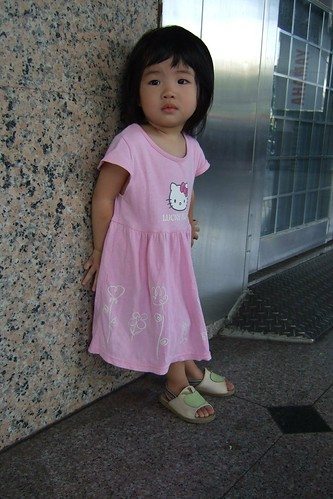
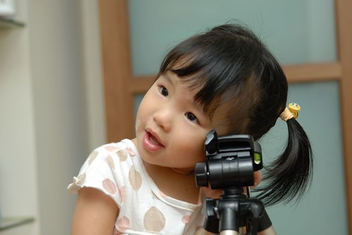
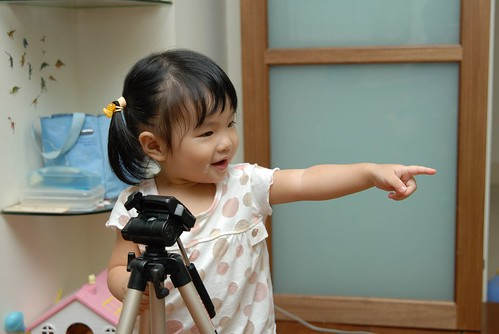
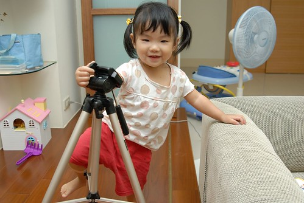
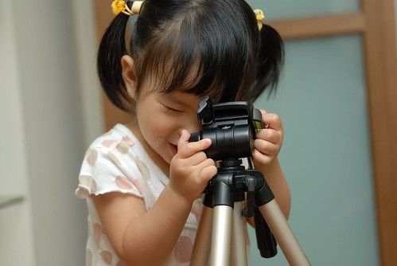

雖然我們很幸福的有個興趣是買相機的爸爸  
也很幸運的這個愛買相機的爸爸 技術還挺不賴  
但最最最幸福&幸運的是這個爸爸有兩個可愛的小model  
所以說啦 有小兩的加持 加上阿徹小愛這兩個可人兒   
徹爸如果拍不出好照片 "來人阿 拖出去斬了" 這應該沒人反對吧  
  
小愛這POSE　真的很像徹爸常潛水網站上的外拍model標準POSE  
連眼神都帶點淡淡的憂愁　好像瓊瑤小說裡穿著長裙　氣質優雅的憂鬱少女  
  
  
  
這是ＱＱ版  
  

腳架也成了攝影配角  
  
  
  
這ＰＯＳＥ就有點鄉土了。。。  
  
  
  
唉呀　小愛搞錯啦　誤把雲台當相機　窮開心  
  
  
  
這表情真的跟阿徹小時後超像　" 小阿徹"當之無愧  
  

