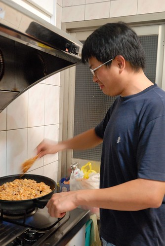
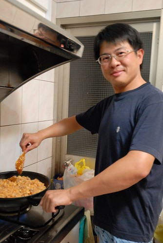
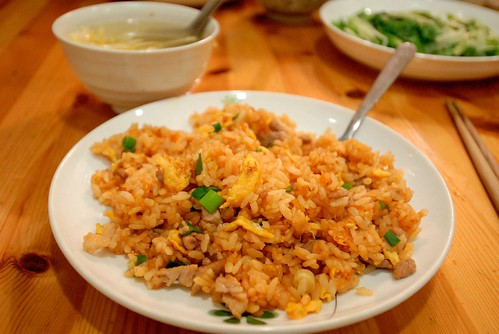
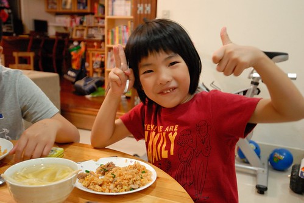
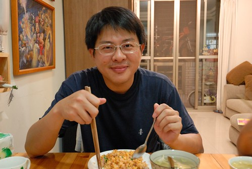

「君子遠庖廚」雖然被人誤用作為男人不入廚房的理由 但我們家的一家之主真的就是那個遠庖廚的君子 而且離的很遠... 甚至一家之主在外也從不隱瞞他在家就像個大老爺一般 只需負責洗碗與一週一次的拖地家事 其他時候就是飯來張口 茶來伸手(是沒這麼誇張 但就是坐在餐桌旁等老婆熱好所有菜湯) 其實我也從不以為意 畢竟每個人的興趣不同 擅長的事不同 分擔的事也不同 就像我就沒法修水管 換燈泡 與整理那成堆的照片一樣... 今年八月的某一颱風天是我們第一次吃到一家之主為我們煮的一餐 我們吃著軟硬適中 鹹淡剛好 熱呼呼的泡麵 驚呼著"爸爸煮的泡麵真是太好吃了" 於是煮泡麵就此變成爸爸擅長的家事之一...

上週六我在嘀咕著隔天週日晚餐要外食還是煮什麼時 徹爸可能是被我的柴米油鹽碎碎念搞煩還是搞昏了 竟然脫口說"我來炒飯" 嘖嘖嘖! 這可真的是我們家的大事! 連隔天中午我在煮水餃時 阿徹看到電鍋煮著飯訝異的問"為什麼要煮飯"  我說"爸爸說他晚上要炒飯" 阿徹瞪大眼睛的說"爸爸? 怎麼可能!" 我說"真的" 真的! 那天晚上我真的就準備好飯  蛋 肉(還先炒好8分熟)跟蕃茄醬  等候徹爸的大顯身手 而徹爸也果真很有氣概與氣勢的踏進廚房拿起鍋鏟 同時我這二廚也很盡責的在旁告訴大廚什麼時候可以下飯 遞醬油 遞蔥花 而且二廚還很貼心的讓炒飯只有蛋跟肉 只怕易生水的青菜讓飯給糊掉了  徹爸很有耐心的分好幾次加入蕃茄醬 不斷的拌炒 努力的要煮出屬於他的味道 他的代表作 只是炒一兩分鐘後便開始嚷著手好痠 我用來炒菜的飯匙太難用 他要去買把木鏟... 還問我可以像外面那樣"翻"炒嗎 我說"鍋子很重 翻的動的話 請~" (寫到這裡徹爸問我在寫什麼  他說"這 這...有什麼.. 炫耀文" ㄏㄏㄏ )  總算炒了10來分 我眼睜睜看著一塊塊的蛋漸漸染上焦色的時候  徹爸的蛋炒飯完成了 盛盤端上桌後 雖然沒有油亮亮但也可是粒粒分明 色(這絕對有)香味俱全阿~  大家直呼"真是太好吃了!"  我還硬逼每個人都要說一下看法或感想  剛被罵完的阿徹雖然照相的表情很難吃的樣子 不過還是三兩下就解決掉一大盤 而且阿徹說爸爸的炒飯有三四年前在我們家巷口那家日式料理店的蛋包飯味道 沒錯 沒錯~ 想不到相隔這麼多年 而且當時年紀小的阿徹竟然還能這樣兩相比對 爸爸驕傲的大笑兩聲 說"這就是我的味道啦!"  讚! 第一次就能有這樣的成績很是令人欣慰與感動! 給我們家爸爸拍拍手~ (我們真的有放下筷子鼓掌)  後記: 隔天星期一晚餐前 愛愛嚷著好想要吃爸爸的蛋炒飯 我問"真有這麼好吃嗎?" 兄妹倆露出渴望的眼神說"很好吃耶~" 我說"對不起! 爸爸只有周末可以接受點餐!" 兄妹倆失望的大呼'唉呦" 星期三中午問兄妹要吃什麼 兩人又說起爸爸的蛋炒飯 哇ㄌㄟ~~~ 我深深懷疑徹爸有沒有在蛋炒飯裡加了什麼迷藥 不過或許我該是好好想想可以再怎麼多激發與利用徹爸這可能存在的潛能....
