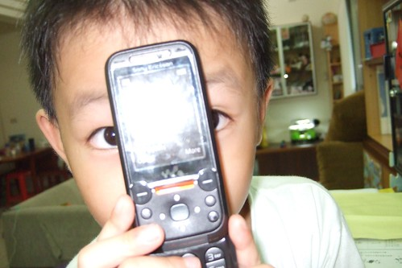
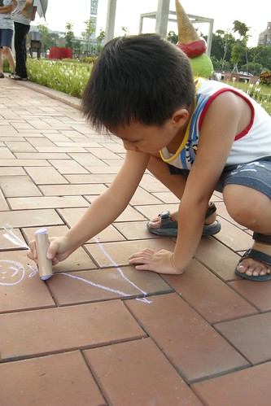

看著同學們開始掉牙換牙 阿徹開始偶而嚷著"我怎麼還沒有掉牙齒阿  我好想要掉牙喔..." "啥咪!!! 為什麼你想掉牙" 阿徹說"因為掉牙 牙仙子就會給我金幣阿"

我說"掉牙後(還用手指比了比他的門牙) 照相笑的時候嘴巴會一個洞黑黑的很好笑喔" 阿徹說"可是我想要牙仙子的金幣阿..." 阿徹露出一附很渴望要錢的樣子 我心理忍不住疑惑他這麼想要錢阿 看他對牙仙子這麼充滿期待 實在很怕他屆時失望 忍不住跟他說 沒有牙仙子啦  有的話應該也是爸爸吧 然後牙仙子爸爸說"漂亮的牙給10元 一點點線的給5元 蛀牙的0元 " 阿徹眼睛發亮 哇著說"ㄛ~~~10元" (10元對他來說已經是大數目了) 我說"你為什麼這麼想掉牙換金幣阿 掉牙很恐怖哩 有時候牙齒不會馬上掉會在那搖搖晃晃的 然後可能你吃芭樂的時候不小心就"喀"的掉了 然後不小心就被你吃進肚子了" 接著徹爸又用著更誇張的語氣說"然後牙齒就跟著你大便一起大出來.... 不過沒關係 大便中的牙齒我給你15元好了" 我說"那很噁心哩...(問阿徹)你要這樣吃下去嗎(把牙齒吞下去)" 本來我是預期阿徹想著大便回答我說"那很噁心 我才不要哩" 結果沒想到阿徹是想也不想 一臉堅毅+興奮的跟我說"當然要阿 這樣就可以賺好多錢錢啦" 哇勒~~~這小子真是想賺錢想瘋了..... 我開始擔心他到時候會不會故意把牙齒都吞進去了 不過講真的我還真難想像阿徹門牙掉光 笑著時候會漏風的樣子......

(阿徹的腦袋真的還蠻符合媽媽期望的幼稚 常有一些讓人噴飯的想法)

 註1:  牙仙子的故事來自於卡通"粉紅佩佩豬" 佩佩豬把掉下來的牙放在她的枕頭下 晚上睡著後牙仙子就會拿一個金幣來交換她那掉下來的牙齒 註2: 這週去看牙醫的時候 問了阿徹的牙醫什麼時候開始換牙 牙醫阿姨說大班到小二間開始換牙都是正常的 而且一般來講男生又會比較慢一些.... 奇怪?男生學講話也慢 學尿尿也慢 連換牙也慢 男生真的是天生慢半拍喔 不過女生似乎就落得"小時了了大未必佳"的下場
