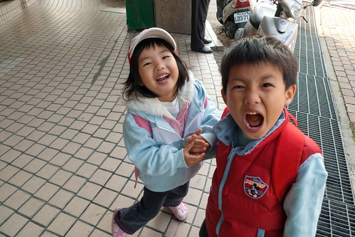
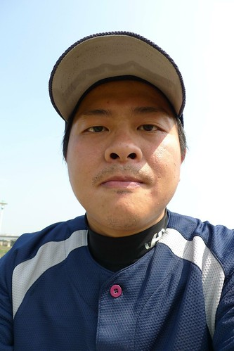
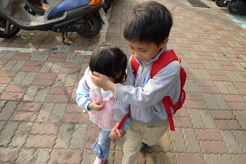
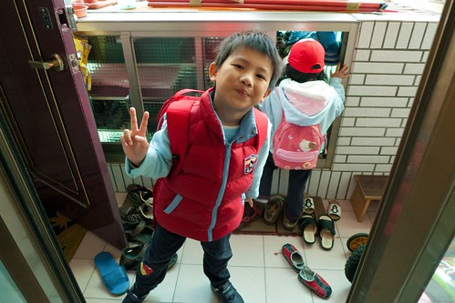
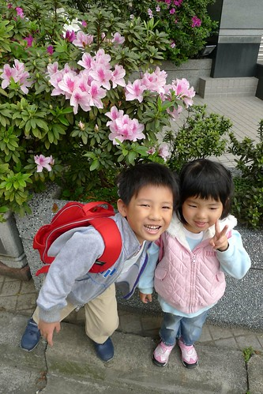
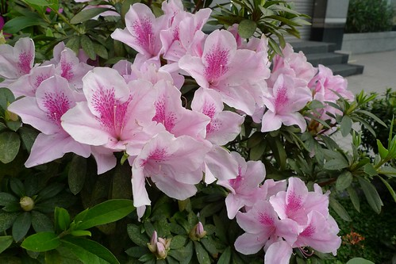

最近我跟徹爸常對兄妹倆說"阿~你們是猴子喔 蹦蹦跳跳的" 結果越唸猴子越開心  跳的更高 笑的更誇張.... 

真的! 我跟徹爸真的養了兩隻小猴子... 本來那隻小的猴性還不高(還是尚未顯現而已) 但最近隨著大的猴性高漲 小的猴性也連帶被啟發出來了 徹爸感嘆著"覺得妹妹小時後比較漂亮像女生 現在看起來真的好猴喔" 我也只能安慰徹爸"放心 等到中大班後他應該就會回復女兒身啦" 希望真的....可以女大十八變 ?!

 

從以前我就一直認為家中第一個小孩的教養很重要 因為老大會深深影響著下面的弟弟妹妹 就像我家的陳大哥 徹爸家的張大姐.... 也許因為這樣 我們對於阿徹嚴格了些  對於小愛卻多了些疼愛 大體上來說阿徹是個好哥哥  起碼有好吃好玩的會想到他妹 但膽小又害怕寂寞的他其實也是很依賴他妹妹的...   

兩個人每天吃在一起 玩在一起 睡在一起的結果就是兩個人越來越像 小動作像 講話語氣像 連故意唱反調的樣子也像 有一天我去接她們放學時  小愛一看到一如往常開心的叫著我 但那天聽到她喊著不同的"嘛ㄇ一ㄡ"時 我第一個反應/感覺是"哇勒~ 活脫脫她哥的叫法"

有一天晚上在家她(故意的)用"ㄟˋ"叫了我幾次 跟她說"不可以說ㄟˋ" 然後她用著更故意的表情故意的說著"幹麻~" 再跟她說"不可以說幹麻~"  她得意的笑了起來 哇勒~ 提前跟她哥一起搞"七歲的叛逆阿"

一個猴子帶出另一個猴子...然後我們家每天有兩隻猴子在那跳阿叫阿笑阿.... 恐怖~ 後天的影響真的恐怖

但好像又不全然是後天的影響 猴子的爸爸好像也猴樣頗俱 加上媽媽愛玩的猴性 唉~ 好唄! 還是回到我本來的信念"先天後天一半一半"

(兩人走路常會手牽手哩... 但阿徹不是好心幫妹妹遮陽 純粹調皮不讓爸爸照妹妹)

姑且不論這兩隻小猴子有多狼狽為奸 但很欣慰他們起碼可以和平相處(當然也會吵架 但哪對小孩不吵架) 甚至可以是彼此很好的朋友及玩伴

如果小愛因為哥哥而提前進化 那阿徹可能因為妹妹而退化吧

兄妹倆在早上出門上學時 常出狀況惡搞他們的爸 關門 開門 爭先恐後搶的罵罵號 看到徹爸踩到狗屎還一起笑爸爸"好臭 好噁心"

真是枉費徹爸對她們這麼好  三不五時帶去逛書局買小禮物 看到美麗的花也一心想幫她們留下美麗的倩影... 難道這年頭的父母都得這樣被小鬼頭糟蹋?! 唉~也許這也是我們自己造的孽 因果 因果阿...

順帶貼幾張徹爸在送小孩上學路上的隨手拍 :

最近巷口設社區的花圃也盛開著美麗的杜鵑花 紅的 粉的 白的都有 煞是美麗...

還有花圃旁一樓人家門口的花盆小池塘 早晨時盛開著的荷花

阿徹請徹爸拍給媽媽看的荷花  謝謝徹爸&阿徹

