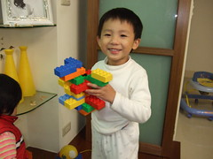
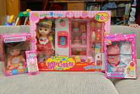
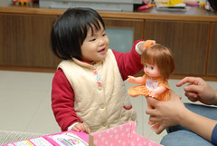

四歲的阿徹 果然令人又愛又恨~  
常會有讓人意想不到的鬼點子或言語表現   
讓人不得不承認他真的如海綿般快速學習長大  
更常有的莫名堅持及好奇  
則嚴峻的考驗著爸媽的耐性與毅力  
幸好偶而出現的體貼 善意行為  
還能讓人欣慰這小子還值得我們這樣勞心勞力的罵他  
  
最近常掛在嘴邊的 "爲什麼~"  "我不要~"  
反應著他的不妥協與不了解  
講真的我很難理解 爲什麼這個年紀的小孩常會搞的爸媽像失控了的瘋狗  
我想他也很難理解與諒解  爲什麼爸媽常會對著自己吼叫 難道他真的有這麼不乖 有這麼讓爸媽生氣難過嗎  
  
曾經試著跟阿徹來軟的  但深深覺得硬的真有其不可替代的重要性ㄚ  
不過 我們還是帶了阿徹去買他延宕許久的禮物 洋娃娃  
期望透過洋娃娃能稍微慰藉 撫平這幼小叛逆的心靈  
讓這個叛逆期時間能縮點一點 強度減緩一點  
~期待浴火重生的阿徹~  
 (哈哈 這樣算是搞悲情牌嗎)  
  
這樣的阿徹看起來就像是成熟懂事的大小孩了 讓人忍不住想摸摸他的頭 抱抱他  
   

   
  
阿徹跟小愛的洋娃娃   
 
