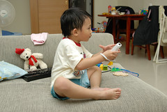
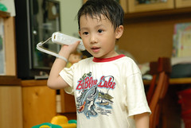
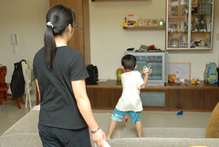
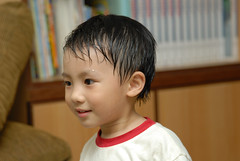
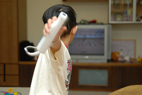
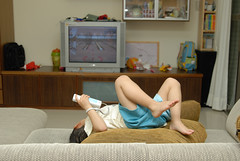
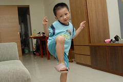
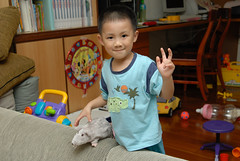
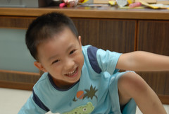
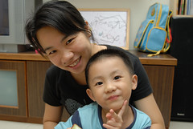

話說徹爸跟徹媽原先也一直在觀望等待wii的公司貨  
想不到過年回嘉義時發現徹伯竟然已經用高價敗了一台  
於是一家三口得以提早嘗鮮體驗 徹爸還打網球打到"ㄊㄧㄚˋ手"  
更更好康的是 徹伯竟然說玩的有點膩 要讓我們帶回台北玩  
(其實wii真的要人多比較好玩 要不然自己一個人再那揮阿揮真的挺白吃的)  
徹伯真的是一個大大好人阿  
  
帶回台北後 阿徹偶而說要打網球或是打拳擊 媽媽就要當起伴玩小姐（是運動不是電動所以准。。。）  
雖然媽媽的技術也不優　但要打敗阿徹這小子應該還足夠  
只是這小子有練習有差喔　越來越難應付  
用他連續的快速揮拍彌補timing的落差  
甚至還能發出讓人難以接招的Ａ球  
媽媽再不勤加練習　認真點打　大概很快就會成為小子的手下敗將了。。。  
  
一開始偷懶坐在椅子上揮拍　　　　　　　　打的不太好　只好站了起來  
 　 

越打越激動　拼命往前衝　　　　　　　　　　　玩的滿頭大汗　像是剛洗完頭  
 　  
  
打完網球換保齡球 最高紀錄８？分  平常水準６０分上下  
２０分鐘打下來　也是挺累人的　雖然累還是要玩　躺在沙發上也能玩....洗溝　甘願了吧...  
 　  
  
看到阿徹那濕淋淋的頭　媽媽比他還難過  
所以過兩天就被媽媽拎去檢個小平頭啦　雖然看起來有點像小流氓　但清爽多了  
就算頭髮濕了既看不出來也很快乾　所以隨便你玩啦  
  
　  
  
　
