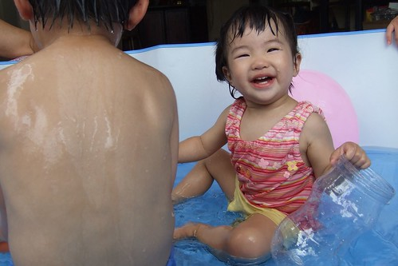
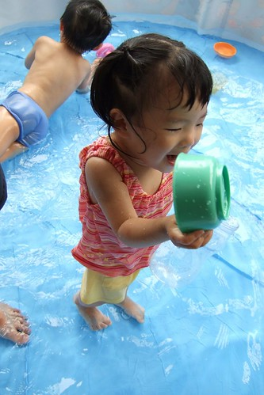
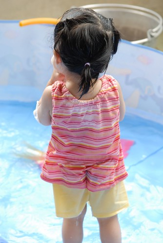

前陣子去逛COSTCO時 跟徹爸忍不住手癢的買了個戲水池  
不用打氣的喔  攤開注入水就可以立起來的喔  
而且才300多元一些 算是很便宜的大玩具  
本來準備要在板橋家裡頂樓玩的  
但因隔壁戶整修房子把家當全凌亂的堆放在頂樓 加上前鎮子的梅雨季  
阿徹每天盼阿盼 唸阿念  
總算總算在端午假期 讓他在嘉義阿公家下水嚕~  
  
打開一看 大大不妙...怎...怎...怎這麼大阿  
這...這...水要不少哩  
水龍頭水力全開的注了10多分鐘  水總算到了阿徹腳環  
雖然阿徹手比著戲水池1/2高度 直喊著"水要到這裡"  
但飲水當思源阿  有水當思沒水苦    
所以水淺淺的就好 就當作在臭水溝裡玩水吧~  
  
雖然淺淺的水讓阿徹有些失望 但兄妹倆還是玩的很開心  
在戲水池裡又跳又叫的   
看的我們這些大人也跟著開心 暑氣全消  
  
(本來要在三樓後露天鐵皮陽台玩的  但是怕曬傷&燙傷 於是移到神明廳前的陽台  
  大陽台裡的大水池.... 這是台北的鳥籠不可能有的)  
  
  
大家也來涼一下吧  
  
[http://myvlog.im.tv/?id=1895198&mid=322793&album=0](http://myvlog.im.tv/?id=1895198&mid=322793&album=0)  

雖然阿徹不甚滿意這水的高度 但對小愛來說剛剛好  
不用擔心她不好走 不小心跌倒溺水    
  
(籃底的戲水池讓人就像看到大海般的心曠神怡)  
  
  
淺淺的水讓阿徹可以大字型的躺在水池中  從頭到腳的徹底清涼  
  
  
  
小孩子好像真的都很愛玩水.... 阿徹跟小愛玩的超開心   
  
  
小愛已經是十足大寶寶的成熟樣  
  
  
  
(徹)老天爺ㄚ~請再多給我一些水吧  
  
  
  
阿嬤還拿出拜拜用的盤子給她的寶貝孫子玩  
  
  
  
(徹) 謝謝爸爸賜給我這涼快的夏日  
  
  
  
只穿著小內褲的阿徹很好奇 為什麼妹妹不能跟他一樣只穿著內褲下水阿  
ㄚ...怕你妹妹穿太清涼不小心就會感冒了哩  
  
  
  
下回要記得帶泳裝讓小愛換上 可愛度包準會破表  
  
  
  
阿徹把毛巾摺疊好放在頭上　學多啦Ａ夢泡溫泉的模樣  
玩完冷冷的水後　再去洗個溫溫熱熱的澡　這應該也是種三溫暖吧  
  
  
  
（衣褲夾進股溝的小愛）這個夏天如果可以常常這麼涼快該有多好～  
  

